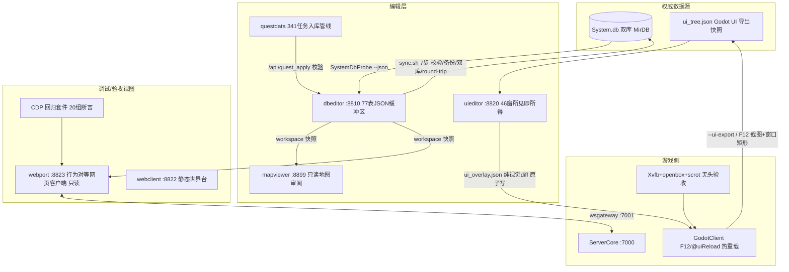

# 全局架构总览：Godot 游戏本体 + 外部 Web 工具生态

> 调研日期：2026-08-15 · 方法：三路只读 scout（webport / 编辑器生态 / GodotClient）
> + 核心文档核对（AGENTS.md ×2、WEB_PORT_SPIKE_REPORT、WEBPORT_MASTER_GOAL、
> PARITY_CHECKLIST、parity REPORT、AUDIT_REPORT 等）
> 定位：给后续"游戏编辑器 / 任务编辑器 / NPC 编辑器 / 数据编辑器共享同一套底座"
> 的愿景做现状底图。事实均引自文件与验收证据；未核实处标注【未验证】。

---

## 一、两仓库分工

| 仓库 | 角色 | 关键组成 |
|---|---|---|
| **Zircon**（~/development/Zircon） | 游戏本体 | `ServerCore`（原版 C# 服务端）· **`GodotClient`**（原版 WinForms Client/ 的 Godot 4.6 C# API 兼容重实现：DXControl 体系照抄原版属性/事件名，GameScene.cs 10283 行）· `LibraryCore`（双端共享枚举/模型/MirDB/网络包，~835 行 LibraryList 图库映射）· `BotRunner`（拟真机器人玩家，人格档案+A*+行为调度） |
| **Mir3-Research**（~/development/Mir3-Research） | 研究 + 工具集 | 全部 Web 工具（10+ 常驻服务，见端口表）· 原版逆向研究文档（docs/ 23 篇 codebase 深度文档 + 逆向产物）· 341 任务设计文档（docs/quest-design/）· `LibraryCore`/`ServerLibrary` 为 **symlink → zircon 同名目录**（C# 工具直接复用游戏模型类编译） |

**共享数据底座**（"数据统一"的物理基础）：

- 服务端双库 `zircon/Debug/ServerCore/Database/{System.db,Users.db}`；
- 客户端副本 `zircon/Debug/Client/Data/System.db`（DatabaseLoader 启动即加载 23 张系统表到
  `Globals.*List`——服务端包反序列化会访问 ItemInfoList，不加载直接 NRE 断线）；
- 原版资源 `Debug/Client/{Data/*.Zl, Map/*.map}`——Godot 端（ZlReader/MapReader）、
  webres 管线、webport WebData 全部消费这一份。

## 二、"从 Godot 反推的外部客户端" = webport (:8823)

比"调试器"走得更远：实际是一个**行为级对等的第二客户端**。

### 2.1 架构

- **纯浏览器原生 ES Module，无框架、无构建**（index.html 直挂 module script，改文件 bump `?v=N`）。
- **UI 层 = DXControl 的 DOM 移植**（`static/js/dx.js`：DXControl/DXButton/DXLabel/DXImageControl/
  DXTextInput/DXCheckBox/DXWindow + UiScaler 1024×768 逻辑画布缩放）；游戏世界 Canvas 2D
  （`themes/zircon/game.js`、camera.js、dxgrid.js 物品格）。无 PixiJS。
- **布局唯一权威 = ui_tree.json**：`--ui-export`（GodotClient/Scripts/UiTreeExporter.cs，反射无头
  实例化全部 DXWindow 子类）导出的 46 窗/441 控件树（634KB），坐标全部 1024×768 逻辑基准。
  **禁止手写布局数字**（总纲纪律）。
- 双 UI 参考模式（mode.js）：zircon 主线（themes/zircon/，7 文件）↔ EI 参考（themes/ei/，仅三场景
  骨架，scope 外未动）；两模式共用同一逻辑层（ws/net/data/world/itemstore）。
- serve.py（FastAPI :8823）：只读聚合 `/ui/*`（转发 GodotClient/UI/*.json）、
  `/res/data/db/{table}.json`（dbeditor workspace 快照白名单）、WebData 瓦片/精灵（**不存在时按需
  调 webres 渲染缓存**，磁盘 3G 守卫 507）。

### 2.2 联机与协议

- 链路：浏览器 `ws.js` → `wsgateway :7001`（WS↔TCP 纯二进制透传，零协议解析，实测每包开销
  <0.2ms）→ ServerCore TCP :7000。服务端零改动。
- 协议核心 `net.js`（68KB）：**376 包全量 ID 表**（来自 `Tools/wsgateway/packet_id_dump/`——对实际
  部署 LibraryCore.dll 反射导出，**禁止手推**，曾因手推 C.Chat 错 id 发聊天即断线，2026-08-14 修正）；
  帧格式 `[i32 长度][i16 id][payload]`；C 发送器 126 个 / S 解析器 ~190 个 / ws.js DISPATCH ~198 条；
  **线路明文无加密**（Encryption.cs 仅 DB 存盘）；CheckSum=20 位随机机器指纹仅记录用；
  心跳 G.Ping 2s 必回否则 20s 踢。

### 2.3 对等验收状态（截至 2026-08-15）

- **PARITY_CHECKLIST.md 全表 ✅**：P0 移动手感（600ms/格节拍、右键跑 2 格、撞墙绕路、Shift 原地
  攻击、UI 上不误触）+ 服务器锁定/移动预测 + HUD（9 键主面板/小地图/BuffDialog/QuestTracker）+
  聊天（频道循环/历史/草稿）+ 键位分发（70 条 1:1）；P1 全 46 窗口；P2 NPC 全部 14 种 DialogType
  面板链（提交锁三态、回包反馈 ×9、真服 e2e）。NPC 其余 6 DialogType 经双 DB 快照交叉审计为
  零引用不可达，判定无需实现。
- 产出方式：**五路并行军团**（A 移动 par-move / B 动画 par-anim / C HUD par-hud / D 窗口 par-win /
  E 键位+军团长 par-keys），R0–R33 共 33 轮合并零 git 冲突（文件领地纪律）。
- **CDP 回归资产**（全部可复跑，`Tools/webport/scripts/`）：主套件 `check-npc-panels-cdp.mjs`
  20 断言组；`check-keybinds.mjs` 557 静态断言；`check-keybinds-cdp.mjs` 70 键真服 dispatch
  （70/70 按键 0 异常 + 28/28 窗口 toggle）。跑法：webport+wsgateway+ServerCore（hub daemon
  `servercore-7k` 共用）→ `node scripts/check-npc-panels-cdp.mjs`，退出码即结果。
- **审计基线**（docs/webport/audit/AUDIT_REPORT.md，2026-08-14，parity sprint 之前）：像素 31.4%
  （两端异步动画噪声所致全 C 级）/ 结构 **90.7%**（39/43 项逐像素吻合）/ 行为 35.7% / 资源可比帧
  PSNR=∞（综合 79.3%）。其中 P0（C.Chat 断线、HP/MP 假满条等）已在 sprint 中修复。
- 残留 3 项（parity/REPORT.md）：①键位重绑 UI（KeyBindDialog 网页版）待接入 ConfigWindow——
  keybinds.js 数据层已就绪；②EI 参考模式未动；③真机对照验收待用户定夺。

### 2.4 webclient (:8822) 的角色

更早的**静态世界测试台**（不连服，627 地图漫游+GM 满配玩家）。其自创 UI 已被判定作废重做；
被 webport 继承的资产：地图位图管线（WebData）、资源服务、地图 manifest、连接数据。

### 2.5 Godot→Web 移植路线背景

WASM 全量移植已被官方硬阻断（Godot 4.6.3 mono 无 web 模板 + 编辑器拒绝 C# Web 导出，
WEB_PORT_SPIKE_REPORT.md 总裁决）。现路线即 webport：原生 Web 技术栈按 Godot 源码逐文件
对等移植。资源侧成果保留：.Zl→WebP 瘦身（8.0GB→3.7GB lossless/~2.1GB q90）、wav→OGG 10.5×、
WS 网关原型。

## 三、统一数据体系与回流闭环

### 通道 A：dbeditor → System.db 双库（数据主通道）

- 编辑**只写 workspace JSON**（`Tools/dbeditor/workspace/*.json` ~77 表，`_baseline/` 基线，
  自动 git commit 可 diff/回滚），.db 文件 mtime 不变（验收实测）。
- 显式「同步到数据库」= `sync.sh` 7 步任一失败即中止：①端口 7000 检测（服务端在跑→拒绝，
  API 409 + importer 退出码 2）→②DBImporter 校验+写临时副本（枚举/范围/悬空引用，基线感知）
  →③probe 重导出→④语义 round-trip 对比→⑤gzip 备份→⑥**双库原子安装**（服务端+客户端 md5
  必须一致，SystemDatabaseInfo.Version 自动 bump）→⑦基线重置。
- 可编辑面：物品（ItemInfo+子表 ItemInfoStat/StoreInfo/DropInfo）、怪物（MonsterInfo+
  MonsterInfoStat/RespawnInfo/GuardInfo/DropInfo）、技能 MagicInfo、掉落 DropInfo；quest_apply
  另写入 QuestInfo 系 5 表+NPCInfo/NPCPage。
- 验收 8/8（2026-08-13，docs/dbeditor-acceptance/）：round-trip 22,272 条读回、双库 md5 一致、
  服务端在跑被拒、**游戏内实测**改价 200→12345 无头截图+日志证实生效。

### 通道 B：uieditor → ui_overlay.json → F12 热重载（客户端视觉通道）

- 数据流：`--ui-export` → ui_tree.json → uieditor(:8820) 画布渲染（/zl/{lib}/{frame}.png 实时
  zlsdk 解码）→ 点「同步」= `POST /api/overlay` **原子写**（tmp+fsync+rename，旧版 .bak）→
  游戏内 **F12**（须在 KeyBindManager 分发前拦截）或聊天 `@uiReload` 热重载，零重启零重编译。
- overlay **只存 diff**，只允许 location/size/text/visible/fontSize/颜色——**永不动逻辑/事件绑定**；
  path（子索引链）不存在→告警跳过。空 overlay 零副作用（已验收）。
- F12 同时导当前可见窗口逻辑矩形 `/tmp/ui_window_rects.json` + 全屏截图——供编辑器截图
  underlay 按矩形裁剪对齐。
- 现状：`GodotClient/UI/ui_overlay.json` 尚不存在（编辑器同步时才生成）——机制完成、未实际使用。

### 通道 C：questdata → /api/quest_apply → workspace → 同步（任务入库通道）

- 341 任务（M3M 主线 44 / M3S 副线 57 / M3K 技能觉醒 224 / M3P 多人 16）设计完成。
- 管线三件套：`gen_semantic_map.py`（中文名↔DB Index：items 1078/monsters 434/magics 174/
  npcs 294(99.66%)/maps 627/regions 5009）→ `gen_quest_manifest.py`（341/341 结构化，核心字段
  100%）→ `import_quest.py`（POST /api/quest_apply：前置/物品/区域/怪物/NPC 存在性+枚举合法+
  批内前向引用，>50 条拒收）→ 全过才写 workspace → 仍走显式同步。
- **内容进度：仅 4/341 入库**（QuestInfo#63-66 望海楼三职业+刺杀剑术觉醒），QuestProbe 无头
  客户端真实接取验证（S.QuestChanged 证据在 docs/quest-design/evidence/）。
- 阻塞（审计 16-agent-readiness-audit.md）：manifest DB 绑定率低（怪物 43.5%/地图 30.9%/
  NPC 19.3%/物品 15.7%/**区域 0%**）；缺新物品 152、剧情区域 65、地图 21。

### 通道 D：NpcMover（一次性直写，已完成）

294 NPC 从 Zircon 坐标系修正到 EI 坐标系（权威参照 Mud3 原版 Merchant.txt 318 条 GB18030 +
英雄杀版 89 条交叉验证）。审计分类：A 精确 130 / B 英雄杀 64+调整 6 / C 语义 58 / D 推算 19 /
E 避让 8 / S 沙巴克不动 9 = 294，实际搬动 85。走停服→备份→干跑→round-trip 纪律直写。
游戏内验收截图 zircon/screenshots/28-32（比奇/边境/银杏/班尼两图）。goal 要求的"合理位置率
≥50%"最终统计数字未见落盘【未验证】。

### 只读消费端（明确非回流通道）

- **mapviewer (:8899)**：读 workspace 第一数据源（NPCInfo 294/MapRegion 5009/MovementInfo 1039，
  比 wiki_all.json 新鲜）；唯一落盘产出 map_links_v2.json（连通图谱，git 跟踪研究产物）。
- **dbviewer (:8800)**：System.db 只读浏览器（77 分类/31,871 行）。
- **webport/webclient/QuestProbe**：只读快照 + WebData。
- **portal (:8840)**：五工具（dbviewer/dbeditor/uieditor/wilviewer/mapviewer）健康检查门户+
  共享移动端壳（Tools/common/webui）。webport/webclient/webres 不在门户内。

### 支撑纪律（每条都踩过真坑，AGENTS.md 固化）

1024×768 逻辑坐标铁律（4K 下双倍偏移）· packet id 反射导出禁止手推 · 绝不绕过缓冲区直写 .db ·
绝不写 Users.db · 双库 md5 必须一致否则客户端 ToolTip/NPCPage 分叉 · MirDB Session 必须传
LibraryCore+ServerLibrary 双程序集（缺一静默 0 表）· 改后端代码必须重启进程再 curl · 静态 JS 改动
bump `?v=N` · GB18030 文本 · zircon 目录小写（大写硬编码在 Linux 静默失败）· WebData 3G 磁盘
红线 · goal_watchdog 管 long-running 任务 · 行为验证 ≥ 编译验证（Zircon AGENTS"验证深度约定"）。

### 无头验证基础设施

- 配方（AGENTS.md：152-156）：Xvfb :100 + openbox + godot-mono（/tmp/godot-mono）+ scrot；
  ZIRCON_UI_SCALE=2 验证 4K；可复制命令在 docs/UI_TEXT_BASELINE_FIX_2026-08-13.md:80-85。
- 代码钩子：AutoLoginArgs（--user/--pass/--char/--window/--screenshot-after-enter 等）、
  UITestScene ~30 个审计 flag、MapTestScene ~20 个渲染审计 flag、ZlViewer 场景、
  DBEDITOR_VERIFY_ITEM / --store-dump（dbeditor 同步验收的读值通道）。

## 四、成熟度对照（愿景 vs 现状）

| 愿景组件 | 现状 | 成熟度 |
|---|---|---|
| 数据编辑器 | dbeditor（物品/怪物/技能/掉落/任务/NPC 表全可编辑，8/8 验收含游戏内实测） | ✅ 基本完成 |
| UI 编辑器 | uieditor + F12 热重载闭环（overlay 机制完成，尚无实际使用记录） | ✅ 完成 |
| 调试用外部客户端 | webport 行为级对等 + CDP 回归（P0-P2 全绿） | ✅ 对等达成；真机对照待定夺 |
| 地图审阅 | mapviewer 只读（瓦片/NPC 标记/刷怪热力/任务叠加/连通图谱） | ✅ 只读成熟，**无写回** |
| 任务编辑器 | 设计 341 完成、管线闭环；内容 4/341；绑定率低（区域 0%/物品 15.7%） | 🟡 管道通，内容欠 |
| NPC 编辑器 | 无专用工具（dbeditor 通用表编辑 + mapviewer 只读摆位 + NpcMover 一次性完成） | ❌ 缺口 |
| "在 webport 里调、直接写回" | webport 纯只读（serve.py 无任何 POST，总纲明令服务端零改动） | ❌ 缺口 |

## 五、缺口与建议（供拍板）

1. **webport 还只是"看"，不是"调"**。愿景里"在外部调完数据写入 Godot"目前只在 dbeditor/uieditor
   成立。若要"在 webport 世界里点 NPC 拖位置→写回"，需给 serve.py 加受控写通道（建议复用
   dbeditor 的 API/缓冲区纪律而非直写）。NPC 编辑器天然 = webport 地图摆位 + dbeditor 校验入库
   的组合，现缺中间那根线。
2. **数据新鲜度**：webport/mapviewer 读 workspace 快照，dbeditor 编辑未同步期间两端短暂分叉；
   webport 的 npcs.json 坐标仍是 EI 坐标系（审计 B-11 记录错位隐患）；同步后需注意派生文件
   （WebData/dbviewer 导出）再生成。
3. **长尾**：EI 参考模式未动；键位重绑 UI 待接入 ConfigWindow（数据层已就绪）；任务内容量产
   （缺 152 新物品/65 剧情区域/21 地图登记 + 三线 OR 前置拆任务 ID 等人工拍板项）。

## 六、关键文件索引

| 领域 | 文件 |
|---|---|
| 仓库入口/纪律 | `Mir3-Research/AGENTS.md`、`Zircon/AGENTS.md` |
| webport | `Tools/webport/{serve.py, static/js/{net,ws,dx,uitree,keybinds,world}.js}`、`docs/webport/{WEBPORT_MASTER_GOAL,WEBPORT_PARALLEL_PLAN}.md`、`docs/webport/parity/{PARITY_CHECKLIST,LEAD_LOG,REPORT}.md`、`docs/webport/audit/AUDIT_REPORT.md`、`Tools/webport/scripts/check-npc-panels-cdp.mjs` |
| 网关/协议 | `Tools/wsgateway/{wsgateway.py,packet_id_dump/}`、`zircon/docs/WEB_PORT_SPIKE_REPORT.md` |
| 资源管线 | `Tools/webres/`（.Zl→WebP）、`Tools/common/{zlsdk,wilsdk}.py`、`Tools/web/wilviewer.py` |
| dbeditor | `Tools/dbeditor/{app.py,sync.sh,README.md,workspace/}`、`docs/dbeditor-acceptance/`、`Tools/SystemDbProbe/`、`Tools/DBImporter/` |
| uieditor | `Tools/uieditor/app.py`、`zircon/GodotClient/{Scripts/UiTreeExporter.cs,Controls/UiOverlay.cs,UI/ui_tree.json}`、`zircon/docs/UI_WEB_EDITOR_GOAL.md` |
| 任务 | `docs/quest-design/`（17 文档+data+evidence）、`Tools/questdata/`、`quest_design_v3_goal.md` |
| NPC 位置 | `Tools/NpcMover/{Program.cs,audit-report.md}`、`npc_position_goal.md` |
| GodotClient | `GodotClient/{Controls/DXControl.cs,Scripts/{GameScene,UiTreeExporter,UITestScene,AutoLoginArgs}.cs,Network/DatabaseLoader.cs,Formats/{ZlReader,MapReader,LibraryCache}.cs}` |
| 门户/评审 | `Tools/portal/portal.py`、`docs/final-review-2026-08-14/GIT_AUDIT.md`、`review_goals/PHASE1-3_*_REPORT.md` |

## 七、数字速查

341 任务(44/57/224/16) · 已入库 4（QuestInfo#63-66） · manifest 绑定率 怪43.5%/图30.9%/NPC19.3%/物15.7%/区0% · 缺物品152/区域65/地图21 ｜ dbeditor 77 表 JSON 缓冲 · 8/8 验收 · 22,272 条 round-trip · 版本 2026.08.14.4 ｜ uieditor 46 窗口/441 控件（ui_tree.json 634KB）· F12 热重载 ｜ NpcMover 294 审计=130+64+6+58+19+8+9 · 搬动 85 ｜ webport 376 包 ID · C 发送器 126 · S 解析器 ~190 · PARITY_CHECKLIST 全表 ✅（2026-08-15）· CDP 主套件 20 组 · 键位 557+70 断言 ｜ 审计基线(08-14)：结构 90.7% / 行为 35.7% / 资源可比帧 PSNR=∞ ｜ WebData 预算 3G（当前 2.2G）· 全量资源 8.0GB→3.7GB(lossless) ｜ 端口：80 svc-dashboard / 7000 服 / 7001 wsgateway / 8765 wilviewer / 8800 dbviewer / 8810 dbeditor / 8820 uieditor / 8821 webres / 8822 webclient / 8823 webport / 8830 yomu / 8831 fudoki / 8840 portal / 8899 mapviewer
