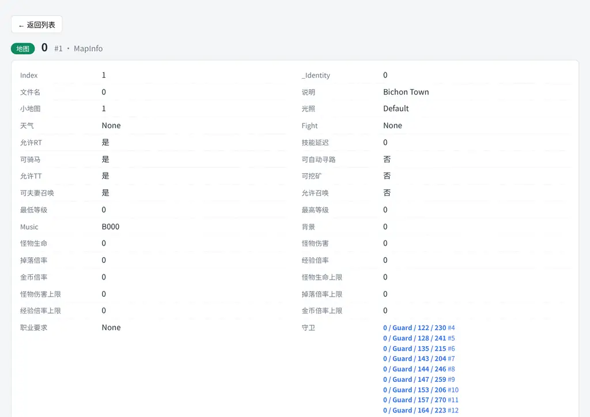

# DB_VIEWER — System.db Web 数据库查看器使用文档

> 工具：`Tools/dbviewer/` · 服务地址：**http://127.0.0.1:8800/** · 数据源：zircon `System.db`

## 一、这是什么

Zircon 私服的游戏世界数据库 `System.db` 是 .NET BinaryFormatter 序列化格式，
此前只能用 `SystemDbProbe`（C# 命令行）导出 Markdown 文档，浏览体验差。

dbviewer 把 System.db 变成攻略站风格的 Web 页面：

- **按业务分类**浏览全部 77 个集合（怪物图鉴 / 物品装备 / 技能魔法 / 地图信息 /
  NPC 位置 / 守卫信息 / 任务系统 / 系统数据），约 3.2 万条记录
- **详情页 + 关联跳转**：怪物 → 掉落 → 物品 → 商店，地图 → 刷怪/NPC/传送/守卫/安全区
- **搜索**：全局搜索（中英文名/ID）+ 表内搜索 + 任意列排序 + 分页
- **地图联动**：位置数据一键跳到在线地图查看器并定位、高亮
- **统计视图**：各集合记录数概览
- **图片预览**：物品图标 / NPC 立绘

## 二、部署

```bash
# 导出数据（调用 SystemDbProbe --json，输出 /tmp/dbviewer_data，约 16MB）
bash Tools/dbviewer/export.sh

# 启动服务
python3 Tools/dbviewer/dbviewer.py --data /tmp/dbviewer_data --port 8800
```

依赖：Python 3.10+（纯标准库）、.NET SDK 10（仅导出阶段需要）。

## 三、界面与功能

### 3.1 集合浏览

左侧分类树 → 右侧数据表格（默认每类显示 5-8 个关键字段，可点表头排序，
表格顶部输入框按当前表搜索，右上角切换每页行数）：


### 3.2 详情页与关联跳转

点任意行进入详情页，显示全部字段（中文名 + 值）。引用字段（Index）全部可点击跳转，
详情页底部按「正向引用 / 反向引用」分组展示关联数据。

怪物详情示例（Oma Hero）：


**核心链路实测**：怪物 Oma Hero(#23) → 掉落 59 种（DropInfo）→ 物品 Gold(#1) →
物品反向引用 252 处掉落 + 商店在售。全程点击跳转，无需手动查 ID。

### 3.3 地图详情 → 位置数据

地图详情页自动列出该地图的刷怪点 / NPC / 传送点 / 守卫 / 安全区 / 矿点，
每行带「地图名 + 坐标」和「地图 ↗」跳转按钮：



### 3.4 图片预览

物品详情显示 `Storeitem.wil` 图标、NPC 详情显示 `NPC.wil` 立绘
（经 wilviewer 8765 解码，跨域 `` 直链）：


### 3.5 搜索

顶栏输入框全局搜索（所有集合的名称 / 标识字段，中英文均可），结果按集合分组：


### 3.6 统计视图

左下角「统计概览」查看所有集合记录数，点击卡片直达该集合：


## 四、地图联动细节

dbviewer 的「地图 ↗」跳转地址格式（mapviewer 的 hash 定位）：

```
http://127.0.0.1:8899/#map=0.map&cur=0&g=1&m=1&f=1&x=5856&y=7360&hl=Guard
```

- `map`：地图文件（如 `0.map`）
- `x` / `y`：世界像素坐标 = 格子坐标 × 48 / × 32
- `hl`：高亮实体名（怪物 / NPC 名），对应 mapviewer 的 `.ent.target` 黄色描边

配套改动（已提交）：`Tools/maps/mapviewer.py` 前端解析 `hl=` 参数并在
`drawEntities()` 中对同名实体加 `.target` 类；`/api/entities` 自动合并
dbviewer 的 `/api/map-entities`（刷怪点 / NPC / 守卫 / 传送 / 安全区标记），
地图上直接可见数据库里的实体位置。

## 五、服务注册

参考现有 svc 模式（`~/.omp/logs/svc-mapviewer.log` 的启动方式），
可用 omp `hub start` 注册常驻服务：

```json
{
  "name": "dbviewer",
  "application": "/home/tetsuya/mir3-venv/bin/python3",
  "args": ["-u", "/home/tetsuya/development/Mir3-Research/Tools/dbviewer/dbviewer.py",
           "--data", "/tmp/dbviewer_data", "--port", "8800"]
}
```

启动后访问 `http://127.0.0.1:8800/`。

## 六、数据更新

```bash
bash Tools/dbviewer/export.sh   # 从 zircon 仓库根 System.db 副本重新导出（只读，不动运行中的服务器）
```

## 七、已知限制与后续建议

1. **怪物图片预览缺失**：EI 客户端 `Mon-N.wil` 帧布局与 Zircon ZL 客户端不同，
   `MonsterLookup.cs` 的帧号不能直接用于 EI 图库。建议后续基于 Zircon ZL 图库
   单独实现（wilviewer 目前仅支持 .wil）。
2. **区域粒度**：`MapRegion.PointRegion` 导出为质心 + 点数，地图上无法显示完整区域形状；
   如需可增加按需区域 API。
3. **性能**：全量数据约 16MB 载入内存，启动约 2 秒；刷新时全量重建倒排索引。
   记录数增长后可将索引持久化。
4. **实时性**：数据为导出快照，与运行中的服务器不实时同步；更新需重新导出。
