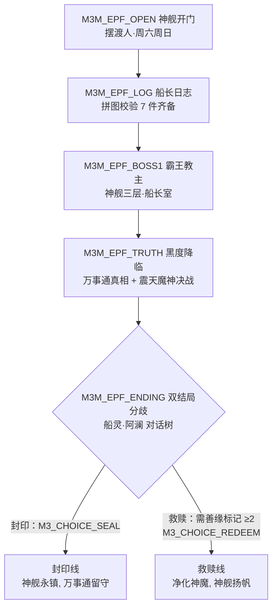

# Mir3 主线+副线任务设计 · 03 主线任务详解 · 共享主线（第一章~终章）

> 系列：Mir3 主线+副线任务完整设计（07 份）｜ 本文：03
> 日期：2026-08-12
> 依据：01 号文档（世界观/NPC/命名基准）、02 号文档（汇合点接入）、《MIR3_主线任务设计》第三章（能力边界）
> 本文内容：共享主线七章 **31 个任务**：第一章（汇合篇）4 + 第二章 4 + 第三章 5 + 第四章 5 + 第五章 4 + 第六章 4 + 终章 5。
> 含：每章 BOSS 战任务（KillMonster + QuestTaskMonsterDetails 限定地图）、4 处对话选项分支（NPCButton + CheckDataList）、
> 掷骰子分支（Random）、双结局（DataList 驱动）、叙事道具收集线（7 件 → 终章拼图）。

---

## 1. 章节总览

| 章 | 等级 | 地图 | 主线事件 | 章节 BOSS | 叙事道具 | 章节标记 |
|----|------|------|---------|----------|---------|---------|
| 一 | 13-15 | 天然洞穴 / 失乐园海边 / 毒蛇山谷 | 船歌谣、老矿工叮嘱、骷髅异动 | 骷髅精灵 | 船歌谣·完整 | M3_EP1_DONE |
| 二 | 15-20 | 矿区 / 比奇官府 | 僵尸涌现、王大人委托、矿车突围 | 尸王 | 船长日志（上半） | M3_EP2_DONE |
| 三 | 20-25 | 沃玛神殿 / 虫峡谷 | 沃玛火魔、堕落道士、三大势力躁动 | 沃玛教主 | 动力核心碎片 | M3_EP3_DONE |
| 四 | 25-30 | 灌木林 / 祖玛神殿 | 蜘蛛之乱、古神之怒、高塔古碑 | 祖玛教主 | 舵轮碎片、龙骨碎片 | M3_EP4_DONE |
| 五 | 30-35 | 诺玛遗迹 / 沙漠绿洲 / 潘夜石窟 / 失乐园海边 | 诺玛秘仪、圣言破译、深海取珠 | 骷髅教主、大法老 | 深海珍珠、船长日志（下半） | M3_EP5_DONE |
| 六 | 35-38 | 潘夜神殿 | 潘夜之殇、牛魔王之谜 | 潘夜牛魔王 | 神舰通行证 | M3_EP6_DONE |
| 终 | 38-40 | 神舰 / 真天黑度 | 幽灵船真相、黑度降临、双结局 | 霸王教主 → 震天魔神 | 全部拼图 → 双结局 | M3_EPF_DONE、M3_CHOICE_* |

### 1.1 叙事道具收集线（终章拼图）

```
船长吊坠(序章) → 船歌谣·完整(一章) → 船长日志·上半(二章) → 动力核心碎片(三章)
  → 舵轮碎片 + 龙骨碎片(四章) → 深海珍珠 + 船长日志·下半(五章) → 神舰通行证(六章)
  → [终章] 拼图校验（GainItem 7 件齐备）→ 唤醒船灵·阿澜 → 双结局
```

### 1.2 对话选项分支（4 处，NPCButton + CheckDataList）

| 位置 | 分支 | 标记 |
|------|------|------|
| 二章 M3M_EP2_WANG | 向王大人如实上报 / 替矿场隐瞒 | M3_WANG_TRUST |
| 三章 M3M_EP3_TAOIST | 与堕落道士和解 / 兵刃相向 | M3_CURSED_TAOIST_FRIEND |
| 五章 M3M_EP5_NUMA | 接受诺玛秘仪邀请 / 拒绝并强攻 | M3_NUMA_PACT |
| 终章 M3M_EPF_ENDING | 封印（神舰永镇）/ 救赎（净化神魔） | M3_CHOICE_SEAL / M3_CHOICE_REDEEM |

### 1.3 能力示范（本系列工作约定 §四.2 全覆盖）

| 能力 | 本文落点 |
|------|---------|
| KillMonster BOSS 限定（地图+掉率） | 各章 BOSS 战（QuestTaskMonsterDetails） |
| 递送任务（TakeItem+GiveItem 双 NPC） | M3M_EP1_SHIPSONG（万事通→老艄公） |
| Choice 多选一奖励 | 各章 BOSS 战奖励（武器/护甲/首饰三选一） |
| Bound / Duration | 叙事道具全 Bound；神舰通行证 Duration=7 天 |
| GiveCurrency | 金币 + 狩猎币（万事通酬金） |
| PromoteFame / CheckFame | 每章完成 +1~2 声望；终章登船 CheckFame ≥ 12 |
| Random 掷骰子 | M3M_EP3_UMA 夜袭骰（成功减半击杀） |
| DaysOfWeek | 终章摆渡人（周六/周日可见，NPCRequirement.DaysOfWeek） |
| DataList / DataValue | 章节进度、分支选择、双结局 |

---

## 2. 第一章（13-15）汇合篇 · 船歌谣

> 衔接：02 号文档汇合任务 M3M_EP1_CONVERGE 完成后接入。
> 主题：三线玩家以"船歌谣"为线索，追查骷髅异动，初战骷髅精灵。

### 2.1 船歌谣之约（M3M_EP1_SHIPSONG）——递送任务示范

| 字段 | 值 |
|------|-----|
| 任务名 | 船歌谣之约 |
| 任务 ID | M3M_EP1_SHIPSONG |
| 任务类型 | Story（剧情，一次性） |
| 等级 | 13-15（一章） |
| 接取 NPC | 万事通（比奇城·望海楼） |
| 交付 NPC | 摆渡人·老艄公（失乐园海边） |
| 接取条件 | MinLevel = 13；HaveCompleted M3M_EP1_CONVERGE；HaveNotCompleted 自身 |
| 前置任务 | M3M_EP1_CONVERGE |

**任务步骤**

| # | QuestTaskType | 参数 | 说明 |
|---|---------------|------|------|
| 1 | GainItem | 船歌谣·残片 ×1（已有，QuestItem） | 万事通交付残片 |
| 2 | VisitRegion | 失乐园·海边（MapRegion） | 寻访老艄公 |
| 3 | —（对话） | 与老艄公对歌 | 残片合成：TakeItem 残片 → GiveItem 船歌谣·完整 |

**奖励**

| 奖励 | 类型 | 说明 |
|------|------|------|
| 船歌谣·完整 ×1 | Item + Bound | 一章核心叙事道具 |
| 金币 ×2000 | GiveCurrency | 老艄公酒钱 |
| 声望 +1 | PromoteFame | 万事通声望 |

**对话全文**

- **万事通 Say（接取页）**
  > 这首船歌谣，是我年轻时——很久很久以前——船上的人唱的歌。残片给你了，歌词缺了后半。
  > 失乐园海边有个老艄公，祖辈都是摆渡的，他会唱后半。你把这残片带给他，他对得上，你就信他。
  > 记住：对歌的时候，看他的眼睛。

- **AcceptText**
  > 万事通将船歌谣残片交予[PLAYERNAME]，嘱其前往失乐园海边寻访摆渡人老艄公，
  > 以歌会人，拼全船歌谣。

- **ProgressText**
  > 携带船歌谣·残片前往失乐园海边，与摆渡人老艄公对歌（0/1）。

- **CompletedText**
  > 老艄公眯着眼听完半句，张口便接了下半——歌声苍凉，直入骨髓。他收下残片，还你一首完整的船歌谣：
  > "沧海茫茫，船归何方；锚落处，是他乡。千年一梦，故人不忘；船开时，莫相望。"

- **摆渡人·老艄公 Say（交付页）**
  > 这歌……是船上的歌。我太爷爷唱过，太爷爷的太爷爷也唱过——说是等一个"能对上歌的人"。
  > 后生，你身上有船的味道。这半首歌你收好。船要开了的时候，你再来找我。

- **ArchiveText**
  > 船歌谣拼全，[PLAYERNAME]与摆渡人老艄公以歌相识。老艄公言及"船开时再来找我"——
  > 那是终章的伏笔。

**剧情分支**：无（线性对歌）。对歌页按钮 `[接下半句]` → 判定 CheckDataList M3_SHIP_SECRET：有 → 老艄公额外说"你已知道船是牢笼"；无 → 老艄公笑"听歌就好"。

---

### 2.2 老矿工的叮嘱（M3M_EP1_MINER）

| 字段 | 值 |
|------|-----|
| 任务名 | 老矿工的叮嘱 |
| 任务 ID | M3M_EP1_MINER |
| 任务类型 | Story（剧情，一次性） |
| 等级 | 13-15（一章） |
| 接取 NPC | 老矿工·陈永年（天然洞穴二层，活人态归位后常驻） |
| 交付 NPC | 老矿工·陈永年 |
| 接取条件 | MinLevel = 13；HaveCompleted M3M_EP1_SHIPSONG |
| 前置任务 | M3M_EP1_SHIPSONG |

**任务步骤**

| # | QuestTaskType | 参数 | 说明 |
|---|---------------|------|------|
| 1 | VisitRegion | 天然洞穴二层·老矿工棚屋（MapRegion） | 探望老矿工 |
| 2 | KillMonster | 骷髅 ×10（天然洞穴） | 替老矿工清扰 |
| 3 | GainItem | 骷髅骨 ×5（天然洞穴骷髅掉落，QuestItem） | 老矿工要的"骨粉"材料 |

**奖励**

| 奖励 | 类型 | 说明 |
|------|------|------|
| 金币 ×2500 | GiveCurrency | 老矿工毕生积蓄 |
| 狩猎币 ×15 | GiveCurrency | 矿工酬谢 |
| 刺杀剑术线索 | 对话钩子 | 19 级回访 → 04 号 M3K_WAR_SKEWER |

**对话全文**

- **老矿工·陈永年 Say（接取页）**
  > 小哥，又见面了。那日矿洞里的话，你怕是只当胡话——不打紧。我这一辈子在土里刨食，
  > 耳朵却比谁都灵：这些天，洞里的骷髅又躁了，像是……在怕什么，又像是在等什么。
  > 你替我收拾一批骷髅，再给我带五根骨头来——我要磨骨粉，给洞口画一道防线的粉线。

- **AcceptText**
  > 老矿工陈永年察觉天然洞穴骷髅异动，请[PLAYERNAME]清剿骷髅并收集骷髅骨，
  > 以骨粉为矿洞画设防线。

- **ProgressText**
  > 清剿天然洞穴骷髅（0/10），收集骷髅骨（0/5）。

- **CompletedText**
  > 骨粉防线画好，老矿工满意地点头。临别他拉住你："洞穴最深处，有个大个子骷髅在召集同类。
  > 你要下去，先记着我的话——骷髅怕光，更怕不怕它的人。还有……这一刺，是保命的。"

- **ArchiveText**
  > 老矿工以骨粉画线，叮嘱[PLAYERNAME]骷髅精灵之事，并留下"一刺保命"的剑术钩子。

**剧情分支**：交付页按钮 `[问船的事]` → 老矿工沉默良久："船的事……等你能上船的时候，自然全明白。
现在知道太多，活不长。"（伏笔，不写标记）。

---

### 2.3 骷髅异动调查（M3M_EP1_SKELETON）

| 字段 | 值 |
|------|-----|
| 任务名 | 骷髅异动调查 |
| 任务 ID | M3M_EP1_SKELETON |
| 任务类型 | Story（剧情，一次性） |
| 等级 | 14-15（一章） |
| 接取 NPC | 镖局师傅·赵四海（比奇城镖局） |
| 交付 NPC | 万事通（比奇城·望海楼） |
| 接取条件 | MinLevel = 14；HaveCompleted M3M_EP1_MINER |
| 前置任务 | M3M_EP1_MINER |

**任务步骤**

| # | QuestTaskType | 参数 | 说明 |
|---|---------------|------|------|
| 1 | VisitRegion | 天然洞穴三层·骷髅祭坛（MapRegion） | 异动源头 |
| 2 | KillMonster | 掷斧骷髅 ×8（天然洞穴三层） | 骷髅潮 |
| 3 | KillMonster | 骷髅战将 ×6（天然洞穴三层） | 精锐骷髅 |
| 4 | GainItem | 祭坛骨纹拓片 ×1（祭坛处采集，QuestItem） | 骷髅祭坛的"船纹" |

**奖励**

| 奖励 | 类型 | 说明 |
|------|------|------|
| 金币 ×3000 | GiveCurrency | 镖局酬金 |
| 声望 +1 | PromoteFame | 万事通声望 |
| 随机传送卷 ×3 | Item | 保命道具 |

**对话全文**

- **镖局师傅·赵四海 Say（接取页）**
  > 商路上的骷髅越来越多，已经伤了好几个趟子手。我查过了——源头在天然洞穴三层，
  > 那帮骷髅在砌一个祭坛，坛上的纹路……我老赵走南闯北，没见过那种纹路。你胆大，替我去看看。

- **AcceptText**
  > 骷髅在天然洞穴三层砌筑祭坛，镖局赵四海请[PLAYERNAME]前往调查：
  > 清剿掷斧骷髅与骷髅战将，拓印祭坛纹路。

- **ProgressText**
  > 抵达天然洞穴三层骷髅祭坛，清剿掷斧骷髅（0/8）、骷髅战将（0/6），拓印祭坛骨纹（0/1）。

- **CompletedText**
  > 祭坛骨纹拓回，万事通看了一眼，脸色微变："这是船纹……和神舰龙骨上的纹路，一模一样。
  > 骷髅在向船献祭。它们的主人，要醒了。"

- **万事通 Say（交付页）**
  > （罕见地严肃）骷髅精灵——天然洞穴的骷髅王，是这祭坛的祭司。它若集齐祭品，就能给
  > 船底下的那位递一句话。你必须抢在它前面。三层，去吧。我在这里等你回来。

- **ArchiveText**
  > 骷髅祭坛的船纹证实骷髅与神舰的关联。万事通揭示骷髅精灵为祭坛祭司，
  > 命[PLAYERNAME]前往讨伐。

**剧情分支**：无。但交付页万事通以 CheckFame 判定（声望 ≥3 时）额外赠"地牢逃脱卷 ×1"。

---

### 2.4 骷髅精灵·亡者之首（M3M_EP1_BOSS）——第一章 BOSS 战

| 字段 | 值 |
|------|-----|
| 任务名 | 骷髅精灵·亡者之首 |
| 任务 ID | M3M_EP1_BOSS |
| 任务类型 | Story（剧情，一次性） |
| 等级 | 14-15（一章） |
| 接取 NPC | 万事通（比奇城·望海楼） |
| 交付 NPC | 万事通 |
| 接取条件 | MinLevel = 14；HaveCompleted M3M_EP1_SKELETON |
| 前置任务 | M3M_EP1_SKELETON |

**任务步骤**

| # | QuestTaskType | 参数 | 说明 |
|---|---------------|------|------|
| 1 | KillMonster | 骷髅精灵 ×1（QuestTaskMonsterDetails：怪物=骷髅精灵，地图=天然洞穴三层，Chance=100，Amount=1） | 章节 BOSS 限定地图 |
| 2 | VisitRegion | 天然洞穴三层·骷髅祭坛（MapRegion） | 战后确认祭坛已毁 |
| 3 | —（对话） | 交付万事通 | 写 M3_EP1_DONE |

**奖励**

| 奖励 | 类型 | 说明 |
|------|------|------|
| Choice：铁剑 ×1 ／ 轻型盔甲 ×1 ／ 骷髅戒指 ×1 | Choice | BOSS 战三选一 |
| 金币 ×5000 | GiveCurrency | 万事通犒赏 |
| 狩猎币 ×30 | GiveCurrency | 赏金 |
| 声望 +2 | PromoteFame | 万事通声望 |

**对话全文**

- **万事通 Say（接取页）**
  > 骷髅精灵在祭坛上等你。它是亡者之首，也是船底下那位的第一条狗。杀了它，祭坛就断了，
  > 一章的祸事就算平了。去吧——记住老矿工的话：骷髅怕不怕它的人。

- **AcceptText**
  > 万事通下令讨伐骷髅精灵。[PLAYERNAME]深入天然洞穴三层祭坛，击杀骷髅精灵，
  > 摧毁骷髅祭坛，截断神舰之下的献祭通道。

- **ProgressText**
  > 击杀骷髅精灵（0/1，天然洞穴三层），摧毁骷髅祭坛（0/1）。

- **CompletedText**
  > 骷髅精灵倒下，祭坛随之崩塌。万事通捻着骨灰，半晌道："船底下的那位，少了一条狗。
  > 一章，平了。往后的事，一件比一件大——你准备好了么？"

- **万事通 Say（交付页）**
  > 干得漂亮。骷髅精灵的骨灰里，我拣出这个——一枚旧船的铆钉。船上的东西，都认得你。
  > （写入 M3_EP1_DONE）去矿区看看吧。那里的僵尸，比骷髅更麻烦——它们会说话。

- **ArchiveText**
  > 骷髅精灵伏诛，骷髅祭坛崩塌。第一章"船歌谣"落幕，[PLAYERNAME]获知僵尸异动，
  > 向矿区进发——第二章开始。

**剧情分支**：无。战斗奖励 Choice 三选一。

---

## 3. 第二章（15-20）僵尸涌现 · 船长日志（上半）

### 3.1 僵尸涌现（M3M_EP2_ZOMBIE）

| 字段 | 值 |
|------|-----|
| 任务名 | 僵尸涌现 |
| 任务 ID | M3M_EP2_ZOMBIE |
| 任务类型 | Story（剧情，一次性） |
| 等级 | 15-20（二章） |
| 接取 NPC | 矿场管事·周老栓（矿区入口） |
| 交付 NPC | 矿场管事·周老栓 |
| 接取条件 | MinLevel = 15；HaveCompleted M3M_EP1_BOSS |
| 前置任务 | M3M_EP1_BOSS |

**任务步骤**

| # | QuestTaskType | 参数 | 说明 |
|---|---------------|------|------|
| 1 | VisitRegion | 矿区一层·坍塌井口（MapRegion） | 僵尸源头勘察 |
| 2 | KillMonster | 僵尸 ×10（矿区） | 尸潮主力 |
| 3 | KillMonster | 烂僵尸 ×6（矿区） | 变异僵尸 |

**奖励**

| 奖励 | 类型 | 说明 |
|------|------|------|
| 金币 ×3000 | GiveCurrency | 矿场酬金 |
| 金创药(大) ×10 | Item | 伤药 |

**对话全文**

- **矿场管事·周老栓 Say（接取页）**
  > 又出事了！这回是僵尸——矿道里一夜之间爬出上百个，见人就咬！老陈说这是"地脉反涌"，
  > 我不懂那些，我就知道矿工们不敢下井了。壮士，你帮矿上把这波僵尸压下去！

- **AcceptText**
  > 矿区僵尸涌现，矿场管事周老栓请[PLAYERNAME]镇压尸潮：清除矿区一层的僵尸与烂僵尸，
  > 查明僵尸源头。

- **ProgressText**
  > 在矿区一层清剿僵尸（0/10）、烂僵尸（0/6）。

- **CompletedText**
  > 尸潮暂平。周老栓擦着冷汗说："最深处那个大棺材……我听见里面有人敲棺材板。"
  > 矿工们都说那是尸王——矿上最老的传说。

- **ArchiveText**
  > 僵尸涌现被镇压，矿区深处"尸王"传说浮出水面。

**剧情分支**：无。

---

### 3.2 王大人委托（M3M_EP2_WANG）——对话选项分支①

| 字段 | 值 |
|------|-----|
| 任务名 | 王大人委托 |
| 任务 ID | M3M_EP2_WANG |
| 任务类型 | Story（剧情，一次性） |
| 等级 | 16-20（二章） |
| 接取 NPC | 王大人（比奇城官府） |
| 交付 NPC | 王大人 |
| 接取条件 | MinLevel = 16；HaveCompleted M3M_EP2_ZOMBIE |
| 前置任务 | M3M_EP2_ZOMBIE |

**任务步骤**

| # | QuestTaskType | 参数 | 说明 |
|---|---------------|------|------|
| 1 | VisitRegion | 矿区三层·尸王殿前室（MapRegion） | 勘察尸王殿 |
| 2 | KillMonster | 老道僵尸 ×8（矿区三层） | 尸王亲卫 |
| 3 | GainItem | 尸王祭文残页 ×1（老道僵尸掉落，QuestItem） | 祭文证据 |

**奖励**

| 奖励 | 类型 | 说明 |
|------|------|------|
| 金币 ×4000 | GiveCurrency | 官府俸银 |
| 声望 +1 | PromoteFame | 比奇官府声望 |
| 半月弯刀线索 | 对话钩子 | 24 级回官府 → 04 号 M3K_WAR_CRESCENT |

**对话全文**

- **王大人 Say（接取页）**
  > 本官乃比奇军需官王奉。僵尸之事，朝廷已知——但矿上有人压着消息，怕的是官府封矿断了财路。
  > 你替本官去矿区三层走一趟，取尸王祭文的残页回来。本官要看看，这矿底下到底藏了什么。

- **AcceptText**
  > 王大人委托[PLAYERNAME]深入矿区三层勘察尸王殿，清剿老道僵尸，取回尸王祭文残页。

- **ProgressText**
  > 在矿区三层清剿老道僵尸（0/8），获取尸王祭文残页（0/1）。

- **CompletedText**
  > 残页上的字迹让王大人眉头紧锁："……献此血肉于船底之主，启锚之日，尸潮为兵……"
  > 他抬眼问你："这'船底之主'，你知道多少？"

- **王大人 Say（交付页·分支）**
  > ① 如实上报（M3_WANG_TRUST）：你将来龙去脉说了。王大人郑重一揖："此事务必再查。
  > 官府信你。"（后续二章任务对话升级，王大人提供军需支援）
  > ② 替矿场隐瞒：你含糊其辞。王大人目光如炬："本官知道了。你退下吧。"（后续任务奖励 -20%）

- **ArchiveText**
  > 尸王祭文揭示"船底之主"，王大人知悉矿下异动。第二章主线进入决战阶段。

**剧情分支**：

| 按钮 | 效果 |
|------|------|
| `[如实上报]` | AddDataList M3_WANG_TRUST；王大人军需支援（后续奖励加成） |
| `[含糊其辞]` | 无标记；王大人不满（后续奖励 -20%） |

---

### 3.3 矿车突围（M3M_EP2_CART）

| 字段 | 值 |
|------|-----|
| 任务名 | 矿车突围 |
| 任务 ID | M3M_EP2_CART |
| 任务类型 | Story（剧情，一次性） |
| 等级 | 17-20（二章） |
| 接取 NPC | 矿场管事·周老栓（矿区入口） |
| 交付 NPC | 王大人（比奇城官府） |
| 接取条件 | MinLevel = 17；HaveCompleted M3M_EP2_WANG |
| 前置任务 | M3M_EP2_WANG |

**任务步骤**

| # | QuestTaskType | 参数 | 说明 |
|---|---------------|------|------|
| 1 | VisitRegion | 矿区三层·矿车道（MapRegion） | 夺回矿车 |
| 2 | KillMonster | 法老僵尸 ×6（矿区三层） | 尸王亲卫 |
| 3 | KillMonster | 魔咒僵尸 ×6（矿区三层） | 施咒僵尸 |
| 4 | —（对话） | 与被困矿工对话 | 护送出井（对话完成，无护送机制——"待服务端扩展"标注） |

**奖励**

| 奖励 | 类型 | 说明 |
|------|------|------|
| 金币 ×4000 | GiveCurrency | 军需犒赏 |
| 狩猎币 ×20 | GiveCurrency | 矿场酬谢 |
| 野蛮冲撞线索 | 对话钩子 | 27 级回矿区 → 04 号 M3K_WAR_CHARGE |

**对话全文**

- **矿场管事·周老栓 Say（接取页）**
  > 矿车卡在尸王殿前室了，车上还有六个活人！法老僵尸和魔咒僵尸把路封死了——
  > 它们会法术，矿工们扛不住。壮士，你是唯一能杀进去的人！

- **AcceptText**
  > 被困矿工危在旦夕，[PLAYERNAME]随周老栓杀入矿区三层：清剿法老僵尸与魔咒僵尸，
  > 夺回矿车，护送被困矿工出井。

- **ProgressText**
  > 抵达矿区三层矿车道，清剿法老僵尸（0/6）、魔咒僵尸（0/6），解救被困矿工（0/1）。

- **CompletedText**
  > 六个矿工活着出了井，抱着你大哭。周老栓红着眼眶："我这条命，欠你两条了。"
  > （注：护送出井为对话完成——真实护送机制不在能力边界内，标"待服务端扩展"。）

- **ArchiveText**
  > 矿车突围成功，六名矿工获救。尸王殿前的最后一道屏障已被扫清。

**剧情分支**：无。

---

### 3.4 尸王讨伐（M3M_EP2_BOSS）——第二章 BOSS 战

| 字段 | 值 |
|------|-----|
| 任务名 | 尸王讨伐 |
| 任务 ID | M3M_EP2_BOSS |
| 任务类型 | Story（剧情，一次性） |
| 等级 | 18-20（二章） |
| 接取 NPC | 王大人（比奇城官府） |
| 交付 NPC | 王大人 |
| 接取条件 | MinLevel = 18；HaveCompleted M3M_EP2_CART |
| 前置任务 | M3M_EP2_CART |

**任务步骤**

| # | QuestTaskType | 参数 | 说明 |
|---|---------------|------|------|
| 1 | KillMonster | 尸王 ×1（QuestTaskMonsterDetails：怪物=尸王，地图=矿区三层·尸王殿，Chance=100，Amount=1） | 章节 BOSS |
| 2 | GainItem | 船长日志（上半）×1（尸王掉落，QuestItem） | 叙事道具 |
| 3 | —（对话） | 交付王大人 | 写 M3_EP2_DONE |

**奖励**

| 奖励 | 类型 | 说明 |
|------|------|------|
| Choice：青铜剑 ×1 ／ 中型盔甲 ×1 ／ 珍珠戒指 ×1 | Choice | BOSS 战三选一 |
| 金币 ×6000 | GiveCurrency | 官府赏金 |
| 声望 +2 | PromoteFame | 万事通声望 |

**对话全文**

- **王大人 Say（接取页）**
  > 尸王殿的棺材已经开了。尸王是"船底之主"埋在矿下的第一颗棋子——杀了它，比奇的地脉就稳一半。
  > 去吧。本官在府衙等你凯旋。

- **AcceptText**
  > 王大人下令讨伐尸王。[PLAYERNAME]深入矿区三层尸王殿，击杀尸王，取回其随身之物。

- **ProgressText**
  > 击杀尸王（0/1，矿区三层·尸王殿），取回船长日志（上半）（0/1）。

- **CompletedText**
  > 尸王倒下，棺材里散落一本浸透尸油的旧册子——封皮上画着一艘大船。王大人翻了两页，面色大变：
  > "这是……船上人的日志。前半本。另一半，在别处。"

- **王大人 Say（交付页）**
  > 这日志记的是千年前那艘船的航程——船员名册、货物清单……还有一句批注：
  > '若封印松动，需寻回全部碎片，方可重铸锚链。' 你收好它。第二章，平了。

- **ArchiveText**
  > 尸王伏诛，船长日志（上半）现世。第二章落幕，王大人告知"寻回全部碎片"的批注——
  > 叙事道具收集线正式开启。

**剧情分支**：无。BOSS 奖励 Choice 三选一。

---

## 4. 第三章（20-25）三大势力躁动 · 动力核心碎片

### 4.1 沃玛火魔（M3M_EP3_UMA）——掷骰子分支示范

| 字段 | 值 |
|------|-----|
| 任务名 | 沃玛火魔 |
| 任务 ID | M3M_EP3_UMA |
| 任务类型 | Story（剧情，一次性） |
| 等级 | 20-25（三章） |
| 接取 NPC | 万事通（比奇城·望海楼） |
| 交付 NPC | 万事通 |
| 接取条件 | MinLevel = 20；HaveCompleted M3M_EP2_BOSS |
| 前置任务 | M3M_EP2_BOSS |

**任务步骤**

| # | QuestTaskType | 参数 | 说明 |
|---|---------------|------|------|
| 1 | VisitRegion | 沃玛神殿一层·火池前厅（MapRegion） | 沃玛军势侦察 |
| 2 | KillMonster | 沃玛战士 ×10（沃玛神殿一层） | 沃玛步兵 |
| 3 | KillMonster | 火焰沃玛 ×6（沃玛神殿一层） | 火魔精锐 |

**奖励**

| 奖励 | 类型 | 说明 |
|------|------|------|
| 金币 ×3500 | GiveCurrency | 万事通酬金 |
| 太阳水 ×5 | Item | 火区保命 |
| 狩猎币 ×20 | GiveCurrency | 赏金 |

**对话全文**

- **万事通 Say（接取页）**
  > 沃玛神殿的火池烧起来了——那是沃玛教主在点兵。三章的风向，从沃玛开始。
  > 你去火池前厅探探虚实，能打就打，不能打就撤。记住：火魔最怕水，也最怕……不怕它的人。

- **AcceptText**
  > 沃玛教主在神殿点兵，万事通请[PLAYERNAME]前往沃玛神殿一层侦察并压制沃玛军势：
  > 清剿沃玛战士与火焰沃玛。

- **ProgressText**
  > 在沃玛神殿一层清剿沃玛战士（0/10）、火焰沃玛（0/6）。

- **CompletedText**
  > 沃玛前厅的兵力被削去三成。万事通捻着胡须："火池还在涨——教主在等什么。
  > 等一个'信号'。你进神殿深处看看，是什么在给它点火。"

- **万事通 Say（交付页·掷骰子）**
  > 夜袭沃玛哨卡，骰子定成败（NPCCheck.Random 50%）：
  > ① 成功：哨卡未及报警，火焰沃玛击杀数减半（-3），额外金币 +500。
  > ② 失败：哨卡吹响号角，追加 KillMonster 火焰沃玛 ×3。

- **ArchiveText**
  > 沃玛神殿军势被压制，沃玛教主的"点火信号"之谜浮出水面。

**剧情分支（Random 掷骰子）**：交付页按钮 `[夜袭哨卡]` → Random 50% 成功/失败页（如上）。

---

### 4.2 堕落道士·云逸（M3M_EP3_TAOIST）——对话选项分支②

| 字段 | 值 |
|------|-----|
| 任务名 | 堕落道士·云逸 |
| 任务 ID | M3M_EP3_TAOIST |
| 任务类型 | Story（剧情，一次性） |
| 等级 | 21-25（三章） |
| 接取 NPC | 万事通（比奇城·望海楼） |
| 交付 NPC | 万事通 |
| 接取条件 | MinLevel = 21；HaveCompleted M3M_EP3_UMA |
| 前置任务 | M3M_EP3_UMA |

**任务步骤**

| # | QuestTaskType | 参数 | 说明 |
|---|---------------|------|------|
| 1 | VisitRegion | 沃玛神殿三层·黑符祭坛（MapRegion） | 寻访堕落道士 |
| 2 | KillMonster | 暗黑战士 ×8（沃玛神殿三层） | 云逸的魔化护卫 |
| 3 | —（对话） | 与堕落道士·云逸对峙 | 分支：和解 / 敌对 |
| 4 | GainItem | 动力核心碎片·线索图 ×1（对话获得，QuestItem） | 核心碎片线索 |

**奖励**

| 奖励 | 类型 | 说明 |
|------|------|------|
| 金币 ×4000 | GiveCurrency | 万事通酬金 |
| 声望 +1 | PromoteFame | 万事通声望 |
| 烈火剑法线索（战士）／幽灵盾线索（道士） | 对话钩子 | 32/25 级 → 04 号 M3K_WAR_FLAME / M3K_TAO_GHOST |

**对话全文**

- **万事通 Say（接取页）**
  > 沃玛神殿里有个道士——穿道袍、画黑符，把镇魔符改成引魔符的，就是他。他叫云逸，
  > 原是失乐园道馆的首徒。他手里有动力核心碎片的线索。见了他……怎么谈，看你自己。

- **AcceptText**
  > 堕落道士云逸现身沃玛神殿三层。[PLAYERNAME]前往黑符祭坛与其对峙，
  > 追索动力核心碎片线索。云逸为失乐园道馆叛徒（道士线 02 号文档伏笔人物）。

- **ProgressText**
  > 抵达沃玛神殿三层黑符祭坛，清剿暗黑战士（0/8），与堕落道士云逸对话。

- **CompletedText**
  > （和解线）云逸交给你线索图，转身隐入黑雾："拿去。别谢我——我欠道馆的，今日还了。
  > 师兄……帮我照看掌门。"（敌对线）云逸冷笑："想要线索？打赢我再说。" 你击败他，
  > 从他怀中搜出线索图。

- **堕落道士·云逸 Say（对峙页·分支）**
  > ① 和解（M3_CURSED_TAOIST_FRIEND）：你提起失乐园道馆、提起玄真掌门。云逸的冷笑僵在脸上：
  > "……掌门还……好吗？" 半晌，他扔给你一张地图："动力核心碎片在教主王座之下。
  > 拿去。我堕我的魔，你行你的道——两不相欠。"
  > ② 敌对：云逸拂袖："道不同，不相为谋。" 黑符炸开，战斗开始。

- **ArchiveText**
  > 堕落道士云逸伏诛/和解，动力核心碎片线索到手。云逸的结局在终章有回响。

**剧情分支**：

| 按钮 | 效果 |
|------|------|
| `[提起道馆旧事]` | 云逸动摇 → 和解：AddDataList M3_CURSED_TAOIST_FRIEND；对话获得线索图 |
| `[拔剑相向]` | 战斗：追加 KillMonster 暗黑战士 ×4；战后搜得线索图（无和解标记） |

---

### 4.3 动力核心碎片（M3M_EP3_CORE）

| 字段 | 值 |
|------|-----|
| 任务名 | 动力核心碎片 |
| 任务 ID | M3M_EP3_CORE |
| 任务类型 | Story（剧情，一次性） |
| 等级 | 22-25（三章） |
| 接取 NPC | 万事通（比奇城·望海楼） |
| 交付 NPC | 万事通 |
| 接取条件 | MinLevel = 22；HaveCompleted M3M_EP3_TAOIST |
| 前置任务 | M3M_EP3_TAOIST |

**任务步骤**

| # | QuestTaskType | 参数 | 说明 |
|---|---------------|------|------|
| 1 | VisitRegion | 沃玛神殿总殿·王座之下（MapRegion） | 按线索图寻核心 |
| 2 | KillMonster | 沃玛卫士 ×6（沃玛神殿总殿） | 王座守卫 |
| 3 | GainItem | 动力核心碎片 ×1（王座下机关取出，QuestItem） | 叙事道具 |

**奖励**

| 奖励 | 类型 | 说明 |
|------|------|------|
| 动力核心碎片 ×1 | Item + Bound | 三章叙事道具 |
| 金币 ×5000 | GiveCurrency | 万事通酬金 |

**对话全文**

- **万事通 Say（接取页）**
  > 王座之下，是沃玛教主藏"火种"的地方。那枚动力核心碎片——是神舰引擎的一部分，
  > 千年前被沃玛一族偷去当了圣物。取回来。神舰要动，离不开它。

- **AcceptText**
  > 按云逸的线索图，[PLAYERNAME]潜入沃玛神殿总殿王座之下，清剿沃玛卫士，
  > 取回神舰引擎部件动力核心碎片。

- **ProgressText**
  > 抵达沃玛神殿总殿王座之下，清剿沃玛卫士（0/6），取得动力核心碎片（0/1）。

- **CompletedText**
  > 碎片入手，温热的金属在掌心微微搏动——像一颗心脏。万事通凝视碎片："引擎的心脏。
  > 船上的东西，一件一件回来了。"

- **ArchiveText**
  > 动力核心碎片取回，神舰引擎的心脏归位。万事通的神色愈发凝重。

**剧情分支**：无。

---

### 4.4 虫峡谷异动（M3M_EP3_BUGS）

| 字段 | 值 |
|------|-----|
| 任务名 | 虫峡谷异动 |
| 任务 ID | M3M_EP3_BUGS |
| 任务类型 | Story（剧情，一次性） |
| 等级 | 22-25（三章） |
| 接取 NPC | 石阁庙守庙人·钟伯（石阁庙） |
| 交付 NPC | 万事通（比奇城·望海楼） |
| 接取条件 | MinLevel = 22；HaveCompleted M3M_EP3_CORE |
| 前置任务 | M3M_EP3_CORE |

**任务步骤**

| # | QuestTaskType | 参数 | 说明 |
|---|---------------|------|------|
| 1 | VisitRegion | 虫峡谷·地脉裂口（MapRegion） | 虫群异动源头 |
| 2 | KillMonster | 蜈蚣 ×10（虫峡谷） | 虫潮 |
| 3 | KillMonster | 邪恶蜈蚣 ×6（虫峡谷） | 异变蜈蚣 |
| 4 | GainItem | 虫群情报·鳞片 ×1（精英掉落，QuestItem） | 虫群来源线索 |

**奖励**

| 奖励 | 类型 | 说明 |
|------|------|------|
| 金币 ×4000 | GiveCurrency | 守庙人酬金 |
| 狩猎币 ×25 | GiveCurrency | 赏金 |

**对话全文**

- **石阁庙守庙人·钟伯 Say（接取页）**
  > 虫峡谷的蜈蚣疯了，一夜之间从地脉裂口涌出来，把石阁庙的墙根都啃穿了一截。
  > 老朽守庙四十年，头回见虫子这么听话——像是……被什么驱使着往一个方向爬。
  > 你去看看，那裂口底下到底有什么。

- **AcceptText**
  > 虫峡谷虫潮异动，守庙人钟伯请[PLAYERNAME]调查地脉裂口：清剿蜈蚣与邪恶蜈蚣，
  > 带回虫群来源线索。

- **ProgressText**
  > 在虫峡谷地脉裂口清剿蜈蚣（0/10）、邪恶蜈蚣（0/6），获取虫群情报（0/1）。

- **CompletedText**
  > 鳞片上刻着微缩的船纹——与骷髅祭坛、与船长日志上的纹路同源。万事通看罢：
  > "虫子也在向船聚集。三大势力……都在等船开。"

- **万事通 Say（交付页）**
  > 沃玛点火、骷髅献祭、虫群迁徙——它们不是各自为战，是同一个主人在调兵。
  > 该收拾沃玛教主了。它一死，三章的天平就倒向我们。

- **ArchiveText**
  > 虫峡谷异动查明：虫群亦受船纹驱使。三大势力躁动的幕后黑手指向船底之主。

**剧情分支**：无。

---

### 4.5 沃玛教主讨伐（M3M_EP3_BOSS）——第三章 BOSS 战

| 字段 | 值 |
|------|-----|
| 任务名 | 沃玛教主讨伐 |
| 任务 ID | M3M_EP3_BOSS |
| 任务类型 | Story（剧情，一次性） |
| 等级 | 24-25（三章） |
| 接取 NPC | 万事通（比奇城·望海楼） |
| 交付 NPC | 万事通 |
| 接取条件 | MinLevel = 24；HaveCompleted M3M_EP3_BUGS |
| 前置任务 | M3M_EP3_BUGS |

**任务步骤**

| # | QuestTaskType | 参数 | 说明 |
|---|---------------|------|------|
| 1 | KillMonster | 沃玛教主 ×1（QuestTaskMonsterDetails：怪物=沃玛教主，地图=沃玛神殿总殿，Chance=100，Amount=1） | 章节 BOSS |
| 2 | —（对话） | 交付万事通 | 写 M3_EP3_DONE |

**奖励**

| 奖励 | 类型 | 说明 |
|------|------|------|
| Choice：乌木剑 ×1 ／ 战袍 ×1 ／ 沃玛号角 ×1 | Choice | BOSS 战三选一 |
| 金币 ×7000 | GiveCurrency | 万事通犒赏 |
| 声望 +2 | PromoteFame | 万事通声望 |

**对话全文**

- **万事通 Say（接取页）**
  > 沃玛教主坐镇总殿，火池为它续命。杀了它，火池即灭，三章的三大势力便去了其一。
  > 去吧。它是火魔，但你身上——已经有四系元素的种子了。

- **AcceptText**
  > 万事通下令讨伐沃玛教主。[PLAYERNAME]杀入沃玛神殿总殿，击杀沃玛教主，
  > 熄灭沃玛一族的千年火池。

- **ProgressText**
  > 击杀沃玛教主（0/1，沃玛神殿总殿）。

- **CompletedText**
  > 沃玛教主倒下，火池轰然熄灭。沃玛神殿的鼓声停了。万事通立于焦土之上：
  > "三章，平了。下一个——祖玛。古神之怒，比火更沉。"

- **万事通 Say（交付页）**
  > （望着熄灭的火池）千年前，沃玛一族偷走引擎核心，自以为得了圣物——却不知那是船的心脏。
  > 如今心脏归位。祖玛那边还握着船的骨头。四章，去祖玛。

- **ArchiveText**
  > 沃玛教主伏诛，火池熄灭，动力核心碎片归位。第三章落幕，祖玛之行使者将至。

**剧情分支**：无。BOSS 奖励 Choice 三选一。

---

## 5. 第四章（25-30）古神之怒 · 舵轮碎片与龙骨碎片

### 5.1 蜘蛛之乱（M3M_EP4_SPIDER）

| 字段 | 值 |
|------|-----|
| 任务名 | 蜘蛛之乱 |
| 任务 ID | M3M_EP4_SPIDER |
| 任务类型 | Story（剧情，一次性） |
| 等级 | 25-30（四章） |
| 接取 NPC | 灌木林猎户·老白（灌木林入口） |
| 交付 NPC | 灌木林猎户·老白 |
| 接取条件 | MinLevel = 25；HaveCompleted M3M_EP3_BOSS |
| 前置任务 | M3M_EP3_BOSS |

**任务步骤**

| # | QuestTaskType | 参数 | 说明 |
|---|---------------|------|------|
| 1 | VisitRegion | 灌木林·蛛巢区（MapRegion） | 蜘蛛潮源头 |
| 2 | KillMonster | 天狼蜘蛛 ×10（灌木林） | 蛛潮主力 |
| 3 | KillMonster | 爆裂蜘蛛 ×8（灌木林） | 自爆蛛 |
| 4 | KillMonster | 八脚首领 ×1（灌木林·蛛巢区，小 BOSS） | 蛛群头目 |

**奖励**

| 奖励 | 类型 | 说明 |
|------|------|------|
| 金币 ×4000 | GiveCurrency | 猎户酬金 |
| 太阳水(强效) ×5 | Item | 解毒保命 |
| 狩猎币 ×20 | GiveCurrency | 赏金 |

**对话全文**

- **灌木林猎户·老白 Say（接取页）**
  > 灌木林的蜘蛛全疯了——天狼蛛咬人，爆裂蛛见人就炸，最要命的是冒出一只八条腿的首领，
  > 盘在蛛巢区，把整个林子都织成了网。这蜘蛛潮来得蹊跷：蜘蛛不是爱动的畜生，
  > 除非……地下有什么东西在赶它们。

- **AcceptText**
  > 灌木林蜘蛛之乱，猎户老白请[PLAYERNAME]清剿蛛潮：清除天狼蜘蛛与爆裂蜘蛛，
  > 讨伐蛛群首领八脚首领。

- **ProgressText**
  > 在灌木林清剿天狼蜘蛛（0/10）、爆裂蜘蛛（0/8），讨伐八脚首领（0/1）。

- **CompletedText**
  > 八脚首领伏诛，蛛网褪去。老白在蛛巢深处捡到一枚刻着船纹的石片："怪了——蜘蛛窝里，
  > 怎么会有船上的东西？"

- **ArchiveText**
  > 蜘蛛之乱平息，蛛巢中发现的船纹石片指向祖玛——蜘蛛是被"地下的东西"赶出来的。

**剧情分支**：无。

---

### 5.2 古神之怒（M3M_EP4_ANGER）

| 字段 | 值 |
|------|-----|
| 任务名 | 古神之怒 |
| 任务 ID | M3M_EP4_ANGER |
| 任务类型 | Story（剧情，一次性） |
| 等级 | 26-30（四章） |
| 接取 NPC | 祖玛守望者·石翁（祖玛神殿一层） |
| 交付 NPC | 祖玛守望者·石翁 |
| 接取条件 | MinLevel = 26；HaveCompleted M3M_EP4_SPIDER |
| 前置任务 | M3M_EP4_SPIDER |

**任务步骤**

| # | QuestTaskType | 参数 | 说明 |
|---|---------------|------|------|
| 1 | VisitRegion | 祖玛神殿二层·古碑回廊（MapRegion） | 古碑异动勘察 |
| 2 | KillMonster | 祖玛弓箭手 ×10（祖玛神殿二层） | 阴兵箭阵 |
| 3 | KillMonster | 祖玛雕像 ×6（祖玛神殿二层） | 活化雕像 |

**奖励**

| 奖励 | 类型 | 说明 |
|------|------|------|
| 金币 ×4500 | GiveCurrency | 石翁酬金 |
| 声望 +1 | PromoteFame | 万事通声望 |

**对话全文**

- **祖玛守望者·石翁 Say（接取页）**
  > 老朽守祖玛神殿六十年，从未见过祖玛教主如此暴怒——古碑在流血，雕像在走动，
  > 阴兵列阵，刀尖全指着同一个方向：祖玛高塔。传说祖玛一族是"古神"的后裔，
  > 教主怒的不是我们——是有人动了它先祖的东西。那东西，就在高塔顶上。

- **AcceptText**
  > 祖玛古神之怒蔓延，守望者石翁请[PLAYERNAME]清剿祖玛阴兵，
  > 查明古碑异动的根源——有人动了祖玛高塔上的先祖遗物。

- **ProgressText**
  > 在祖玛神殿二层清剿祖玛弓箭手（0/10）、祖玛雕像（0/6）。

- **CompletedText**
  > 阴兵暂退，古碑的血色纹路仍在蔓延。石翁叹息："教主的东西……是船的骨头。
  > 祖玛一族当年从沉船上拆下两根骨头，一根舵轮、一根龙骨，当圣物供在高塔。
  > 如今，它们在呼唤主人。"

- **ArchiveText**
  > 古神之怒查明根源：祖玛高塔供奉着神舰的舵轮碎片与龙骨碎片，它们在呼唤主人。

**剧情分支**：无。

---

### 5.3 舵轮碎片（M3M_EP4_RUDDER）

| 字段 | 值 |
|------|-----|
| 任务名 | 舵轮碎片 |
| 任务 ID | M3M_EP4_RUDDER |
| 任务类型 | Story（剧情，一次性） |
| 等级 | 27-30（四章） |
| 接取 NPC | 祖玛守望者·石翁（祖玛神殿一层） |
| 交付 NPC | 万事通（比奇城·望海楼） |
| 接取条件 | MinLevel = 27；HaveCompleted M3M_EP4_ANGER |
| 前置任务 | M3M_EP4_ANGER |

**任务步骤**

| # | QuestTaskType | 参数 | 说明 |
|---|---------------|------|------|
| 1 | VisitRegion | 祖玛神殿三层·舵轮祭室（MapRegion） | 舵轮碎片所在 |
| 2 | KillMonster | 祖玛卫士 ×8（祖玛神殿三层） | 圣物守卫 |
| 3 | GainItem | 舵轮碎片 ×1（祭室中取出，QuestItem） | 叙事道具 |

**奖励**

| 奖励 | 类型 | 说明 |
|------|------|------|
| 舵轮碎片 ×1 | Item + Bound | 四章叙事道具 |
| 金币 ×5000 | GiveCurrency | 万事通酬金 |

**对话全文**

- **祖玛守望者·石翁 Say（接取页）**
  > 舵轮碎片供在神殿三层的祭室里，祖玛卫士昼夜看守。老朽劝你：取的时候快一些，
  > 古碑的怒意已经压不住了——教主随时会来。

- **AcceptText**
  > 石翁指引[PLAYERNAME]前往祖玛神殿三层舵轮祭室，清剿祖玛卫士，取回神舰舵轮碎片。

- **ProgressText**
  > 抵达祖玛神殿三层舵轮祭室，清剿祖玛卫士（0/8），取得舵轮碎片（0/1）。

- **CompletedText**
  > 舵轮碎片入手，木质温润，其上刻满船纹。万事通接过去，指尖轻抚："舵轮……船的'方向'。
  > 四章的任务，过半了。"

- **ArchiveText**
  > 舵轮碎片取回，神舰的"方向"归位。

**剧情分支**：无。

---

### 5.4 龙骨碎片（M3M_EP4_KEEL）

| 字段 | 值 |
|------|-----|
| 任务名 | 龙骨碎片 |
| 任务 ID | M3M_EP4_KEEL |
| 任务类型 | Story（剧情，一次性） |
| 等级 | 28-30（四章） |
| 接取 NPC | 祖玛守望者·石翁（祖玛神殿一层） |
| 交付 NPC | 万事通（比奇城·望海楼） |
| 接取条件 | MinLevel = 28；HaveCompleted M3M_EP4_RUDDER |
| 前置任务 | M3M_EP4_RUDDER |

**任务步骤**

| # | QuestTaskType | 参数 | 说明 |
|---|---------------|------|------|
| 1 | VisitRegion | 祖玛高塔·塔顶古碑（MapRegion） | 龙骨碎片所在 |
| 2 | KillMonster | 护法天 ×6（祖玛高塔） | 教主护法 |
| 3 | GainItem | 龙骨碎片 ×1（古碑下取出，QuestItem） | 叙事道具 |
| 4 | —（对话） | 拓印塔顶古碑铭文 | 翔空剑法钩子（04 号 M3K_WAR_SOAR） |

**奖励**

| 奖励 | 类型 | 说明 |
|------|------|------|
| 龙骨碎片 ×1 | Item + Bound | 四章叙事道具 |
| 金币 ×5500 | GiveCurrency | 万事通酬金 |

**对话全文**

- **祖玛守望者·石翁 Say（接取页）**
  > 龙骨碎片在塔顶古碑之下，护法天守着。塔顶的碑文是失传的剑法——祖玛一族称它
  > '翔空剑法'，说是从船上的人那里学的。你若能取回龙骨，碑文拓片也一并带走吧。

- **AcceptText**
  > 石翁指引[PLAYERNAME]登上祖玛高塔：清剿护法天，取回龙骨碎片，并拓印塔顶古碑铭文。

- **ProgressText**
  > 抵达祖玛高塔塔顶，清剿护法天（0/6），取得龙骨碎片（0/1），拓印古碑铭文（0/1）。

- **CompletedText**
  > 龙骨碎片入手，沉甸甸的，像握着一条船的脊梁。万事通接过碎片，长叹一声：
  > "龙骨……船的脊梁。舵轮、龙骨、心脏——船的身子，快拼齐了。"

- **ArchiveText**
  > 龙骨碎片与塔顶剑法拓片取回，神舰的"脊梁"归位。

**剧情分支**：无。

---

### 5.5 祖玛教主讨伐（M3M_EP4_BOSS）——第四章 BOSS 战

| 字段 | 值 |
|------|-----|
| 任务名 | 祖玛教主讨伐 |
| 任务 ID | M3M_EP4_BOSS |
| 任务类型 | Story（剧情，一次性） |
| 等级 | 29-30（四章） |
| 接取 NPC | 万事通（比奇城·望海楼） |
| 交付 NPC | 万事通 |
| 接取条件 | MinLevel = 29；HaveCompleted M3M_EP4_KEEL |
| 前置任务 | M3M_EP4_KEEL |

**任务步骤**

| # | QuestTaskType | 参数 | 说明 |
|---|---------------|------|------|
| 1 | KillMonster | 祖玛教主 ×1（QuestTaskMonsterDetails：怪物=祖玛教主，地图=祖玛大殿，Chance=100，Amount=1） | 章节 BOSS |
| 2 | —（对话） | 交付万事通 | 写 M3_EP4_DONE |

**奖励**

| 奖励 | 类型 | 说明 |
|------|------|------|
| Choice：青锋剑 ×1 ／ 锁子甲 ×1 ／ 祖玛头像 ×1 | Choice | BOSS 战三选一 |
| 金币 ×8000 | GiveCurrency | 万事通犒赏 |
| 声望 +2 | PromoteFame | 万事通声望 |

**对话全文**

- **万事通 Say（接取页）**
  > 祖玛教主守着最后一块圣物执念不放——它以为是荣耀，其实是枷锁。杀了它，
  > 祖玛一族才得解脱。去吧。四章的局，该收了。

- **AcceptText**
  > 万事通下令讨伐祖玛教主。[PLAYERNAME]杀入祖玛大殿，击杀祖玛教主，
  > 终结古神之怒。

- **ProgressText**
  > 击杀祖玛教主（0/1，祖玛大殿）。

- **CompletedText**
  > 祖玛教主倒下，古碑的血色纹路缓缓褪去。石翁在殿外长跪："古神安息。"万事通立于塔影下：
  > "四章，平了。骨头都回来了——还剩眼睛和心。五章，去沙漠。"

- **万事通 Say（交付页）**
  > 诺玛一族在沙漠里挖了千年，挖的是船的'眼睛'——罗盘。还有失乐园海边的'心'——
  > 深海珍珠。五章的事，比前四章都险。

- **ArchiveText**
  > 祖玛教主伏诛，古神之怒平息。第四章落幕，诺玛秘仪与深海取珠之行开启。

**剧情分支**：无。BOSS 奖励 Choice 三选一。

---

## 6. 第五章（30-35）诺玛秘仪 · 深海珍珠与船长日志（下半）

### 6.1 诺玛秘仪（M3M_EP5_NUMA）——对话选项分支③

| 字段 | 值 |
|------|-----|
| 任务名 | 诺玛秘仪 |
| 任务 ID | M3M_EP5_NUMA |
| 任务类型 | Story（剧情，一次性） |
| 等级 | 30-35（五章） |
| 接取 NPC | 万事通（比奇城·望海楼） |
| 交付 NPC | 万事通 |
| 接取条件 | MinLevel = 30；HaveCompleted M3M_EP4_BOSS |
| 前置任务 | M3M_EP4_BOSS |

**任务步骤**

| # | QuestTaskType | 参数 | 说明 |
|---|---------------|------|------|
| 1 | VisitRegion | 诺玛遗迹一层·秘仪广场（MapRegion） | 诺玛秘仪侦察 |
| 2 | KillMonster | 诺玛将士 ×10（诺玛遗迹一层） | 秘仪卫队 |
| 3 | KillMonster | 沙漠风魔 ×6（沙漠绿洲） | 风魔哨戒 |
| 4 | —（对话） | 与诺玛大法老·图兰对峙 | 分支：接受秘仪邀请 / 拒绝强攻 |

**奖励**

| 奖励 | 类型 | 说明 |
|------|------|------|
| 金币 ×5000 | GiveCurrency | 万事通酬金 |
| 狩猎币 ×30 | GiveCurrency | 赏金 |
| 声望 +1 | PromoteFame | 万事通声望 |

**对话全文**

- **万事通 Say（接取页）**
  > 诺玛法老在沙漠里挖出一面古镜——那是船的'眼睛'，罗盘。他们围着镜子跳了三个月大神，
  > 想撬开镜子里的话。你去看看。大法老·图兰不是蠢人——他也许愿意谈，也许不愿意。

- **AcceptText**
  > 诺玛秘仪以神舰罗盘古镜为中心举行，[PLAYERNAME]奉万事通之命前往诺玛遗迹侦察：
  > 清剿诺玛将士与沙漠风魔，与诺玛大法老图兰周旋。

- **ProgressText**
  > 抵达诺玛遗迹秘仪广场，清剿诺玛将士（0/10）、沙漠风魔（0/6），会见大法老图兰。

- **CompletedText**
  > （接受线）图兰邀你入秘仪观礼——镜中浮出半页日志："……第五层船舱，珍珠为眼……
  > 持之可渡深水……"（拒绝线）你强攻秘仪广场，图兰在混战中留下半句话："……珍珠……
  > 失乐园……海下……" 随即遁入沙暴。

- **诺玛大法老·图兰 Say（对峙页·分支）**
  > ① 接受秘仪（M3_NUMA_PACT）：图兰抚镜而笑："异乡人，你身上有船的气息。
  > 吾族挖了千年，只想知道镜中之海通向何处。你既与船有缘，入仪观礼如何？"
  > ② 拒绝：图兰神色一冷："那就用你们的法子。" 沙暴骤起，诺玛将士合围。

- **ArchiveText**
  > 诺玛秘仪探明：古镜即神舰罗盘，镜中揭示深海珍珠的所在。诺玛线收束。

**剧情分支**：

| 按钮 | 效果 |
|------|------|
| `[接受秘仪邀请]` | AddDataList M3_NUMA_PACT；图兰提供圣言线索（下任务对话升级） |
| `[拒绝并强攻]` | 无标记；追加 KillMonster 诺玛将士 ×4 |

---

### 6.2 圣言破译（M3M_EP5_SCRIBE）

| 字段 | 值 |
|------|-----|
| 任务名 | 圣言破译 |
| 任务 ID | M3M_EP5_SCRIBE |
| 任务类型 | Story（剧情，一次性） |
| 等级 | 31-35（五章） |
| 接取 NPC | 诺玛大法老·图兰（诺玛遗迹五层）／万事通（拒绝线） |
| 交付 NPC | 万事通（比奇城·望海楼） |
| 接取条件 | MinLevel = 31；HaveCompleted M3M_EP5_NUMA |
| 前置任务 | M3M_EP5_NUMA |

**任务步骤**

| # | QuestTaskType | 参数 | 说明 |
|---|---------------|------|------|
| 1 | VisitRegion | 诺玛遗迹五层·圣言殿（MapRegion） | 圣言碑文 |
| 2 | KillMonster | 诺玛法老 ×6（诺玛遗迹五层） | 法老卫队 |
| 3 | GainItem | 诺玛圣言残卷 ×1（圣言殿拓印，QuestItem） | 破译材料 |
| 4 | —（对话） | 交付万事通破译 | 圣言术钩子（04 号 M3K_MAG_HOLY） |

**奖励**

| 奖励 | 类型 | 说明 |
|------|------|------|
| 金币 ×5500 | GiveCurrency | 万事通酬金 |
| 太阳水(强效) ×3 | Item | 沙暴保命 |

**对话全文**

- **诺玛大法老·图兰 Say（接取页·接受线）**
  > 圣言殿的碑文，吾族百年未解。你既入过秘仪，便是有缘人——替吾拓一份圣言残卷回去，
  > 若解得开，古镜之言便多一分。若解不开……也无妨，缘分尽了便是。
  > （拒绝线改为万事通 Say："诺玛圣言殿的碑文里藏着古镜的使用之法。硬闯吧，拓回来就是。"）

- **AcceptText**
  > 圣言殿碑文蕴含古镜（神舰罗盘）的使用之法，[PLAYERNAME]前往诺玛遗迹五层：
  > 清剿诺玛法老，拓印圣言残卷，交付万事通破译。

- **ProgressText**
  > 抵达诺玛遗迹五层圣言殿，清剿诺玛法老（0/6），取得圣言残卷（0/1）。

- **CompletedText**
  > 万事通对着残卷熬了三夜，译出一行："……镜之所指，即船之所向；珍珠为眼，罗盘为心……"
  > 他拍案而起："深海珍珠！珍珠就是古镜的钥匙——先去失乐园海边！"

- **万事通 Say（交付页）**
  > 圣言破译，指向深海珍珠。船的眼睛、船的心——都在失乐园的海下。

- **ArchiveText**
  > 圣言破译完成，古镜指向深海珍珠。五章进入取珠阶段。

**剧情分支**：无。

---

### 6.3 深海珍珠（M3M_EP5_PEARL）

| 字段 | 值 |
|------|-----|
| 任务名 | 深海珍珠 |
| 任务 ID | M3M_EP5_PEARL |
| 任务类型 | Story（剧情，一次性） |
| 等级 | 33-35（五章） |
| 接取 NPC | 摆渡人·老艄公（失乐园海边） |
| 交付 NPC | 万事通（比奇城·望海楼） |
| 接取条件 | MinLevel = 33；HaveCompleted M3M_EP5_SCRIBE |
| 前置任务 | M3M_EP5_SCRIBE |

**任务步骤**

| # | QuestTaskType | 参数 | 说明 |
|---|---------------|------|------|
| 1 | VisitRegion | 失乐园·沉船礁（MapRegion，需持古镜拓文） | 深海下潜点 |
| 2 | KillMonster | 浪子人鬼 ×8（潘夜岛海域） | 沉船守卫 |
| 3 | KillMonster | 腐蚀人鬼 ×6（潘夜岛海域） | 腐蚀亡魂 |
| 4 | GainItem | 深海珍珠 ×1（沉船礁深处取出，QuestItem） | 叙事道具 |
| 5 | GainItem | 船长日志（下半）×1（沉船残骸中寻得，QuestItem） | 叙事道具 |

**奖励**

| 奖励 | 类型 | 说明 |
|------|------|------|
| 深海珍珠 ×1 | Item + Bound | 五章叙事道具 |
| 船长日志（下半）×1 | Item + Bound | 五章叙事道具 |
| 金币 ×6000 | GiveCurrency | 老艄公酬金 |

**对话全文**

- **摆渡人·老艄公 Say（接取页）**
  > 你终于来了。船开之前，得先取回船的眼睛——深海珍珠。珍珠沉在失乐园海下的沉船礁，
  > 那里是千年前那艘船沉锚的地方。礁下有亡魂守着，人鬼不散。我这把老骨头撑不到那里，
  > 但你——你身上有船的味道，它们认你。

- **AcceptText**
  > 老艄公指引[PLAYERNAME]潜往失乐园海下沉船礁：清剿浪子人鬼与腐蚀人鬼，
  > 取回深海珍珠，并搜寻沉船残骸中的船长日志（下半）。

- **ProgressText**
  > 抵达沉船礁，清剿浪子人鬼（0/8）、腐蚀人鬼（0/6），取得深海珍珠（0/1）、船长日志（下半）（0/1）。

- **CompletedText**
  > 珍珠入手，微光如月；日志的下半本从沉船残骸中捞起，水渍斑驳。老艄公望着珍珠：
  > "眼睛回来了。船……看得见路了。"

- **ArchiveText**
  > 深海珍珠与船长日志（下半）取回，神舰的"眼睛"归位。船长日志两半合璧，可读全本。

**剧情分支**：无。

---

### 6.4 大法老与骷髅教主（M3M_EP5_BOSS）——第五章双 BOSS 战

| 字段 | 值 |
|------|-----|
| 任务名 | 大法老与骷髅教主 |
| 任务 ID | M3M_EP5_BOSS |
| 任务类型 | Story（剧情，一次性） |
| 等级 | 34-35（五章） |
| 接取 NPC | 万事通（比奇城·望海楼） |
| 交付 NPC | 万事通 |
| 接取条件 | MinLevel = 34；HaveCompleted M3M_EP5_PEARL |
| 前置任务 | M3M_EP5_PEARL |

**任务步骤**

| # | QuestTaskType | 参数 | 说明 |
|---|---------------|------|------|
| 1 | KillMonster | 大法老 ×1（QuestTaskMonsterDetails：怪物=大法老，地图=诺玛遗迹五层·圣言殿，Chance=100，Amount=1） | 五章 BOSS·沙漠 |
| 2 | KillMonster | 骷髅教主 ×1（QuestTaskMonsterDetails：怪物=骷髅教主，地图=潘夜石窟三层，Chance=100，Amount=1） | 五章 BOSS·潘夜 |
| 3 | —（对话） | 交付万事通 | 写 M3_EP5_DONE |

**奖励**

| 奖励 | 类型 | 说明 |
|------|------|------|
| Choice：玄铁剑 ×1 ／ 秘银甲 ×1 ／ 诺玛勇气 ×1 | Choice | BOSS 战三选一 |
| 金币 ×9000 | GiveCurrency | 万事通犒赏 |
| 声望 +2 | PromoteFame | 万事通声望 |

**对话全文**

- **万事通 Say（接取页）**
  > 古镜既明，诺玛再无秘仪可守；潘夜石窟的骷髅教主也在借船纹聚兵。两个头，一次砍——
  > 大法老在圣言殿，骷髅教主在石窟三层。五章的收尾，是双线。

- **AcceptText**
  > 万事通下令讨伐诺玛大法老与潘夜骷髅教主。[PLAYERNAME]分赴诺玛遗迹圣言殿
  > 与潘夜石窟三层，击杀双 BOSS，终结五章的双线之局。

- **ProgressText**
  > 击杀大法老（0/1，诺玛遗迹五层·圣言殿），击杀骷髅教主（0/1，潘夜石窟三层）。

- **CompletedText**
  > 大法老与骷髅教主双双伏诛。万事通合上船长日志全本，手指停在最后一页：
  > "日志记到'锚落之日'就断了。下一章……是潘夜。神族之殇，最重的一章。"

- **万事通 Say（交付页）**
  > 五章，平了。潘夜神殿的牛魔王——那是船底之主最后一条大狗。六章，去潘夜。
  > 带上一颗心。那章的故事……会疼。

- **ArchiveText**
  > 大法老与骷髅教主伏诛，第五章落幕。船长日志全本合璧，潘夜之殇将至。

**剧情分支**：无。双 BOSS 奖励 Choice 三选一。

---

## 7. 第六章（35-38）潘夜之殇 · 神舰通行证

### 7.1 潘夜之殇（M3M_EP6_PANYA）

| 字段 | 值 |
|------|-----|
| 任务名 | 潘夜之殇 |
| 任务 ID | M3M_EP6_PANYA |
| 任务类型 | Story（剧情，一次性） |
| 等级 | 35-38（六章） |
| 接取 NPC | 潘夜圣女·月见（潘夜神殿一层） |
| 交付 NPC | 潘夜圣女·月见 |
| 接取条件 | MinLevel = 35；HaveCompleted M3M_EP5_BOSS |
| 前置任务 | M3M_EP5_BOSS |

**任务步骤**

| # | QuestTaskType | 参数 | 说明 |
|---|---------------|------|------|
| 1 | VisitRegion | 潘夜神殿一层·神族祭坛（MapRegion） | 潘夜神族现状 |
| 2 | KillMonster | 潘夜战士 ×10（潘夜神殿一层） | 堕落神族 |
| 3 | KillMonster | 潘夜风魔 ×6（潘夜神殿一层） | 风魔哨戒 |

**奖励**

| 奖励 | 类型 | 说明 |
|------|------|------|
| 金币 ×6000 | GiveCurrency | 圣女酬金 |
| 声望 +1 | PromoteFame | 万事通声望 |
| 群体治愈术线索（道士）／莲月剑法线索（战士） | 对话钩子 | 31/38 级 → 04 号 |

**对话全文**

- **潘夜圣女·月见 Say（接取页）**
  > 外乡人……你终于来了。我是潘夜神族最后的圣女，月见。我的族人被牛魔王裹挟着堕落——
  > 他们不是恶，是怕。牛魔王握着神舰通行证，以'船开之日，神族复兴'蛊惑全族。
  > 可我知道，那艘船是牢笼。船开之日，就是潘夜覆灭之日。

- **AcceptText**
  > 潘夜圣女月见向[PLAYERNAME]道出潘夜之殇：牛魔王以神舰通行证蛊惑神族堕落。
  > 请[PLAYERNAME]清剿堕落神族，调查牛魔王的阴谋。

- **ProgressText**
  > 在潘夜神殿一层清剿潘夜战士（0/10）、潘夜风魔（0/6）。

- **CompletedText**
  > 堕落神族暂退。月见望着神殿深处的黑雾："牛魔王在等一个'祭日'——月食之夜。
  > 那晚它会打开船门。我们……没有多少时间了。"

- **ArchiveText**
  > 潘夜之殇浮出水面：牛魔王以神舰通行证为饵，欲在月食之夜开启船门。

**剧情分支**：无。

---

### 7.2 牛魔王之谜（M3M_EP6_RITE）——对话选项分支④

| 字段 | 值 |
|------|-----|
| 任务名 | 牛魔王之谜 |
| 任务 ID | M3M_EP6_RITE |
| 任务类型 | Story（剧情，一次性） |
| 等级 | 36-38（六章） |
| 接取 NPC | 潘夜圣女·月见（潘夜神殿一层） |
| 交付 NPC | 潘夜圣女·月见 |
| 接取条件 | MinLevel = 36；HaveCompleted M3M_EP6_PANYA |
| 前置任务 | M3M_EP6_PANYA |

**任务步骤**

| # | QuestTaskType | 参数 | 说明 |
|---|---------------|------|------|
| 1 | VisitRegion | 潘夜神殿五层·牛魔王前厅（MapRegion） | 牛魔王行踪 |
| 2 | KillMonster | 潘夜云魔 ×6（潘夜神殿五层） | 云魔哨戒 |
| 3 | KillMonster | 潘夜鬼将 ×6（潘夜神殿五层） | 牛魔王亲卫 |
| 4 | —（对话） | 与潘夜右护卫·夜枭对话 | 分支：相信夜枭 / 怀疑夜枭 |

**奖励**

| 奖励 | 类型 | 说明 |
|------|------|------|
| 金币 ×6500 | GiveCurrency | 圣女酬金 |
| 狩猎币 ×30 | GiveCurrency | 赏金 |

**对话全文**

- **潘夜圣女·月见 Say（接取页）**
  > 牛魔王座下有左右护卫。左护卫是死忠，右护卫夜枭……却常独自望着月亮出神。
  > 你去五层前厅探一探。若夜枭可劝，牛魔王便少一只臂膀；若不可劝——你活着回来就好。

- **AcceptText**
  > 圣女月见请[PLAYERNAME]前往潘夜神殿五层调查牛魔王行踪：清剿潘夜云魔与潘夜鬼将，
  > 试探右护卫夜枭的立场。

- **ProgressText**
  > 抵达潘夜神殿五层前厅，清剿潘夜云魔（0/6）、潘夜鬼将（0/6），会见夜枭。

- **CompletedText**
  > 夜枭望着月亮，声音沙哑："我效忠的不是牛魔王，是潘夜。圣女说得对——船开之日，
  > 就是灭族之日。可牛魔王听不进去……它只信船底之主的许诺。" 他递给你一枚腰牌：
  > "月食之夜，大殿侧门。我从里面开。"

- **潘夜右护卫·夜枭 Say（对峙页·分支）**
  > ① 相信（M3_PANYA_TRUST）：你直视夜枭的眼睛，把月见的话原样转告。夜枭沉默良久：
  > "……她还在。那就还有救。月食之夜，侧门等我。"（六章 BOSS 战获得内应优势）
  > ② 怀疑：夜枭冷笑："圣女派你来试我？回去告诉她——我夜枭的刀，只认潘夜。"

- **ArchiveText**
  > 牛魔王之谜探明：右护卫夜枭心向圣女，愿在月食之夜内应。牛魔王一意孤行，六章决战在即。

**剧情分支**：

| 按钮 | 效果 |
|------|------|
| `[相信夜枭]` | AddDataList M3_PANYA_TRUST；BOSS 战夜枭内应（战后额外奖励） |
| `[半信半疑]` | 无标记；正常流程 |

---

### 7.3 神舰通行证（M3M_EP6_PASS）

| 字段 | 值 |
|------|-----|
| 任务名 | 神舰通行证 |
| 任务 ID | M3M_EP6_PASS |
| 任务类型 | Story（剧情，一次性） |
| 等级 | 36-38（六章） |
| 接取 NPC | 潘夜圣女·月见（潘夜神殿一层） |
| 交付 NPC | 潘夜圣女·月见 |
| 接取条件 | MinLevel = 36；HaveCompleted M3M_EP6_RITE |
| 前置任务 | M3M_EP6_RITE |

**任务步骤**

| # | QuestTaskType | 参数 | 说明 |
|---|---------------|------|------|
| 1 | VisitRegion | 潘夜神殿七层·圣物殿（MapRegion） | 通行证所在 |
| 2 | KillMonster | 潘夜火魔 ×6（潘夜神殿七层） | 圣物守卫 |
| 3 | KillMonster | 潘夜冰魔 ×6（潘夜神殿七层） | 圣物守卫 |
| 4 | GainItem | 神舰通行证 ×1（圣物殿取出，QuestItem） | 叙事道具（Duration 限时） |

**奖励**

| 奖励 | 类型 | 说明 |
|------|------|------|
| 神舰通行证 ×1 | Item + Bound + Duration（604800 秒 = 7 天） | 终章登船凭证；过期回六章找月见补领 |
| 金币 ×7000 | GiveCurrency | 圣女酬金 |

**对话全文**

- **潘夜圣女·月见 Say（接取页）**
  > 神舰通行证供在圣物殿——牛魔王不敢亲自去取，怕惊动船底之主。那是登船的凭证，
  > 也是神族千年的执念。你去取来。记住：通行证有灵，七日不登船，便会化作飞灰。

- **AcceptText**
  > 月见请[PLAYERNAME]前往潘夜神殿七层圣物殿：清剿潘夜火魔与潘夜冰魔，
  > 取回神舰通行证（限时 7 日，逾期需补领）。

- **ProgressText**
  > 抵达潘夜神殿七层圣物殿，清剿潘夜火魔（0/6）、潘夜冰魔（0/6），取得神舰通行证（0/1）。

- **CompletedText**
  > 通行证入手，冰冷如铁，其上刻着船纹与一行小字："持此证者，可登神舰。
  > 锚落之日，船门大开。" 月见低声道："月食之夜，就是锚落之日。"

- **ArchiveText**
  > 神舰通行证取回（限时 7 日）。潘夜之殇进入决战——月食之夜，大殿之约。

**剧情分支**：无。（Duration 示范：通行证 7 天限时，逾期对话补领。）

---

### 7.4 潘夜牛魔王（M3M_EP6_BOSS）——第六章 BOSS 战

| 字段 | 值 |
|------|-----|
| 任务名 | 潘夜牛魔王 |
| 任务 ID | M3M_EP6_BOSS |
| 任务类型 | Story（剧情，一次性） |
| 等级 | 37-38（六章） |
| 接取 NPC | 潘夜圣女·月见（潘夜神殿一层） |
| 交付 NPC | 潘夜圣女·月见 |
| 接取条件 | MinLevel = 37；HaveCompleted M3M_EP6_PASS |
| 前置任务 | M3M_EP6_PASS |

**任务步骤**

| # | QuestTaskType | 参数 | 说明 |
|---|---------------|------|------|
| 1 | KillMonster | 潘夜牛魔王 ×1（QuestTaskMonsterDetails：怪物=潘夜牛魔王，地图=潘夜神殿大殿，Chance=100，Amount=1） | 章节 BOSS |
| 2 | —（对话） | 交付月见（夜枭内应线：CheckDataList M3_PANYA_TRUST → 额外剧情） | 写 M3_EP6_DONE |

**奖励**

| 奖励 | 类型 | 说明 |
|------|------|------|
| Choice：龙纹剑 ×1 ／ 神族战甲 ×1 ／ 夜明珠 ×1 | Choice | BOSS 战三选一 |
| 金币 ×10000 | GiveCurrency | 神族谢礼 |
| 声望 +3 | PromoteFame | 万事通声望 |
| 莲月剑法线索（战士，夜枭线额外） | 对话钩子 | 38 级 → 04 号 M3K_WAR_LOTUS |

**对话全文**

- **潘夜圣女·月见 Say（接取页）**
  > 月食之夜到了。牛魔王在大殿开启船门仪式——若成，神舰的锚就断了。去吧。
  > 若夜枭信守承诺，侧门会为你敞开；若没有……正面，杀进去。

- **AcceptText**
  > 月食之夜，潘夜牛魔王在大殿开启船门仪式。[PLAYERNAME]奉圣女月见之命讨伐牛魔王，
  > 阻止神舰锚链断裂。

- **ProgressText**
  > 击杀潘夜牛魔王（0/1，潘夜神殿大殿）。

- **CompletedText**
  > 牛魔王轰然倒下，临死前它的目光忽然清明："……月见……告诉圣女……我……
  > 只是想带族人回家……" 月见泪如雨下，跪在牛魔王身前，轻声诵起神族古老的挽歌。

- **潘夜圣女·月见 Say（交付页）**
  > 牛魔王死了，潘夜的心也死了半颗。可它的遗言……你听见了。它只想带族人回家。
  > 六章，落幕了。拿着通行证，去失乐园海边吧——船门，要开了。万事通在等你。

- **ArchiveText**
  > 潘夜牛魔王伏诛，潘夜之殇落幕。神舰通行证在手，终章——神舰与黑度——开启。

**剧情分支（夜枭内应线）**：CheckDataList M3_PANYA_TRUST 为真 → 交付页夜枭出现致敬，
额外奖励「神族腰牌」×1（终章黑度入口彩蛋）。无标记 → 正常交付。

---

## 8. 终章（38-40）幽灵船真相 · 黑度降临 · 双结局

> 终章双结局流程图：



### 8.1 神舰开门（M3M_EPF_OPEN）——DaysOfWeek 示范

| 字段 | 值 |
|------|-----|
| 任务名 | 神舰开门 |
| 任务 ID | M3M_EPF_OPEN |
| 任务类型 | Story（剧情，一次性） |
| 等级 | 38-40（终章） |
| 接取 NPC | 摆渡人·老艄公（失乐园海边；**NPCRequirement.DaysOfWeek = 周六、周日 可见**） |
| 交付 NPC | 摆渡人·老艄公 |
| 接取条件 | MinLevel = 38；HaveCompleted M3M_EP6_BOSS；CheckFame ≥ 12（万事通声望门槛示范）；HaveItem 神舰通行证 |
| 前置任务 | M3M_EP6_BOSS |

**任务步骤**

| # | QuestTaskType | 参数 | 说明 |
|---|---------------|------|------|
| 1 | —（对话） | 出示神舰通行证（HasItem 校验） | 老艄公验票 |
| 2 | VisitRegion | 神舰·幽灵船入口（MapRegion） | 登船 |
| 3 | —（对话） | 交付老艄公 | 写 M3_EPF_OPENED |

**奖励**

| 奖励 | 类型 | 说明 |
|------|------|------|
| 金币 ×8000 | GiveCurrency | 老艄公"船资" |
| 摆渡人符 ×1 | Item + Duration（3600 秒） | 登船时限时护符 |

**对话全文**

- **摆渡人·老艄公 Say（接取页·周六/周日可见）**
  > 时辰到了。船门只在周六、周日开——这是千年的规矩，改不得。通行证，拿来我看。
  > （验过通行证）好。上船吧，后生。记住：船上的东西，有些已经等了你一千年。

- **AcceptText**
  > 神舰开门日（周六/周日），[PLAYERNAME]持神舰通行证在失乐园海边登上幽灵船。
  > 摆渡人老艄公验票放行，终章登船。

- **ProgressText**
  > 于开门日出示神舰通行证，登上神舰（0/1）。

- **CompletedText**
  > 踏板吱呀作响，你踏上神舰甲板。咸腥的海风穿过千年的时光扑面而来——
  > 甲板上空无一人，却处处是"人"的痕迹：翻倒的酒桶、褪色的缆绳、刻在舱壁上的船歌谣。

- **ArchiveText**
  > [PLAYERNAME]登上神舰。幽灵船的真相，就在船舱深处。

**剧情分支**：无。（DaysOfWeek 示范：老艄公周六/周日出现；错过需等下个周末。时段开门
[原版 11:50 / 19:30] 标注"待服务端扩展"。）

---

### 8.2 船长日志（M3M_EPF_LOG）——拼图校验

| 字段 | 值 |
|------|-----|
| 任务名 | 船长日志 |
| 任务 ID | M3M_EPF_LOG |
| 任务类型 | Story（剧情，一次性） |
| 等级 | 38-40（终章） |
| 接取 NPC | 船灵·阿澜（神舰甲板，拼图齐备后现身） |
| 交付 NPC | 船灵·阿澜 |
| 接取条件 | MinLevel = 38；HaveCompleted M3M_EPF_OPEN；CheckDataList M3_SHIP_SECRET |
| 前置任务 | M3M_EPF_OPEN |

**任务步骤（拼图校验：GainItem 7 件）**

| # | QuestTaskType | 参数 | 说明 |
|---|---------------|------|------|
| 1 | GainItem | 船长吊坠 ×1（已有） | 序章信物 |
| 2 | GainItem | 船歌谣·完整 ×1（已有） | 一章道具 |
| 3 | GainItem | 船长日志（上半）×1（已有） | 二章道具 |
| 4 | GainItem | 船长日志（下半）×1（已有） | 五章道具 |
| 5 | GainItem | 动力核心碎片 ×1（已有） | 三章道具 |
| 6 | GainItem | 舵轮碎片 ×1 ／ 龙骨碎片 ×1（已有） | 四章道具 |
| 7 | GainItem | 深海珍珠 ×1 ／ 神舰通行证 ×1（已有） | 五/六章道具 |
| 8 | VisitRegion | 神舰二层·船长室（MapRegion） | 合并日志 |
| 9 | —（对话） | 唤醒船灵·阿澜 | 真相揭示 |

**奖励**

| 奖励 | 类型 | 说明 |
|------|------|------|
| 船长日志·全本 ×1 | Item + Bound | 终章核心道具 |
| 金币 ×10000 | GiveCurrency | 船灵谢礼 |
| 声望 +2 | PromoteFame | 万事通声望 |

**对话全文**

- **船灵·阿澜 Say（拼图齐备后现身）**
  > （光影凝成一个模糊的人形）集齐了……吊坠、歌谣、日志、心脏、方向、脊梁、眼睛……
  > 一千年了，你是第一个带着全部信物走上这艘船的人。我是阿澜——这艘船的灵，
  > 也是……船长的一半魂魄。

- **AcceptText**
  > 神舰拼图齐备（7 件叙事道具），船灵阿澜现身，请[PLAYERNAME]携信物进入船长室，
  > 合并船长日志，见证千年前的真相。

- **ProgressText**
  > 校验拼图：船长吊坠、船歌谣、船长日志×2、动力核心碎片、舵轮碎片、龙骨碎片、
  > 深海珍珠、神舰通行证（共 7 件，全部持有）。

- **CompletedText**
  > 船长室的门缓缓打开。日志合并成完整的一册，最后一页写着："若有人能读到此处——
  > 船底压着的不是神魔，是一个被感染的兄弟。救他，或者镇他。都是对的。"

- **船灵·阿澜 Say（交付页）**
  > 千年前的真相：震天魔神本是上古神族，为救苍生吞下黑度之息，反被侵染成魔。
  > 船长——也就是万事通——以身为锚镇它千年，等的就是这一天：
  > 一个能替这艘船做决定的人。你，就是那个人。

- **ArchiveText**
  > 神舰真相揭示：震天魔神为被黑度之息感染的上古神族；万事通即第一代船长。
  > 终章抉择的序幕拉开。

**剧情分支**：无。（拼图校验 = GainItem 7 步，全部持有即完成。）

---

### 8.3 霸王教主（M3M_EPF_BOSS1）——终章前哨 BOSS

| 字段 | 值 |
|------|-----|
| 任务名 | 霸王教主 |
| 任务 ID | M3M_EPF_BOSS1 |
| 任务类型 | Story（剧情，一次性） |
| 等级 | 39-40（终章） |
| 接取 NPC | 船灵·阿澜（神舰甲板） |
| 交付 NPC | 船灵·阿澜 |
| 接取条件 | MinLevel = 39；HaveCompleted M3M_EPF_LOG |
| 前置任务 | M3M_EPF_LOG |

**任务步骤**

| # | QuestTaskType | 参数 | 说明 |
|---|---------------|------|------|
| 1 | KillMonster | 霸王教主 ×1（QuestTaskMonsterDetails：怪物=霸王教主，地图=神舰三层·船长室，Chance=100，Amount=1） | 终章前哨 BOSS |
| 2 | —（对话） | 交付阿澜 | 甲板通道开启 |

**奖励**

| 奖励 | 类型 | 说明 |
|------|------|------|
| Choice：屠龙剑 ×1 ／ 龙鳞战甲 ×1 ／ 海洋之心 ×1 | Choice | BOSS 战三选一 |
| 金币 ×12000 | GiveCurrency | 船灵谢礼 |
| 声望 +3 | PromoteFame | 万事通声望 |

**对话全文**

- **船灵·阿澜 Say（接取页）**
  > 霸王教主镇守船长室——它是震天魔神最后的看门犬。杀了它，甲板之下通往黑度大殿
  > 的门才会开。去吧。它很强，但你——已经带着船的全部记忆站在这里了。

- **AcceptText**
  > 船灵阿澜请[PLAYERNAME]讨伐镇守船长室的霸王教主，开启通往真天黑度大殿的通道。

- **ProgressText**
  > 击杀霸王教主（0/1，神舰三层·船长室）。

- **CompletedText**
  > 霸王教主倒下，船长室的暗门轰然开启——一道漆黑的光从门内涌出：
  > 真天黑度，震天魔神的沉睡之地。

- **ArchiveText**
  > 霸王教主伏诛，真天黑度通道开启。最终决战在即。

**剧情分支**：无。BOSS 奖励 Choice 三选一。

---

### 8.4 黑度降临（M3M_EPF_TRUTH）——最终决战

| 字段 | 值 |
|------|-----|
| 任务名 | 黑度降临 |
| 任务 ID | M3M_EPF_TRUTH |
| 任务类型 | Story（剧情，一次性） |
| 等级 | 39-40（终章） |
| 接取 NPC | 船灵·阿澜（神舰甲板） |
| 交付 NPC | 船灵·阿澜 |
| 接取条件 | MinLevel = 39；HaveCompleted M3M_EPF_BOSS1 |
| 前置任务 | M3M_EPF_BOSS1 |

**任务步骤**

| # | QuestTaskType | 参数 | 说明 |
|---|---------------|------|------|
| 1 | VisitRegion | 真天黑度·大殿前廊（MapRegion） | 直面真相 |
| 2 | KillMonster | 震天首将 ×6（真天黑度大殿前廊） | 魔神亲卫 |
| 3 | KillMonster | 武力神将 ×6（真天黑度大殿前廊） | 魔神亲卫 |
| 4 | —（对话） | 万事通真身现身（真相全揭） | 写 M3_SHIP_TRUTH |
| 5 | KillMonster | 震天魔神 ×1（QuestTaskMonsterDetails：怪物=震天魔神，地图=真天黑度大殿，Chance=100，Amount=1） | 最终 BOSS |

**奖励**

| 奖励 | 类型 | 说明 |
|------|------|------|
| 金币 ×15000 | GiveCurrency | 决战犒赏 |
| 声望 +5 | PromoteFame | 万事通声望 |
| 十方斩线索（战士）／焰天火雨线索（法师）／回生术线索（道士） | 对话钩子 | 40 级 → 04 号终章觉醒 |

**对话全文**

- **船灵·阿澜 Say（接取页）**
  > 大殿前廊的尽头，就是震天魔神。你准备好了么？——去之前，见见那个人吧。
  > 他在甲板上等你。千年了，他第一次以真面目示人。

- **AcceptText**
  > 决战之前，万事通真身现身，道出全部真相（M3_SHIP_TRUTH）：他是第一代船长、
  > 以半魂为锚镇压震天魔神千年；震天魔神本为上古神族，被黑度之息感染成魔。
  > [PLAYERNAME]随后杀入真天黑度大殿，迎战震天魔神。

- **ProgressText**
  > 清剿震天首将（0/6）、武力神将（0/6），听万事通道出真相，迎战震天魔神（0/1）。

- **CompletedText**
  > 震天魔神倒下——它没有死，只是"停"住了。巨大的身躯蜷缩在大殿中央，像一头
  > 沉睡的巨兽。黑度之息在它体内翻涌，隐隐可见其下神族的金色纹路。
  > 万事通站在你身边，声音平静："现在，该你做决定了。"

- **万事通 Say（真身现身·真相页）**
  > 千年了。老夫本名已不可考，只记得自己是船上的船长。震天魔神——它是上古神族，
  > 为了救玛法大陆，吞下了黑度之息。它救了你们，却把自己变成了魔。老夫镇了它千年，
  > 也只能镇住它的躯壳，镇不住它的痛苦。今天，你带着船的七件信物走到这里——
  > 船说，你有资格替它做决定。

- **ArchiveText**
  > 震天魔神被击败（停驻），真相全揭。终章双结局的分歧，就在眼前。

**剧情分支**：无。（真相固定揭示，写 M3_SHIP_TRUTH。）

---

### 8.5 双结局（M3M_EPF_ENDING）——封印 vs 救赎

| 字段 | 值 |
|------|-----|
| 任务名 | 双结局 |
| 任务 ID | M3M_EPF_ENDING |
| 任务类型 | Story（剧情，一次性） |
| 等级 | 40（终章·结局） |
| 接取 NPC | 船灵·阿澜（真天黑度大殿） |
| 交付 NPC | 船灵·阿澜 |
| 接取条件 | MinLevel = 40；HaveCompleted M3M_EPF_TRUTH；CheckDataList M3_SHIP_TRUTH |
| 前置任务 | M3M_EPF_TRUTH |

**任务步骤**

| # | QuestTaskType | 参数 | 说明 |
|---|---------------|------|------|
| 1 | —（对话） | 船灵·阿澜给出抉择 | 对话树双 Button |
| 2 | GainItem | 船长日志·全本 ×1（持有） | 抉择载体 |
| 3 | —（对话） | 按标记写结局 | 写 M3_EPF_DONE + M3_CHOICE_SEAL / M3_CHOICE_REDEEM |

**奖励（按结局分支）**

| 结局 | 奖励 |
|------|------|
| 封印线 | Choice：镇魔碑文 ×1（称号道具）／ 守船者护符 ×1（防具）＋ 金币 ×20000 ＋ 声望 +10 |
| 救赎线 | Choice：净化圣印 ×1（称号道具）／ 神舰远帆徽章 ×1（首饰）＋ 金币 ×20000 ＋ 声望 +10 |

**对话全文（分歧对话树）**

- **船灵·阿澜 Say（抉择页）**
  > 两条路，一条是"镇"，一条是"救"。
  > 镇：以船长吊坠为引，将震天魔神重新镇于神舰之下。神舰永沉，船长（万事通）以余命守船。
  > 救：需要你这一路上的善缘——与堕落道士和解的慈悲、与诺玛化敌为友的胸襟、
  > 与潘夜神族共情的仁心（CheckDataList：M3_CURSED_TAOIST_FRIEND / M3_NUMA_PACT /
  > M3_PANYA_TRUST，三者至少其二），再以四系元素之力为引，净化黑度之息。
  > 船说：'救他，或者镇他——都是对的。' 但只有你，能替船做这个决定。

| 按钮 | 前置校验 | 效果 |
|------|---------|------|
| `[封印——让船沉底]` | 无 | AddDataList M3_CHOICE_SEAL → 封印结局 |
| `[救赎——让船起航]` | CheckDataList 善缘标记 ≥2；缺标记时按钮不可选（灰置） | AddDataList M3_CHOICE_REDEEM → 救赎结局 |

**结局一 · 封印（M3_CHOICE_SEAL）**

- **封印完成文本（CompletedText）**
  > 你举起船长吊坠，吊坠化作一道光柱，缓缓压入大殿中央。震天魔神的身躯沉入地底，
  > 神舰的龙骨发出沉闷的轰鸣——锚，落了。万事通站在船头，身形一点点变得透明：
  > "千年了，老夫终于能睡个安稳觉。船沉了，锚落了……玛法大陆，拜托你了。"
  > 他化作一缕青烟，融入龙骨。神舰缓缓沉入海底，海面上只剩一圈圈涟漪。
  > 失乐园海边的老艄公望着海面，唱起那首船歌谣："沧海茫茫，船归何方；锚落处，是他乡。"

- **ArchiveText（封印结局）**
  > 神舰永沉，震天魔神再镇千年。万事通（第一代船长）以余命守船，长眠海底。
  > 玛法大陆重归安宁，唯船歌谣仍在海风中传唱。[PLAYERNAME]之名，与船同沉。

**结局二 · 救赎（M3_CHOICE_REDEEM）**

- **救赎完成文本（CompletedText）**
  > 你盘膝坐于大殿中央，四系元素之力自掌心涌出——火、雷、冰、风，缠绕成环，
  > 将黑度之息一寸寸从震天魔神体内剥离。它的金色纹路重新亮起，庞大的身躯缓缓睁眼：
  > 那是神族的眼睛，清澈而疲惫。"……谢谢你。" 它说，"千年了，终于有人记得我是谁。"
  > 万事通——不，第一代船长——登上船头，号角长鸣。神舰缓缓升起风帆，
  > 向着海天相接处的天光驶去。"船，要开了。" 他笑着回头，"后会有期，应劫之人。"
  > 老艄公在海边挥手，唱起船歌谣的后半："千年一梦，故人不忘；船开时，莫相望。"

- **ArchiveText（救赎结局）**
  > 震天魔神被净化，恢复上古神族之身。神舰扬帆远航，第一代船长（万事通）随船离去，
  > 向着海的彼岸——那里有更多等待救赎的故事。玛法大陆记住了这一天：
  > 船开之日，天光最盛。

**剧情分支总结**：

| 标记 | 触发 |
|------|------|
| M3_CHOICE_SEAL | 封印线（任何玩家可选） |
| M3_CHOICE_REDEEM | 救赎线（需 M3_CURSED_TAOIST_FRIEND / M3_NUMA_PACT / M3_PANYA_TRUST 至少 2 项） |

---

## 9. 本文涉及的 DataList 标记（登记见 06 号文档）

| 标记 | NPCDataType | 含义 | 写入点 |
|------|-------------|------|--------|
| M3_EP1_DONE ~ M3_EP6_DONE | Player | 各章完成进度 | 各章 BOSS 交付 |
| M3_EPF_DONE | Player | 终章完成（结局选定） | M3M_EPF_ENDING |
| M3_EPF_OPENED | Player | 已登船 | M3M_EPF_OPEN |
| M3_SHIP_SECRET | Player | 得知神舰真相（表层） | 02 号汇合任务 |
| M3_SHIP_TRUTH | Player | 得知神舰真相（深层：万事通=船长、震天魔神=感染神族） | M3M_EPF_TRUTH |
| M3_WANG_TRUST | Player | 向王大人如实上报 | M3M_EP2_WANG |
| M3_CURSED_TAOIST_FRIEND | Player | 与堕落道士和解 | M3M_EP3_TAOIST |
| M3_NUMA_PACT | Player | 接受诺玛秘仪邀请 | M3M_EP5_NUMA |
| M3_PANYA_TRUST | Player | 相信夜枭（潘夜内应） | M3M_EP6_RITE |
| M3_CHOICE_SEAL / M3_CHOICE_REDEEM | Player | 终章结局选择 | M3M_EPF_ENDING |

---

## 10. 与后续文档的衔接

| 后续 | 衔接点 |
|------|--------|
| 04 技能觉醒 | 本章各「线索钩子」→ M3K_ 觉醒任务接取（刺杀剑术/半月弯刀/野蛮冲撞/烈火剑法/翔空剑法/莲月剑法/十方斩/圣言术/群体治愈术/幽灵盾/焰天火雨/回生术等） |
| 05 副线任务 | 每章地图的悬赏/采集副线与本章 NPC 同场景 |
| 06 标记登记 | 本章 11 个标记全部登记 |
| 07 任务总表 | 本章 31 个任务 ID 入总表 |
