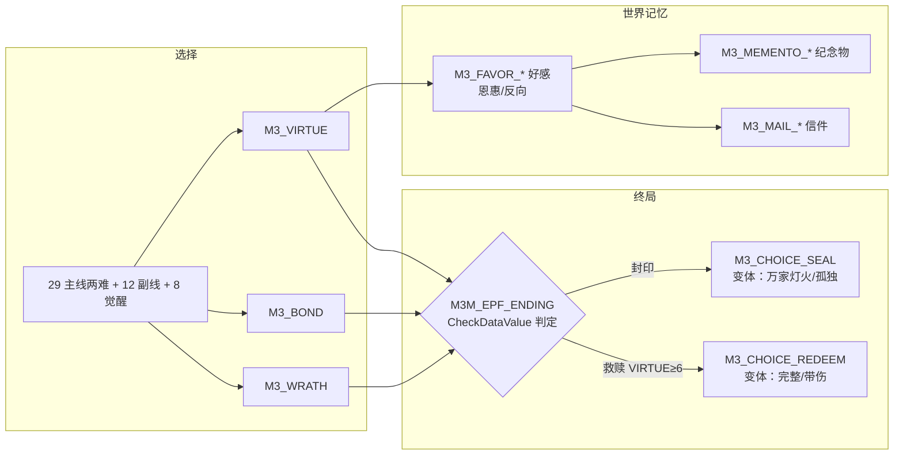

# Mir3 主线+副线任务设计 · 06 DataList 标记登记表

> 系列：Mir3 主线+副线任务完整设计（07 份）｜ 本文：06
> 日期：2026-08-12（v2 新增技能精通/两难抉择标记；**v3 新增三值/好感/纪念物/信件/称号/多人计数**）
> 依据：《MIR3_主线任务设计》第三章（DataList/DataValue 机制 + NPCDataType）、02/03/04/05 号文档（标记实际使用点）、
> **08/09/10/11 号文档（v3 新增：伏笔呼应/情感分值/剧情小说/多人任务）**
> 本文内容：全系列剧情标记（DataList）与剧情数值（DataValue）的**唯一登记表**——
> 防撞名约定（`M3_` 前缀、分类名全大写）、全部标记登记（含义/写入点/检查点/NPCDataType）、
> 副线计数（DataValue，非剧情）。
> **v2 新增**：技能精通标记（SKILL_MASTER_*，25 个）、技能已学回退标记（SKILL_LEARNED_*）、
> 两难抉择标记（DILEMMA_*）——服务于 04 号文档「已学三态处理」与主线两难抉择设计。
> **v3 新增（§9）**：三值体系（M3_VIRTUE/BOND/WRATH）、两难抉择 21 个（DILEMMA_*）、好感（M3_FAVOR_*）、
> 纪念物（M3_MEMENTO_*）、信件（M3_MAIL_*）、称号（M3_TITLE_*）、副线小抉择（M3S_CHOICE_*）、
> 多人任务计数（M3P_COUNT_*）、伏笔驱动（M3_FORESIGHT_*）——全量登记见 §9。

---

## 1. 命名约定（防撞名）

1. **剧情标记（DataList）**：一律以 `M3_` 为前缀，分类名全大写，语义化命名。
   格式：`M3_<语义>`（如 `M3_SHIP_SECRET`、`M3_EP1_DONE`、`M3_CHOICE_SEAL`）。
2. **剧情数值（DataValue）**：以 `M3_` 为前缀，用于主线数值（当前版本未启用，预留）；
   副线计数统一用 `M3S_COUNT_<语义>`（S=Side，仅计数，不驱动剧情分支）。
3. **技能精通标记（DataList，v2）**：以 `SKILL_MASTER_<技能>` 为前缀（如 `SKILL_MASTER_TENFOLD`）；
   **技能已学回退标记**：`SKILL_LEARNED_<技能>`（HasSkill 未实现前的等效方案）。
4. **两难抉择标记（DataList，v2）**：以 `DILEMMA_<语义>` 为前缀（如 `DILEMMA_ANTIDOTE`）。
5. **NPCDataType（值来源维度）**：全部剧情标记记录**玩家维度**（NPCDataType = Player）；
   副线计数同样 Player 维度。不使用怪物/物品维度（本系列无此需求）。
6. **登记纪律**：任何文档新增标记必须先在本表登记再使用；撞名/重名一律禁止；
   标记一经登记，语义不得变更（只能新增，不能修改/删除，避免存档冲突）。

### 1.1 命名速查

| 前缀 | 用途 | 示例 |
|------|------|------|
| `M3_` | 主线剧情标记（DataList）/ 主线数值（DataValue） | M3_SHIP_SECRET、M3_EP1_DONE |
| `SKILL_MASTER_` | 技能精通标记（DataList，v2） | SKILL_MASTER_TENFOLD |
| `SKILL_LEARNED_` | 技能已学回退标记（DataList，v2） | SKILL_LEARNED_TENFOLD |
| `DILEMMA_` | 两难抉择标记（DataList，v2+v3） | DILEMMA_ANTIDOTE、DILEMMA_DAGGER |
| `M3_VIRTUE` / `M3_BOND` / `M3_WRATH` | 三值体系（DataValue，v3：善缘/羁绊/煞气） | M3_VIRTUE ≥6 → 救赎线 |
| `M3_FAVOR_` | NPC 好感（DataValue 0-4，v3） | M3_FAVOR_DEXIU ≥1 → 9 折 |
| `M3_MEMENTO_` | 纪念物（DataList/持有，v3） | M3_MEMENTO_PIPE（老矿工烟斗） |
| `M3_MAIL_` | 信件触发（DataList，v3） | M3_MAIL_AGUI（阿贵的信） |
| `M3_TITLE_` | 称号（DataList，v3） | M3_TITLE_VIRTUOUS（比奇善人） |
| `M3_FORESIGHT_` | 伏笔驱动（DataList，v3） | M3_FORESIGHT_LOG（名册已读） |
| `M3S_CHOICE_` | 副线小抉择（DataValue，v3，仅副线内部） | M3S_CHOICE_DAVID |
| `M3P_COUNT_` | 多人任务计数（DataValue，v3） | M3P_COUNT_DOOMCLAW |
| `M3S_COUNT_` | 副线计数（DataValue，仅计数） | M3S_COUNT_DAILY |
| `M3M_` / `M3K_` / `M3S_` / `M3P_` | 任务 ID 前缀（非标记，见 07 号总表） | M3M_EP1_BOSS、M3P_SIEGE_SABAK 等 |

---

## 2. 剧情标记总登记（DataList，全部 Player 维度）

### 2.1 章节进度标记

| 分类名 | 含义 | 写入点（NPC/任务） | 检查点（NPC/任务） | 备注 |
|--------|------|--------------------|--------------------|------|
| M3_EP1_DONE | 第一章完成 | M3M_EP1_BOSS 交付（万事通 AddDataList） | 第二章任务接取条件 | 章节进度链 |
| M3_EP2_DONE | 第二章完成 | M3M_EP2_BOSS 交付（王大人） | 第三章任务接取条件 | |
| M3_EP3_DONE | 第三章完成 | M3M_EP3_BOSS 交付（万事通） | 第四章任务接取条件 | |
| M3_EP4_DONE | 第四章完成 | M3M_EP4_BOSS 交付（万事通） | 第五章任务接取条件 | |
| M3_EP5_DONE | 第五章完成 | M3M_EP5_BOSS 交付（万事通） | 第六章任务接取条件 | |
| M3_EP6_DONE | 第六章完成 | M3M_EP6_BOSS 交付（圣女月见） | 终章任务接取条件 | |
| M3_EPF_OPENED | 已登上神舰 | M3M_EPF_OPEN 交付（老艄公） | M3M_EPF_LOG 接取 | 终章登船记录 |
| M3_EPF_DONE | 终章完成（结局选定） | M3M_EPF_ENDING 交付（船灵阿澜） | 结局后 NPC 对话（万事通留影） | 结局唯一性 |

> 说明：M3_EPx_DONE 系列既是任务链前置（QuestRequirement.HaveCompleted 亦可用），
> 也是 NPC 对话树的剧情深度开关（CheckDataList）。

### 2.2 真相/情报标记

| 分类名 | 含义 | 写入点 | 检查点 | 备注 |
|--------|------|--------|--------|------|
| M3_SHIP_HINT | 三线各自的神舰伏笔线索 | 02 号：PW4「追问船的事」/ PM2「按下不表」/ PM3「立即深入」/ PT3「追问」/ PT4「先问清船的事」 | M3M_EP1_CONVERGE 万事通对话（按持有数 1-3 档情报深度） | 三线共用同一分类，CheckDataList 计数判定 |
| M3_SHIP_SECRET | 得知神舰真相（表层：海上大船是牢笼） | M3M_EP1_CONVERGE「信」分支（万事通） | M3M_EP1_SHIPSONG 对歌页；M3M_EPF_LOG 接取 | 表层真相 |
| M3_SHIP_TRUTH | 得知神舰真相（深层：万事通=第一代船长、震天魔神=被感染神族） | M3M_EPF_TRUTH 万事通真身现身页 | M3M_EPF_ENDING 接取 | 深层真相，终章解锁 |
| M3_MINER_SAVED | 老矿工三线汇合确认（三态合一） | M3M_EP1_CONVERGE 完成（万事通） | 第一章 NPC 对话（老矿工归位）；M3M_EP1_SHIPSONG 接取 | 汇合任务完成标记 |

### 2.3 分支选择标记（对话树）

| 分类名 | 含义 | 写入点 | 检查点 | 备注 |
|--------|------|--------|--------|------|
| M3_ESCORT_STRONG | 商路护卫选择硬闯蛇王 | M3M_PW2_ESCORT「硬闯过去」页 | 蛇王掉落/奖励差异（无后续剧情依赖，彩蛋） | 战士线序章 |
| M3_RAID_PERSUADE | 半兽人据点劝降成功 | M3M_PW3_HALFRAID Random 成功页 | 后续 NPC 彩蛋对话 | 掷骰子分支示范 |
| M3_TAOIST_HINT | 提前撞见云逸堕落痕迹 | M3M_PT2_TALISMAN「循足迹深入」 | M3M_EP3_TAOIST 对峙特殊对话（和解线解锁额外台词） | 道士线伏笔 |
| M3_WANG_TRUST | 向王大人如实上报 | M3M_EP2_WANG「如实上报」 | 二章后续任务奖励加成（军需支援）；五章王大人对话 | 二章分支① |
| M3_CURSED_TAOIST_FRIEND | 与堕落道士云逸和解 | M3M_EP3_TAOIST「提起道馆旧事」 | ① M3K_WAR_FLAME / M3K_TAO_GHOSTSHIELD 接取（和解线）；② 终章救赎线善缘判定 | 三章分支②＋终章善缘 |
| M3_NUMA_PACT | 接受诺玛秘仪邀请（与诺玛化敌为友） | M3M_EP5_NUMA「接受秘仪邀请」 | ① M3M_EP5_SCRIBE 接取对话升级；② 终章救赎线善缘判定 | 五章分支③＋终章善缘 |
| M3_PANYA_TRUST | 相信夜枭（潘夜内应） | M3M_EP6_RITE「相信夜枭」 | ① M3M_EP6_BOSS 夜枭内应线（额外奖励）；② 终章救赎线善缘判定 | 六章分支④＋终章善缘 |

### 2.4 终章结局标记（互斥）

| 分类名 | 含义 | 写入点 | 检查点 | 备注 |
|--------|------|--------|--------|------|
| M3_CHOICE_SEAL | 终章选择：封印（神舰永镇） | M3M_EPF_ENDING「封印」按钮 | 结局后奖励/称号/万事通留影对话 | 与 REDEEM 互斥 |
| M3_CHOICE_REDEEM | 终章选择：救赎（净化神魔，神舰扬帆） | M3M_EPF_ENDING「救赎」按钮（需善缘标记 ≥2） | ① 结局奖励/称号；② M3K_MAG_SOULBIND / M3K_TAO_REVIVE 接取（救赎线专属技能） | 与 SEAL 互斥 |

> 终章善缘判定（M3M_EPF_ENDING 救赎按钮前置）：
> CheckDataList M3_CURSED_TAOIST_FRIEND / M3_NUMA_PACT / M3_PANYA_TRUST 三者中 **至少 2 项** 成立。

### 2.5 技能精通标记（v2 新增，25 个）

> 用途：已学三态处理之「精通」——玩家已学会后期技能（买书/其他途径）后，觉醒任务变为精修链，
> 完成时写入 `SKILL_MASTER_<技能>` 标记（供称号发放/后续链接取/终章善缘等 CheckDataList 判定）。
> 与技能书交付时的 `SKILL_LEARNED_<技能>`（§2.7）区分：LEARNED=已习得技能，MASTER=精通链完成。
> 全部 Player 维度，写入点 = 各史诗链终环交付 NPC（精通分支）。

| 分类名 | 含义 | 写入点（NPC/任务） | 检查点 | 备注 |
|--------|------|--------------------|--------|------|
| SKILL_MASTER_FLAME | 烈火剑法精通 | M3K_WAR_FLAME_C6 精通分支（云逸） | 称号「火中取粟」发放；后续链接取 | 战士 T3 |
| SKILL_MASTER_SOAR | 翔空剑法精通 | M3K_WAR_SOAR_C7 精通分支（石翁） | 称号「凌云客」发放 | 战士 T3 |
| SKILL_MASTER_LOTUS | 莲月剑法精通 | M3K_WAR_LOTUS_C8 精通分支（月见） | 称号「月下送行人」发放 | 战士 T4 |
| SKILL_MASTER_TENFOLD | 十方斩精通 | M3K_WAR_TENFOLD_C9 精通分支（阿澜） | 称号「守船人」发放 | 战士 T4 |
| SKILL_MASTER_PUSH | 乾坤大挪移精通 | M3K_WAR_PUSH_C9 精通分支（关铁山） | 称号「四两拨千斤」发放 | 战士 T5·转生 |
| SKILL_MASTER_IRON | 铁布衫精通 | M3K_WAR_IRON_C9 精通分支（关铁山） | 称号「铜墙铁壁」发放 | 战士 T5·转生 |
| SKILL_MASTER_COUNTER | 斗转星移精通 | M3K_WAR_COUNTER_C10 精通分支（赵四海） | 称号「以彼之道」发放 | 战士 T5·转生 |
| SKILL_MASTER_FINAL | 破血狂杀精通 | M3K_WAR_FINAL_C10 精通分支（阿澜） | 称号「血誓守护者」发放 | 战士 T5·转生 |
| SKILL_MASTER_EXPLODE | 爆裂火焰精通 | M3K_MAG_EXPLODE_C6 精通分支（素心） | 称号「一炸惊林」发放 | 法师 T3 |
| SKILL_MASTER_STORM | 地狱雷光精通 | M3K_MAG_STORM_C6 精通分支（莫白石） | 称号「敬雷者」发放 | 法师 T3 |
| SKILL_MASTER_BLIZZARD | 冰咆哮精通 | M3K_MAG_BLIZZARD_C7 精通分支（莫白石） | 称号「寒潮使者」发放 | 法师 T3 |
| SKILL_MASTER_TORNADO | 龙卷风精通 | M3K_MAG_TORNADO_C7 精通分支（阿岚） | 称号「听风者」发放 | 法师 T3 |
| SKILL_MASTER_SPIKE | 魄冰刺精通 | M3K_MAG_SPIKE_C8 精通分支（莫白石） | 称号「冰魄针锋」发放 | 法师 T4 |
| SKILL_MASTER_THUNDER | 怒神霹雳精通 | M3K_MAG_THUNDER_C9 精通分支（莫白石） | 称号「雷神之怒」发放 | 法师 T4 |
| SKILL_MASTER_METEOR | 焰天火雨精通 | M3K_MAG_METEOR_C9 精通分支（素心） | 称号「火雨倾天」发放 | 法师 T5·转生 |
| SKILL_MASTER_SOULBIND | 凝血离魂精通 | M3K_MAG_SOULBIND_C10 跳过分支（万事通） | 称号「魂契者」发放 | 法师 T5·剧情专属（跳过） |
| SKILL_MASTER_BEAST | 召唤神兽精通 | M3K_TAO_BEAST_C6 精通分支（玄真） | 称号「御兽人」发放 | 道士 T3 |
| SKILL_MASTER_GROUPHEAL | 群体治愈术精通 | M3K_TAO_GROUPHEAL_C6 精通分支（月见） | 称号「万家生佛」发放 | 道士 T3 |
| SKILL_MASTER_SUPERSKEL | 超强召唤骷髅精通 | M3K_TAO_SUPERSKEL_C6 精通分支（阿丑） | 称号「百战之骨」发放 | 道士 T3 |
| SKILL_MASTER_TIGER | 猛虎强势精通 | M3K_TAO_TIGER_C7 精通分支（月见） | 称号「虎啸山林」发放 | 道士 T3 |
| SKILL_MASTER_REVIVE | 回生术精通 | M3K_TAO_REVIVE_C7 跳过分支（清微） | 称号「救赎者」发放 | 道士 T3·剧情专属（跳过） |
| SKILL_MASTER_CLOUD | 云寂术精通 | M3K_TAO_CLOUD_C8 精通分支（清微） | 称号「云过无声」发放 | 道士 T4 |
| SKILL_MASTER_MIRROR | 移花接玉精通 | M3K_TAO_MIRROR_C9 精通分支（玄真） | 称号「接花还玉」发放 | 道士 T4 |
| SKILL_MASTER_SHADOW | 妙影无踪精通 | M3K_TAO_SHADOW_C9 精通分支（玄真） | 称号「来去无踪」发放 | 道士 T5·转生 |
| SKILL_MASTER_RING | 阴阳法环精通 | M3K_TAO_RING_C10 精通分支（清微） | 称号「阴阳法环」发放 | 道士 T5·转生 |

> 落地说明：技能经验（LevelMagic）奖励为「待服务端扩展」能力；已学检测用 `NPCCheck.HasSkill`
> （待服务端扩展），回退方案用 `SKILL_LEARNED_<技能>` 标记近似（见 §2.7）。

### 2.6 两难抉择标记（v2 新增登记，DILEMMA_ 前缀）

> 原则：**两难抉择必须标记化**——选择用 AddDataList 记录，后续 NPC/剧情用 CheckDataList 分支反映，
> 让玩家的选择"被记得"，代价可见（失去的 NPC 不再出现/态度变化）。登记纪律同 §1。
> 命名约定：`DILEMMA_<语义>`（Player 维度）；取值用分类内成员标记（DataList 分类名）或 DataValue 记录选择值。

| 分类名 | 含义 | 写入点（NPC/任务） | 检查点 | 代价/反映 |
|--------|------|--------------------|--------|----------|
| DILEMMA_ANTIDOTE | 四章·资源两难：唯一解药救小丫（猎户侄女）还是救阿贵（药铺帮工） | M3M_EP4_SPIDER 抉择页（老白）：`[救小丫]` / `[救阿贵]` 两 Button 各自 AddDataList | ①五章万事通对话 CheckDataList 分支；②六章老白托弓（救阿贵线额外道具）；③灌木林 NPC 态度 | 救小丫→阿贵死（瞎眼老娘不再出现）；救阿贵→小丫死（老白寡言、弓挂坟头） |
| DILEMMA_REPORT_TAOIST | 三章·忠义两难：向王大人举报堕落道士云逸（获官职）还是放走他（获道友情谊但被通缉） | M3M_EP3_TAOIST 对峙页（万事通）：举报/放走 两 Button（与 M3_CURSED_TAOIST_FRIEND 联动） | ①M3K_WAR_FLAME / M3K_TAO_GHOSTSHIELD 接取（和解线）；②终章救赎善缘判定；③比奇官府对话（举报线官职奖励） | 举报→云逸被通缉（道馆封口、获官职奖励）；放走→获道友情谊（善缘 +1） |
| M3_WANG_TRUST | 二章·忠义两难：向王大人如实上报矿中异象还是隐瞒 | M3M_EP2_WANG「如实上报」 | 二章后续军需支援；五章王大人对话 | 隐瞒→军需奖励减少（王大人态度变化） |
| M3_NUMA_PACT | 五章·道义两难：接受诺玛秘仪邀请（化敌为友）还是拒绝（保住封印立场） | M3M_EP5_NUMA「接受秘仪邀请」 | ①M3M_EP5_SCRIBE 接取升级；②终章救赎善缘判定 | 接受→诺玛为友（善缘 +1）；拒绝→强攻秘仪广场 |
| M3_PANYA_TRUST | 六章·信任两难：相信夜枭（潘夜内应）还是怀疑他 | M3M_EP6_RITE「相信夜枭」 | ①M3M_EP6_BOSS 内应线额外奖励；②终章救赎善缘判定 | 相信→牛魔王战内应协助；怀疑→强攻 |
| M3_CHOICE_SEAL / M3_CHOICE_REDEEM | 终章·牺牲两难：封印（牺牲神舰与老矿工）vs 救赎（冒黑度反噬风险） | M3M_EPF_ENDING 抉择页（阿澜）双 Button | 结局奖励/称号；救赎线专属技能（凝血离魂/回生术）接取 | 封印→神舰永沉（万事通守船长眠）；救赎→净化神魔（需善缘 ≥2，冒反噬风险） |

> 每章两难覆盖核对：一章（13-15）无强制两难（新手期友好）✅ 按 §3.4"每章至少 1 处，后期章节 2 处"——
> 二章 WANG_TRUST、三章 REPORT_TAOIST、四章 ANTIDOTE、五章 NUMA_PACT、六章 PANYA_TRUST、终章 SEAL/REDEEM；
> 后期章节（五/六/终）各 ≥2 处 ✅。

### 2.7 技能已学检测标记（v2 新增，回退方案）

> 用途：已学三态处理的前提是"服务端可检测玩家是否已学会某技能"（`NPCCheck.HasSkill`，**待服务端扩展**）。
> 服务端未实现 HasSkill 前的回退方案：技能书交付时 AddDataList `SKILL_LEARNED_<技能>`，
> 任务接取页用 CheckDataList 分流（已学 → 精通/跳过分支）。技能书购买/其他途径习得时由服务端补写该标记。

| 分类名 | 含义 | 写入点 | 检查点 | 备注 |
|--------|------|--------|--------|------|
| SKILL_LEARNED_<技能>（如 SKILL_LEARNED_TENFOLD） | 玩家已习得某技能 | 技能书交付（NPC GiveItem 时 AddDataList）；商城/黑市购买技能书（服务端补写） | 对应觉醒任务接取页 CheckDataList → 精通/跳过分支 | 与 HasSkill 等效；服务端实现 HasSkill 后此标记可停用（保留兼容） |

> 已学三态总览：**换奖品**（10 本 M3M_ + 26 简单觉醒：无 SKILL_LEARNED 分支，仅奖励替换，对话走 HasItem/对话按钮）／
> **精通**（25 条史诗链：HasSkill/CheckDataList SKILL_LEARNED_* → 精修链，完成写 SKILL_MASTER_*）／
> **跳过**（凝血离魂/回生术：剧情专属，已学 → 直接剧情奖励 + SKILL_MASTER_*）。

---

## 3. 剧情数值登记（DataValue，主线）

> 当前版本主线未使用 DataValue 做数值驱动（全部用 DataList 布尔标记即可表达）。
> 以下为**预留命名空间**，供后续扩展（如"收集物计数/善缘点数/章节评级"），登记后使用。

| 分类名 | 含义 | 建议用途 | 备注 |
|--------|------|---------|------|
| M3_KARMA | 善缘点数（救赎线数值版） | 若将来把"善缘标记 ≥2"改为点数制（每项 +1，≥2 开启救赎） | 预留，当前用 CheckDataList 组合实现 |
| M3_RELIC_COUNT | 叙事道具持有计数 | 终章拼图若改用计数校验（7/7） | 预留，当前用 GainItem 多步骤校验 |

---

## 4. 副线计数登记（DataValue，非剧情）

> 边界约定：副线**不产生 DataList 剧情标记**；仅用 DataValue 计数（累计奖励/称号兑换门槛），
> 计数不驱动任何剧情分支。全部 Player 维度。

| 分类名 | 含义 | 累加点（任务） | 兑换/奖励门槛 | 备注 |
|--------|------|---------------|---------------|------|
| M3S_COUNT_DAILY | 万事通悬赏板·每日完成次数 | M3S_BOARD_DAILY 完成 | 累计 30 次 → 「悬赏老手」称号 | ChangeDataValue +1 |
| M3S_COUNT_WEEKLY | 万事通悬赏板·周常完成次数 | M3S_BOARD_WEEKLY 完成 | 累计 10 次 → 「万事通座上宾」称号（CheckFame 联动） | |
| M3S_COUNT_BOSS | 赏金 BOSS 讨伐次数 | M3S_BOUNTY_BOSS 完成 | 累计 5 次 → 「赏金猎人」称号 | |
| M3S_COUNT_ELEMENT | 元素采集完成次数 | M3S_GATHER_ELEMENT 完成 | 满 7 次 → 兑换元素护身符（法师专属） | |
| M3S_COUNT_ABSOLVE | 亡灵超度完成次数 | M3S_TAO_ABSOLVE 完成 | 满 10 次 → 「超度大师」称号 | |
| M3S_COUNT_TRIAL | 武器试炼完成次数 | M3S_WAR_TRIAL 完成 | 满 5 次 → 武器精炼券 ×1 | |

---

## 5. NPCDataType 说明（值来源维度）

| NPCDataType | 含义 | 本系列使用 |
|-------------|------|-----------|
| Player | 记录玩家名维度（该玩家是否在列表中 / 该玩家的数值） | ✅ 全部剧情标记与副线计数 |
| Monster / Item / Map 等 | 记录怪物/物品/地图维度 | ❌ 本系列不使用 |

> 落库建议：DataList 分类名直接使用本文 §2 的分类名（如 `M3_SHIP_SECRET`）；
> AddDataList(StringParameter1=分类名, IntParameter1=NPCDataType.Player)。

---

## 6. 标记使用全景（写入→检查依赖图）

```mermaid
flowchart LR
    subgraph 序章
    H1[M3_SHIP_HINT<br/>三线可选写入]
    end
    subgraph 一章
    C1[M3M_EP1_CONVERGE<br/>Check M3_SHIP_HINT] --> S1[M3_SHIP_SECRET<br/>「信」分支]
    C1 --> M1[M3_MINER_SAVED<br/>汇合完成]
    end
    subgraph 二~六章
    E1[M3_EP1_DONE] --> E2[M3_EP2_DONE]
    E2 --> E3[M3_EP3_DONE]
    E3 --> E4[M3_EP4_DONE]
    E4 --> E5[M3_EP5_DONE]
    E5 --> E6[M3_EP6_DONE]
    W1[M3_WANG_TRUST<br/>二章分支]
    T1[M3_CURSED_TAOIST_FRIEND<br/>三章分支]
    N1[M3_NUMA_PACT<br/>五章分支]
    P1[M3_PANYA_TRUST<br/>六章分支]
    end
    subgraph 终章
    E6 --> O1[M3_EPF_OPENED]
    O1 --> L1[M3_SHIP_TRUTH<br/>深层真相]
    L1 --> EN[M3_EPF_ENDING<br/>双结局]
    T1 & N1 & P1 --> EN
    EN -->|封印| SEAL[M3_CHOICE_SEAL]
    EN -->|救赎 善缘≥2| RED[M3_CHOICE_REDEEM]
    RED --> K1[M3K_MAG_SOULBIND / M3K_TAO_REVIVE<br/>救赎线专属觉醒]
    end
```

---

## 7. 检查/登记纪律

1. 新增标记先在本表登记（含写入点与检查点），再在 02/03/04/05 号文档中使用。
2. 标记名一经登记不得修改语义；如需变更，新建标记并废弃旧标记（在表中标注「已废弃」）。
3. 主线剧情标记一律 `M3_` 前缀；技能精通/已学用 `SKILL_MASTER_` / `SKILL_LEARNED_`；两难抉择用 `DILEMMA_`；
   副线计数一律 `M3S_COUNT_`；任务 ID 前缀（M3M_/M3K_/M3S_）不参与标记命名。
4. 副线禁止写 AddDataList（边界约定）；如有副线需要剧情联动，升级为主线任务并登记标记。
5. 终章双结局互斥标记（SEAL/REDEEM）：由 M3M_EPF_ENDING 交付逻辑保证只写其一（按钮互斥）。
6. 两难抉择标记（DILEMMA_*）由抉择页双 Button 各写其一；后续 NPC 必须 CheckDataList 分支反映（代价可见）。
7. 技能精通标记（SKILL_MASTER_*）仅由精通/跳过分支写入；与 SKILL_LEARNED_*（已学检测）语义分离，不得混用。

---

## 8. 登记汇总（快速索引）

| 类别 | 标记/数值 | 数量 |
|------|----------|------|
| 章节进度（DataList） | M3_EP1_DONE ~ M3_EP6_DONE、M3_EPF_OPENED、M3_EPF_DONE | 8 |
| 真相情报（DataList） | M3_SHIP_HINT、M3_SHIP_SECRET、M3_SHIP_TRUTH、M3_MINER_SAVED | 4 |
| 分支选择（DataList） | M3_ESCORT_STRONG、M3_RAID_PERSUADE、M3_TAOIST_HINT、M3_WANG_TRUST、M3_CURSED_TAOIST_FRIEND、M3_NUMA_PACT、M3_PANYA_TRUST | 7 |
| 结局（DataList） | M3_CHOICE_SEAL、M3_CHOICE_REDEEM | 2 |
| 技能精通（DataList，v2） | SKILL_MASTER_FLAME ~ RING（25 个，§2.5） | 25 |
| 技能已学回退（DataList，v2） | SKILL_LEARNED_<技能>（§2.7，HasSkill 待服务端扩展） | 动态 |
| 两难抉择（DataList，v2） | DILEMMA_ANTIDOTE、DILEMMA_REPORT_TAOIST（+ 归类 M3_WANG_TRUST 等 5 处） | 2 新增 + 5 归类 |
| 主线数值（DataValue，预留） | M3_KARMA、M3_RELIC_COUNT | 2 |
| 副线计数（DataValue） | M3S_COUNT_DAILY、WEEKLY、BOSS、ELEMENT、ABSOLVE、TRIAL | 6 |
| **v2 小计** | | **54 ＋ 动态** |
| 三值体系（DataValue，v3） | M3_VIRTUE、M3_BOND、M3_WRATH（§9.1） | 3 |
| 两难抉择（DataList，v3） | DILEMMA_DAGGER/SCROLL/SNAKEKING/BONEPOWDER/JADE/ROBE/TREASURE/CANYON/SACRIFICE/STELE/GUARDIAN/TABLET/SCRIBE/TULAN/PURIFY/PASS/HORN/OLDMINER/COMPANION/ROSTER/PENDANT（§9.2） | 21 |
| 副线小抉择（DataValue，v3） | M3S_CHOICE_*（§9.3） | 12 |
| NPC 好感（DataValue，v3） | M3_FAVOR_<NPC>（§9.4） | 30 |
| 纪念物（DataList，v3） | M3_MEMENTO_*（§9.5） | 13 |
| 信件触发（DataList，v3） | M3_MAIL_*（§9.6） | 10 |
| 称号（DataList，v3） | M3_TITLE_*（§9.7） | 12 |
| 伏笔驱动（DataList，v3） | M3_FORESIGHT_*（§9.8） | 4 |
| 多人计数（DataValue，v3） | M3P_COUNT_*（§9.9） | 6 |
| **v3 小计** | | **111** |
| **总计** | | **165 ＋ 动态** |

---

## 9. v3 新增登记（三值/两难/好感/纪念物/信件/称号/伏笔/多人）

> v3 依据：08（伏笔呼应）、10（情感与分值）、11（多人任务）。登记纪律同 §1/§7。
> 全部 Player 维度；标记语义一经登记不得修改（§7 纪律 2）。

### 9.1 三值体系（DataValue，v3）

| 数值 | 含义 | 写入点（ChangeDataValue） | 检查点（CheckDataValue） | 备注 |
|------|------|--------------------------|--------------------------|------|
| M3_VIRTUE | 善缘值（侠义/救赎/无私） | 各两难善缘选项（10 号 §2/§3/§4 全表） | 终章救赎线门槛（≥6）；称号「比奇善人」（≥15） | 与 v2 善缘标记互认（标记写入时同步 +2） |
| M3_BOND | 羁绊值（情谊/信任/承诺） | 各两难羁绊选项 | 称号「万家灯火」（≥15）；封印·万家灯火变体（≥12） | — |
| M3_WRATH | 煞气值（杀戮/功利/冷酷） | 各两难煞气选项 | 救赎按钮灰置（≥10）；称号「血手」（≥15）；封印·孤独变体（≥12） | 高煞气封印线专属差分 |

> 实现：NPCAction.ChangeDataValue（分类 = M3_VIRTUE/M3_BOND/M3_WRATH，±N）；
> 检查 NPCCheck.CheckDataValue（Operator ≥ / <）。分值表见 10 号 §2/§3/§4。

### 9.2 两难抉择标记（DataList，v3 新增 21 个）

> 与 v2 的 DILEMMA_ANTIDOTE / DILEMMA_REPORT_TAOIST 及归类标记（M3_WANG_TRUST 等 5 处）并列。
> 全部由抉择页双 Button 各写其一；后续 NPC CheckDataList 分支反映（代价可见，10 号 §2 分值表）。

| 分类名 | 含义 | 写入点（任务/抉择页） | 检查点 | 代价/反映 |
|--------|------|----------------------|--------|----------|
| DILEMMA_DAGGER | 序章·匕首去留 | M3M_PW1 抉择页（交出/保留） | 三章德秀（T1 奖励转移） | 交出→金氏人情+精铁匕首；保留→金氏失望 |
| DILEMMA_SCROLL | 序章·船文拓片去向 | M3M_PM2 抉择页（交万事通/留书斋） | 五章万事通情报；四章圣言破译 | 交→万事通情报线；留→拓片免跑 |
| DILEMMA_SNAKEKING | 一章·蛇王去留 | M3M_PW2 抉择页（硬闯/绕道） | 五章蛇王报恩（T2） | 硬闯→蛇胆；绕道→五章蛇群引路 |
| DILEMMA_BONEPOWDER | 一章·骨粉去向 | M3M_EP1_MINER 抉择页（留老矿工/卖药铺） | 一章 BOSS 战难度；老矿工好感 | 留→刺杀剑术提前；卖→药铺好感 |
| DILEMMA_JADE | 二章·老矿工亡妻的玉 | M3M_EP2_CART 抉择页（还家属/私藏） | 老矿工好感；德秀收购（T4） | 还→精炼券+亲传；私藏→德秀高价 |
| DILEMMA_ROBE | 二章·尸王殿道袍 | M3M_EP2_BOSS 抉择页（带走超度/扒法器） | 三章云逸（T5） | 超度→云逸和解秘笈；扒→法器收益 |
| DILEMMA_TREASURE | 三章·沃玛窖藏 | M3M_EP3_CORE 抉择页（只取碎片/顺手取） | 六章沃玛祝福（T6）；五章商队价格 | 只取→火灵祝福；取→商队抬价 |
| DILEMMA_CANYON | 三章·虫峡谷少年 | M3M_EP3_BUGS 抉择页（先救/先采） | 四章后石阁庙隐藏剧情（T7） | 救→虫甲副线加成；采→钟伯失孙 |
| DILEMMA_SACRIFICE | 三章·烈火献祭 | M3K_WAR_FLAME_C4 抉择页（献珍品/放弃） | 火灵印记；云逸好感 | 献→印记+敬重；弃→环奖励 -50% |
| DILEMMA_STELE | 四章·祖玛古碑 | M3M_EP4_ANGER 抉择页（半图/全图） | 六章石翁战甲（T9） | 半图→战甲；全图→教主难度+ |
| DILEMMA_GUARDIAN | 四章·舵轮老卫士 | M3M_EP4_RUDDER 抉择页（守护至死/迷香） | 终章祖玛挡刀（T10） | 尊重→终章护盾；迷香→无回响 |
| DILEMMA_TABLET | 四章·剑法拓片 | M3M_EP4_KEEL 抉择页（留祖玛/私吞） | 翔空链亲传加成；石翁好感 | 留→亲传+5%；私吞→进度快 |
| DILEMMA_SCRIBE | 五章·水手私语 | M3M_EP5_SCRIBE 抉择页（交万事通/卖图兰） | 终章罗盘用法（T11） | 交→善缘判定+1 档；卖→金币+万事通失望 |
| DILEMMA_TULAN | 五章·重伤图兰 | M3M_EP5_BOSS 抉择页（圣水救/取镜片） | 六章图兰赠礼；结局来信 | 救→罗盘仿品+来信；取→终章无援 |
| DILEMMA_PURIFY | 六章·净化/斩杀神族 | M3M_EP6_PANYA 抉择页（净化/斩杀） | 六章 BOSS 战神族倒戈；月见好感 | 净化→倒戈；斩杀→残部冷漠 |
| DILEMMA_PASS | 六章·第二份通行证 | M3M_EP6_PASS 抉择页（交月见/卖黑市） | 终章船灵感谢；黑市副线 | 交→船灵感谢；卖→黑市利益 |
| DILEMMA_HORN | 六章·牛魔王之角 | M3M_EP6_BOSS 抉择页（送圣地/铸神兵） | 终章潘夜船员（T13）；月见好感 | 送→船员+纪念物；铸→神兵 |
| DILEMMA_OLDMINER | 六章·老矿工挡刀 | M3M_EP6_BOSS 抉择页（替他挡/让他挡） | 终章船员名册剧情；刺杀剑术链 | 挡→吊坠碎+名册完整；让→老矿工失忆 |
| DILEMMA_COMPANION | 终章·带谁上船 | M3M_EPF_OPEN 抉择页（带故人/独行） | 结局差分（故人命运线） | 带→羁绊+2 差分；独行→标准结局 |
| DILEMMA_ROSTER | 终章·名册页 | M3M_EPF_LOG 抉择页（找回/不找） | 老矿工身份回收（F45） | 找回→善缘+羁绊+情感核弹；不找→留白 |
| DILEMMA_PENDANT | 终章·吊坠保魂 | M3M_EPF_TRUTH 抉择页（保万事通魂/自用） | 结局告别台词（T14） | 保→吊坠碎+完整告别；自用→告别缺半句 |

### 9.3 副线小抉择（DataValue，v3，12 个）

> 边界：副线小抉择**不产生 DataList 剧情标记**（§1 纪律 4）；用 `M3S_CHOICE_*` 短效计数/好感
> （DataValue，仅影响副线内部：失主点头致意/口耳相传/小店优惠）。分值表见 10 号 §3。

| 数值 | 含义 | 累加点（副线任务） | 影响 |
|------|------|-------------------|------|
| M3S_CHOICE_DAVID | 大卫钥匙·追查木牌主人 | M3S_KEY_DAVID | 大卫道歉（情感回响） |
| M3S_CHOICE_GRESHAM | 格雷沙姆日记·找画 | M3S_JOURNAL_GRESHAM | 画合璧赠画 |
| M3S_CHOICE_CURE | 解药·先救路人 | M3S_CURE_POISON1-6 | 解药线减 1 环 |
| M3S_CHOICE_FISH | 渔获·放生孕鱼 | M3S_GATHER_FISH | 渔夫敬重 |
| M3S_CHOICE_HERB | 药草·留灵芝 | M3S_GATHER_HERB | 阿丑知己 |
| M3S_CHOICE_ORE | 矿脉·墓碑送墓园 | M3S_GATHER_ORE | 阿丑道谢 |
| M3S_CHOICE_LOOKOUT | 望海楼·分酒 | M3S_RUN_LOOKOUT | 五章沙漠向导彩蛋 |
| M3S_CHOICE_MAIL | 送信·按地址送 | M3S_RUN_MAIL | 家属谢礼 |
| M3S_CHOICE_ELEPHANT | 大象·救幼象 | M3S_BOUNTY_ELEPHANT | 象群不再袭人 |
| M3S_CHOICE_FLEA | 跳蚤洞·救幼猫狗 | M3S_BOUNTY_FLEA | 村口猫狗+外号 |
| M3S_CHOICE_BONES | 收骨·上报官府 | M3S_TAO_BONES | 破案重谢 |
| M3S_CHOICE_DAILY | 悬赏板·放生带崽猎物 | M3S_BOARD_DAILY | 周悬赏 +10% |

### 9.4 NPC 好感（DataValue，v3，30 个）

> 取值 0-4：0 初识 → 1 相熟 → 2 深交 → 3 挚友。增长：任务链完成＋两难加分；下降：煞气选择/举报/弃人。
> 检查：NPCCheck.CheckDataValue（如 M3_FAVOR_DEXIU ≥1 → 价格分支）。恩惠表见 10 号 §7。

| 数值 | NPC | 相熟恩惠 | 深交恩惠 | 挚友恩惠 |
|------|-----|---------|---------|---------|
| M3_FAVOR_MASTER | 万事通 | 见面喊名＋船歌谣点拨 | 每日 BOSS 情报 | 罗盘/最后一封信 |
| M3_FAVOR_OLDMINER | 老矿工·陈永年 | 刺杀链提前 | 矿工便当＋铜哨升级 | 船员名册完整＋留船 |
| M3_FAVOR_WANG | 王大人 | 军需 9 折 | 官职推荐（声望/章） | 辞官归隐差分 |
| M3_FAVOR_JIN | 金氏 | 每日肉汤 | 老战友回忆（王大人线加分） | — |
| M3_FAVOR_DEXIU | 德秀 | 每天 9 折 | 炼制成功率 +5% | 铁花告白＋免费精炼 |
| M3_FAVOR_BAILI | 白莉 | 每天首谈送 1 药 | 免费包扎 | 平安符＋铁花见证 |
| M3_FAVOR_SUXIN | 素心 | 每日魔法药 | 四系启蒙提前 | 元素亲和加成 |
| M3_FAVOR_MOBAISHI | 莫白石 | 书斋借阅 | 圣言破译免一环 | 秘法笔记 |
| M3_FAVOR_ALAN | 阿岚 | 风铃寄语 | 每日风灵碎羽 | 听风者亲传加成 |
| M3_FAVOR_XUANZHEN | 玄真 | 道观客房 | 每日护身符 | 掌门托付差分 |
| M3_FAVOR_ACHOU | 阿丑 | 收骨优先 | 每日香灰 | 无名骨名字簿 |
| M3_FAVOR_QINGWEI | 清微 | 月下古井恢复 | 回生术线索提前 | 月下之约 |
| M3_FAVOR_YUNYI | 云逸（和解线） | 黑符情报 | 亲传加成 | 桂花树约定 |
| M3_FAVOR_SHIWENG | 石翁 | 祖玛情报 | 祖玛战甲 | 古碑剑法亲传 |
| M3_FAVOR_LAOBAI | 老白 | 狩猎情报 | 每日肉食 | 祖传弓 |
| M3_FAVOR_XIAOYA | 小丫 | 红绳 | 每日野果 | 涂鸦信 |
| M3_FAVOR_ZHONGBO | 钟伯 | 石阁庙茶 | 虫甲副线加成 | 小钟剧情＋隐藏任务 |
| M3_FAVOR_TULAN | 图兰 | 沙漠向导 | 圣言优先 | 罗盘仿品＋来信 |
| M3_FAVOR_LAOSHAOGONG | 老艄公 | 摆渡免费 | 沉船礁情报 | 船歌谣后半＋送行曲 |
| M3_FAVOR_YUEJIAN | 月见 | 神族挽歌 | 群体治愈线提前 | 结局同行 |
| M3_FAVOR_YEXIAO | 夜枭 | 潘夜情报 | 内应 | 终章守门彩蛋 |
| M3_FAVOR_GUANTIESHAN | 关铁山 | 演武场陪练 | 军牌 | 血誓亲传 |
| M3_FAVOR_ZHOU | 周老栓 | 矿场关照 | 敬酒 | 阿牛托付 |
| M3_FAVOR_ANIU | 阿牛 | 师兄弟相称 | 每日矿工便当 | 顶上老矿工之位 |
| M3_FAVOR_ZHAOSIHAI | 赵四海 | 镖局情报 | 商路通行 | 攻杀亲传加成 |
| M3_FAVOR_XIAOCHUN | 小春 | 测绘协助 | 洞穴情报 | — |
| M3_FAVOR_LINGQUE | 灵雀 | 药圃协助 | 每日草药 | — |
| M3_FAVOR_SUNER | 孙二娘 | 望海楼留座 | 每日陈酿 | — |
| M3_FAVOR_TIEXIONG | 铁雄 | 演武场试炼 | 攻杀亲传 | — |
| M3_FAVOR_SHENGUI | 上官小姐/南宫小姐/士官（三线接引） | 接引优先 | 官方链加速 | — |

### 9.5 纪念物（DataList/持有，v3，13 个）

> 规则：不占格专属物品，右键"回忆"→弹出文字；终章后再看文字变化（CheckDataList M3_EPF_DONE 切换）。
> 清单/文字见 10 号 §6。此处登记标记名（AddDataList 于获取时写入，HasItem 校验持有）。

| 标记 | 纪念物 | 获取条件 |
|------|--------|---------|
| M3_MEMENTO_PIPE | 老矿工的烟斗 | M3_FAVOR_OLDMINER ≥2 |
| M3_MEMENTO_REDSTRING | 小丫的红绳 | DILEMMA_ANTIDOTE=SAVE_GIRL |
| M3_MEMENTO_TALISMAN | 云逸的旧符纸 | M3_CURSED_TAOIST_FRIEND |
| M3_MEMENTO_WINE | 阿贵埋的酒 | DILEMMA_ANTIDOTE=SAVE_HELPER |
| M3_MEMENTO_HORN | 牛魔王之角 | DILEMMA_HORN=RETURN |
| M3_MEMENTO_PLAQUE | 夜枭腰牌 | M3_PANYA_TRUST |
| M3_MEMENTO_LETTER | 水手家书 | DILEMMA_REMAINS |
| M3_MEMENTO_SCALE | 蛇王鳞 | DILEMMA_SNAKEKING=SPARE |
| M3_MEMENTO_WHISTLE | 矿工铜哨（升级） | M3_FAVOR_OLDMINER ≥2 |
| M3_MEMENTO_COMPASS | 万事通的罗盘 | M3_CHOICE_REDEEM＋M3_VIRTUE≥10 |
| M3_MEMENTO_PLAQUE2 | 关铁山的军牌 | M3_FAVOR_GUANTIESHAN ≥1 |
| M3_MEMENTO_AMULET | 白莉的平安符 | M3_FAVOR_BAILI ≥3 |
| M3_MEMENTO_PETAL | 月见的花瓣 | M3M_EP6_PANYA 完成 |

### 9.6 信件触发（DataList，v3，10 个）

> 实现：MailInfo（服务端邮件系统）＋章节推进/终章触发；离世 NPC 的"最后一封信"为情感核弹。
> 全文见 10 号 §9。

| 标记 | 信件 | 触发 |
|------|------|------|
| M3_MAIL_MASTER_SEAL | 万事通·最后一封信（封印线） | M3_CHOICE_SEAL 后 3 日 |
| M3_MAIL_MASTER_REDEEM | 万事通·最后一封信（救赎线） | M3_CHOICE_REDEEM 后 3 日 |
| M3_MAIL_AGUI | 阿贵留给瞎眼老娘的信 | DILEMMA_ANTIDOTE=SAVE_GIRL（老白转交） |
| M3_MAIL_NIU | 牛魔王留给月见的信 | M3M_EP6_BOSS 完成（遗物） |
| M3_MAIL_SAILOR | 水手家书 | DILEMMA_REMAINS（沉船礁） |
| M3_MAIL_OLDMINER | 老矿工留给阿牛的信 | M3_CHOICE_SEAL 后（封印线） |
| M3_MAIL_BAILI | 白莉的信 | M3_FAVOR_BAILI ≥2 且章节 ≥4 |
| M3_MAIL_DEXIU | 德秀的信 | M3_FAVOR_DEXIU ≥2 且章节 ≥5 |
| M3_MAIL_YUEJIAN | 月见的信 | 六章后（M3M_EP6_BOSS 完成） |
| M3_MAIL_TULAN | 图兰的信 | M3_CHOICE_REDEEM 后（救赎线） |

### 9.7 称号（DataList，v3，12 个）

| 标记 | 称号 | 触发 |
|------|------|------|
| M3_TITLE_VIRTUOUS | 比奇善人 | M3_VIRTUE ≥15 |
| M3_TITLE_BLOODHAND | 血手 | M3_WRATH ≥15 |
| M3_TITLE_LAMPLIGHT | 万家灯火 | M3_BOND ≥15 |
| M3_TITLE_ZOMBIEKILLER | 僵尸克星 | 击杀僵尸类 1000 |
| M3_TITLE_SHIPFRIEND | 神舰知音 | 集齐船歌谣全篇 |
| M3_TITLE_GUIDE | 引路者 | DILEMMA_REMAINS（带出水手家书） |
| M3_TITLE_SOULBOUND | 魂契者 | SKILL_MASTER_SOULBIND |
| M3_TITLE_SIEGEHERO | 沙巴克英豪 | M3P_SIEGE_SABAK 胜方 |
| M3_TITLE_PHANTOMCLEAR | 神舰清道夫 | M3P_CLEAR_PHANTOM 完成 |
| M3_TITLE_CLAWKILLER | 屠爪者 | M3P_DOOMCLAW 完成 |
| M3_TITLE_GUILDSOUL | 行会之魂 | M3P_GUILD_ELDER 完成 |
| M3_TITLE_COUPLE | 神仙眷侣 | M3P_MARRIAGE_WEDDING（结婚） |

### 9.8 伏笔驱动（DataList，v3，4 个）

| 标记 | 含义 | 写入点 | 检查点 |
|------|------|--------|--------|
| M3_FORESIGHT_LOG | 船长日志船员名册已读（陈永年身份揭示） | M3M_EPF_LOG 名册页 | 老矿工结局对话；救赎线船员身份回响 |
| M3_FORESIGHT_SNAKE | 蛇王报恩已兑现 | M3M_EP5_PEARL 蛇群引路 | 蛇王鳞纪念物；后续蛇类怪不主动攻击 |
| M3_FORESIGHT_MAIL | 水手家书已送达 | 终章后回信（M3_MAIL_SAILOR 系列） | 「引路者」称号发放 |
| M3_FORESIGHT_FALLEN | 云逸旧事已了（道袍/桂花树回收） | M3M_EP3_TAOIST 和解线＋终章玄真结局 | 道馆结局差分 |

### 9.9 多人任务计数（DataValue，v3，6 个）

> 边界：多人任务**不产生 DataList 剧情标记**（§1 纪律 4）；仅 M3P_COUNT_* 计数（DataValue），
> 三值（善缘/羁绊/煞气）不参与多人任务（避免队伍争吵）。详见 11 号文档 §8。

| 数值 | 含义 | 累加点 | 兑换/称号门槛 |
|------|------|--------|--------------|
| M3P_COUNT_BOUNTY | 赏金 BOSS 完成次数 | M3P_BOUNTY_* 完成 | 满 10 次 → 「赏金团队」称号 |
| M3P_COUNT_RESONANCE | 共鸣试炼完成次数 | M3P_RESONANCE_* 完成 | 满 5 次 → 入场券减免 |
| M3P_COUNT_SIEGE | 攻城战参战次数 | M3P_SIEGE_SABAK | 满 10 次 → 「沙巴克常客」称号 |
| M3P_COUNT_CLEAR | 神舰清剿完成次数 | M3P_CLEAR_PHANTOM | 满 5 次 → 碎片自选 ×1 |
| M3P_COUNT_DOOMCLAW | 末日之爪讨伐次数 | M3P_DOOMCLAW | 满 3 次 → 称号进阶 |
| M3P_MARRIAGE_BOND | 道侣同心值 | M3P_MARRIAGE_DAILY | 满 30 → 道侣时装/双人坐骑 |

---

## 10. v3 标记使用全景（三值驱动终局）


