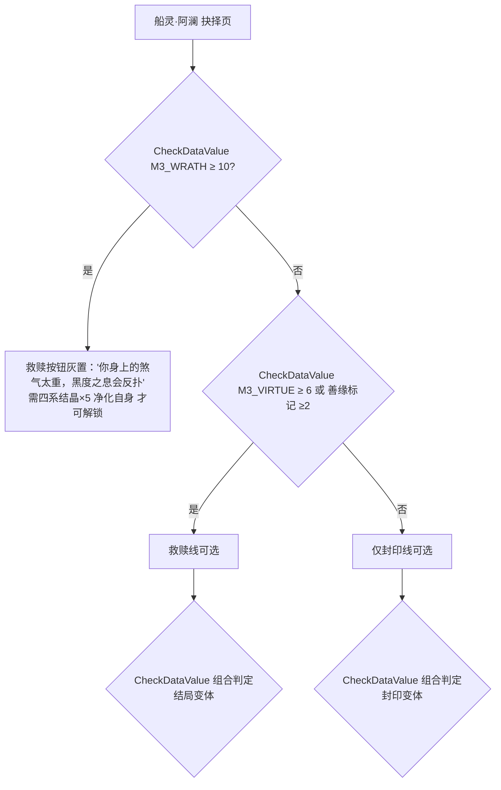

# Mir3 任务设计 v3 · 10 情感与分值总览

> 系列：Mir3 主线+副线任务完整设计（07 份）＋ v3 新增（08-11）｜ 本文：10（v3 新增）
> 日期：2026-08-12（v3）
> 依据：01（世界观/NPC）、02/03（主线任务）、04（技能觉醒）、05（副线）、06（标记登记）、08（伏笔呼应）
> 本文内容：**三值体系（善缘/羁绊/煞气）完整设计**、全部两难抉择分值表（主线 29＋副线 12＋觉醒 8）、
> 终章结局分值门槛与变体、每 NPC 好感分级与恩惠表、每 NPC 情感线、纪念物清单、关键信件全文、称号系统、多人任务总览。
> 定位：本文是"选择的记账本"——所有两难的分值、代价、后续影响、登记标记在此一表打尽；
> 各章文档（02-05）的两难标注以此为准；标记在 06 号登记。

---

## 1. 三值体系（选择的记账本）

### 1.1 三维定义

| 数值（DataValue） | 含义 | 积累方式 | 高处命运 |
|------------------|------|---------|---------|
| **M3_VIRTUE 善缘值** | 侠义/救赎/无私 | 救人、放人、牺牲利益 | 善缘高被利用（但终章可走救赎线） |
| **M3_BOND 羁绊值** | 情谊/信任/承诺 | 帮 NPC、守信、维护同伴 | 羁绊高→万家灯火（世界记得你） |
| **M3_WRATH 煞气值** | 杀戮/功利/冷酷 | 举报、夺宝、弃人于危 | 煞气高→强而孤独（封印线专属差分） |

- 实现：`NPCAction.ChangeDataValue`（分类 = `M3_VIRTUE` / `M3_BOND` / `M3_WRATH`，±N，Player 维度）；
  检查用 `NPCCheck.CheckDataValue`（Operator ≥ / <）。
- 与 v2 兼容：既有善缘标记（M3_CURSED_TAOIST_FRIEND / M3_NUMA_PACT / M3_PANYA_TRUST）写入时**同时** ChangeDataValue 善缘 +2，
  旧判定（标记 ≥2）与新数值判定（善缘 ≥6）互认，存档平滑迁移。
- 无最优解原则：**善缘高被利用、煞气高强而孤独、羁绊高担更多牵挂**——三值各有代价，见 §5 结局差分。
- 记账纪律：每个两难选项必须标分值（可 0 分）；同一选择可同时影响两维（如救小丫 = 善缘+2 羁绊+2）；
  煞气选项通常伴随即时利益（金币/装备/便利）。

### 1.2 分值节奏

| 章节 | 可获总分（三值合计） | 说明 |
|------|--------------------|------|
| 序章 | 8 | 两难 2 处，选项 1-2 分 |
| 一章 | 10 | 两难 3 处 |
| 二章 | 10 | 两难 3 处 |
| 三章 | 12 | 两难 4 处 |
| 四章 | 14 | 两难 4 处 |
| 五章 | 14 | 两难 4 处 |
| 六章 | 16 | 两难 5 处（情感高潮章，分值最密） |
| 终章 | 12 | 两难 4 处（含结局判定） |
| **合计** | **96** | 典型通关可见 ~55-70 分（玩家选择决定分布） |

---

## 2. 主线两难抉择分值总表（29 处 ≥ 25）

> 格式：`位置·任务`｜类型｜选项（分值）｜代价｜后续可见影响｜标记。
> 「类型」七类：资源/忠义/情感/道义/利益/修炼/信息。标记全量在 06 号 §2.6 登记。

### 2.1 序章（2 处）

| # | 位置·任务 | 类型 | 选项（分值） | 代价 | 后续可见影响 | 标记 |
|---|----------|------|-------------|------|-------------|------|
| D1 | 序章·战士线初级任务（M3M_PW1）：德秀回赠的匕首 | 情感/利益 | ① 交出匕首给金氏换药钱（善缘+2，羁绊+1）② 保留匕首（煞气+1） | ① 失去新手武器，金氏欠你人情 ② 金氏失望（好感锁 1 档） | ① 三章德秀认出玄铁，送你精铁匕首（奖励转移 T1）② 无补回 | DILEMMA_DAGGER |
| D2 | 序章·法师线古卷破译（M3M_PM2）：船文拓片去向 | 信息 | ① 交万事通（羁绊+2）② 留书斋给莫白石研究（善缘+1） | ① 失去情报独占 ② 失去万事通情报线提前解锁 | ① 五章万事通主动告之罗盘线索 ② 四章圣言破译引用书斋成果（拓片免跑） | DILEMMA_SCROLL |

### 2.2 一章（3 处）

| # | 位置·任务 | 类型 | 选项（分值） | 代价 | 后续可见影响 | 标记 |
|---|----------|------|-------------|------|-------------|------|
| D3 | 一章·商路护卫（M3M_PW2）：蛇王 | 道义/利益 | ① 硬闯杀蛇王取胆（煞气+1，获千年蛇胆）② 绕道放生（善缘+1） | ① 杀护崽老蛇 ② 失蛇胆（稀有材料） | ① 蛇胆→副线万灵解毒丹（利益）② **五章蛇王报恩：沉船礁蛇群引路**（奖励转移 T2） | DILEMMA_SNAKEKING |
| D4 | 一章·汇合望海楼（M3M_EP1_CONVERGE）：信还是半信半疑 | 信息 | ① 信（羁绊+2）② 半信半疑（0） | ① 担上"船的因果" ② 万事通保留细节 | ① 万事通对话直白，终章日志线索全 ② 五章需自行补线索（圣言殿多跑一环） | M3_SHIP_SECRET |
| D5 | 一章·老矿工叮嘱（M3M_EP1_MINER）：骷髅骨粉 | 利益/道义 | ① 骨粉给老矿工画防线（羁绊+2）② 卖给药铺郎中（煞气+1） | ① 失卖钱收益 ② 老矿工防线缺失（一章 BOSS 战小难度提升） | ① 老矿工视你为徒（刺杀剑术提前解锁）② 药铺好感、阿丑收骨线嫌你"卖骨" | DILEMMA_BONEPOWDER |

### 2.3 二章（3 处）

| # | 位置·任务 | 类型 | 选项（分值） | 代价 | 后续可见影响 | 标记 |
|---|----------|------|-------------|------|-------------|------|
| D6 | 二章·王大人委托（M3M_EP2_WANG）：如实上报 vs 隐瞒 | 忠义 | ① 如实上报（羁绊+2）② 替矿场隐瞒（煞气+1，周老栓羁绊+1） | ① 矿场封矿风险 ② 王大人军需支援取消 | ① 军需支援（后续任务奖励加成）② **矿车突围矿工死里逃生→周老栓敬酒**（奖励转移 T3） | M3_WANG_TRUST |
| D7 | 二章·矿车突围（M3M_EP2_CART）：法老僵尸攥着的玉 | 情感/利益 | ① 还给家属（善缘+2，羁绊+1）② 私藏（煞气+1） | ① 失卖钱收益 ② 老矿工察觉（好感锁 1 档） | ① 老矿工传刺杀剑术加赠精炼券（奖励转移 T4）② 三章德秀高价收玉 | DILEMMA_JADE |
| D8 | 二章·尸王讨伐（M3M_EP2_BOSS）：不腐尸身的道袍 | 道义/利益 | ① 带走道袍超度（善缘+2）② 扒法器卖钱（煞气+1） | ① 失法器收益 ② 亡者不安（尸王殿阴气残留，二章后小概率遇怨魂） | ① **三章云逸认出师父道袍→和解线额外秘笈**（奖励转移 T5）② 无 | DILEMMA_ROBE |

### 2.4 三章（4 处）

| # | 位置·任务 | 类型 | 选项（分值） | 代价 | 后续可见影响 | 标记 |
|---|----------|------|-------------|------|-------------|------|
| D9 | 三章·堕落道士对峙（M3M_EP3_TAOIST）：云逸去留 | 忠义/情感 | ① 提起道馆旧事（和解：羁绊+2，善缘+1）② 拔剑相向（煞气+1）③ 向王大人举报（煞气+2，羁绊-2） | ① 道馆与官府两边不讨好 ② 失去幽灵盾/烈火和解线 ③ 云逸被通缉（道馆封口） | ① 幽灵盾/烈火觉醒解锁，终章善缘判定 ② 敌对线靠清微补技 ③ 获官职奖励＋军需；**四章黑市追查云逸黑符**（副线） | DILEMMA_REPORT_TAOIST、M3_CURSED_TAOIST_FRIEND |
| D10 | 三章·动力核心碎片（M3M_EP3_CORE）：王座下沃玛窖藏 | 利益/道义 | ① 只取碎片（善缘+1）② 顺手取窖藏（煞气+1） | ① 失金银 ② 沃玛一族记恨 | ① **六章沃玛使者送火灵祝福**（奖励转移 T6）② 五章沙漠沃玛商队抬价 | DILEMMA_TREASURE |
| D11 | 三章·虫峡谷（M3M_EP3_BUGS）：被困勘探少年 | 情感/利益 | ① 先救少年（羁绊+2，善缘+1）② 先采虫鳞（煞气+2） | ① 稀有虫鳞情报缺失 ② 少年葬身虫腹 | ① **四章后石阁庙隐藏剧情＋虫甲副线加成**（奖励转移 T7）② 万事通一句"钟伯的孙子没了" | DILEMMA_CANYON |
| D12 | 三章·烈火剑法 C4（M3K_WAR_FLAME）：献祭珍品武器 | 修炼 | ① 献祭珍品武器（修炼+羁绊+2）② 放弃本环（0，金币代偿） | ① 武器损毁 ② 环奖励 -50%，进度延后 | ① 火灵印记（下环解锁）＋云逸敬你"舍得"② 云逸话少一分（好感 -1 档） | DILEMMA_SACRIFICE |

### 2.5 四章（4 处）

| # | 位置·任务 | 类型 | 选项（分值） | 代价 | 后续可见影响 | 标记 |
|---|----------|------|-------------|------|-------------|------|
| D13 | 四章·蜘蛛之乱（M3M_EP4_SPIDER）：唯一血清 | 资源/情感 | ① 救小丫（善缘+2，羁绊+2）② 救阿贵（善缘+1，羁绊+1） | ① 阿贵亡（瞎眼老娘消失）② 小丫亡（老白寡言） | ① **六章老白祖传弓系红绳＋小丫红绳纪念物**（T8）② **五章老娘送免死护身符＋阿贵埋的酒**（T8b）；两线各有收获，无最优解 | DILEMMA_ANTIDOTE |
| D14 | 四章·古神之怒（M3M_EP4_ANGER）：祖玛古碑 | 道义/利益 | ① 只拓半图敬古神（善缘+1）② 拓全图（煞气+1，五章破译更快） | ① 五章诺玛古镜破译慢一环 ② 祖玛教主战难度提升 | ① **六章石翁送祖玛战甲**（奖励转移 T9）② 无 | DILEMMA_STELE |
| D15 | 四章·舵轮祭室（M3M_EP4_RUDDER）：守舵老卫士 | 情感/道义 | ① 让它守护至死（善缘+2）② 迷香取物（煞气+1） | ① 多一场战斗 ② 老卫士醒来自尽 | ① **终章祖玛亡灵神舰挡刀**（奖励转移 T10）② 六章祖玛祭坛无回响 | DILEMMA_GUARDIAN |
| D16 | 四章·龙骨高塔（M3M_EP4_KEEL）：剑法拓片归属 | 修炼 | ① 拓给祖玛后人（羁绊+1，石翁好感）② 私吞拓片（煞气+1） | ① 翔空剑法链从石翁学（多一环）② 石翁疏远 | ① 石翁收徒（翔空剑法链亲传加成）② 直接解锁但无亲传加成 | DILEMMA_TABLET |

### 2.6 五章（4 处）

| # | 位置·任务 | 类型 | 选项（分值） | 代价 | 后续可见影响 | 标记 |
|---|----------|------|-------------|------|-------------|------|
| D17 | 五章·诺玛秘仪（M3M_EP5_NUMA）：接受 vs 拒绝 | 道义 | ① 接受秘仪（羁绊+2，善缘+1）② 拒绝强攻（煞气+1） | ① 与诺玛结盟（立场争议）② 圣言线索靠硬闯 | ① 图兰助战（五章 BOSS 剧情线），终章善缘判定 ② 六章诺玛残部沙漠报复（副线难度+） | M3_NUMA_PACT |
| D18 | 五章·圣言破译（M3M_EP5_SCRIBE）：水手私语 | 信息 | ① 交万事通（善缘+1，羁绊+1）② 卖图兰（煞气+1，金币） | ① 失金币 ② 船文机密外泄 | ① **终章万事通主动告知罗盘用法**（奖励转移 T11）② 万事通失望（好感 -1 档） | DILEMMA_SCRIBE |
| D19 | 五章·深海取珠（M3M_EP5_PEARL）：水手遗骸 | 情感/道义 | ① 带出遗骸与家书（善缘+2）② 只取珍珠（0） | ① 取珠流程多一环 ② 遗骸永沉 | ① **终章后水手后人回信＋「引路者」称号**（奖励转移 T12）② 无 | DILEMMA_REMAINS |
| D20 | 五章·双 BOSS 战（M3M_EP5_BOSS）：重伤的图兰 | 情感/利益 | ① 用唯一圣水救他（善缘+2，羁绊+1）② 取其古镜残片（煞气+2） | ① 失圣水（战斗药）② 图兰亡（和解线破灭） | ① 图兰后期送罗盘仿品＋结局来信 ② 终章诺玛无援 | DILEMMA_TULAN |

### 2.7 六章（5 处）

| # | 位置·任务 | 类型 | 选项（分值） | 代价 | 后续可见影响 | 标记 |
|---|----------|------|-------------|------|-------------|------|
| D21 | 六章·潘夜之殇（M3M_EP6_PANYA）：净化 vs 斩杀神族战士 | 情感/道义 | ① 圣水净化（善缘+2）② 直接斩杀（煞气+1） | ① 战斗更耗资源 ② 月见失望 | ① 六章 BOSS 战神族战士倒戈 ② 潘夜残部冷漠 | DILEMMA_PURIFY |
| D22 | 六章·牛魔王之谜（M3M_EP6_RITE）：信夜枭 | 信任 | ① 相信（羁绊+2，善缘+1）② 怀疑（0） | ① 担内应风险 ② 内应优势缺失 | ① 内应线奖励＋夜枭挡刀 ② 夜枭迟援，战后一句"你从没信过我" | M3_PANYA_TRUST |
| D23 | 六章·神舰通行证（M3M_EP6_PASS）：第二份通行证 | 利益 | ① 交月见销毁（善缘+1）② 卖黑市（煞气+1） | ① 失黑市收益 ② 黑市商人出现（副线） | ① 终章神舰无偷渡者（船灵感谢）② 黑市副线解锁（利益） | DILEMMA_PASS |
| D24 | 六章·牛魔王战（M3M_EP6_BOSS）：牛魔王之角 | 情感/利益 | ① 送圣地（善缘+2，羁绊+1）② 铸神兵（煞气+2） | ① 失神兵材料 ② 月见失望 | ① **终章潘夜船员入神舰＋角纪念物**（奖励转移 T13）② 神兵属性加成 | DILEMMA_HORN |
| D25 | 六章·牛魔王战（M3M_EP6_BOSS）：老矿工挡刀 | 情感 | ① 替他挡（吊坠护魂，善缘+2）② 让他挡（0，老矿工重伤失忆） | ① 吊坠碎裂（属性-）② 老矿工神志受损 | ① 老矿工安然（终章船员名册剧情完整）② 老矿工忘事（刺杀剑术链改由阿牛传） | DILEMMA_OLDMINER |

### 2.8 终章（4 处）

| # | 位置·任务 | 类型 | 选项（分值） | 代价 | 后续可见影响 | 标记 |
|---|----------|------|-------------|------|-------------|------|
| D26 | 终章·神舰开门（M3M_EPF_OPEN）：带谁上船 | 情感 | ① 带一名故人上船（羁绊+2，故人 = 好感最高 NPC）② 独自登船（0） | ① 结局后多一段该 NPC 的命运线 ② 无牵挂 | ① 结局差分：故人见证真相（老白/月见/小丫/阿丑可选）② 标准结局 | DILEMMA_COMPANION |
| D27 | 终章·船长日志（M3M_EPF_LOG）：被撕掉的船员名册页 | 信息 | ① 找回名册页（善缘+1，羁绊+1）② 不找（0） | ① 多一段追查（霸王教主战前）② 老矿工身份留白 | ① **名册现"陈永年"之名——千年水手身份回收**（情感核弹）② 老矿工结局缺一环 | DILEMMA_ROSTER |
| D28 | 终章·黑度降临（M3M_EPF_TRUTH）：吊坠保魂 | 道义 | ① 吊坠保万事通魂（善缘+2）② 吊坠自用（0，属性保留） | ① 吊坠碎裂 ② 万事通魂力大损（结局台词差分） | ① **结局后万事通记得你（完整告别）**（奖励转移 T14）② 告别缺半句 | DILEMMA_PENDANT |
| D29 | 终章·双结局（M3M_EPF_ENDING）：封印 vs 救赎 | 牺牲 | 见 §5 结局门槛与变体 | — | — | M3_CHOICE_SEAL / M3_CHOICE_REDEEM |

> 核对：主线两难 **29 处** ≥ 25 ✅；类型覆盖：资源 4 / 忠义 2 / 情感 10 / 道义 6 / 利益 10 / 修炼 2 / 信息 4 —— 七类全覆盖 ✅；
> 序章 2 / 一章 3 / 二章 3 / 三章 4 / 四章 4 / 五章 4 / 六章 5 / 终章 4 —— 后期章节（五/六/终）≥4 ✅。

---

## 3. 副线小抉择分值表（12 处 ≥ 10）

> 副线约定不变（不产生主线剧情标记）；小抉择用 `M3S_CHOICE_*` 计数/短效好感（DataValue，仅影响副线内部，不驱动主线分支）。
> 定位：副线也动人——每一个"顺手的选择"都会被失主记住（点头致意/口耳相传/小店优惠）。

| # | 副线任务 | 类型 | 选项（分值） | 后续可见影响 |
|---|---------|------|-------------|-------------|
| S1 | 大卫的钥匙（M3S_KEY_DAVID） | 道义 | ① 追查木牌主人（善缘+1）② 直接交大卫（0） | ① 木牌主人是钥匙真主（亡妻遗物），大卫道歉 ② 大卫无感 |
| S2 | 格雷沙姆的日记（M3S_JOURNAL_GRESHAM） | 情感 | ① 先找画的下半（羁绊+1）② 直接归还（0） | ① 画合璧，格雷沙姆哽咽赠画 ② 少一段故事 |
| S3 | 解药采集（M3S_CURE_POISON1-6） | 道义 | ① 先救被咬路人（善缘+1，材料重采）② 先交任务（0） | ① 孙济世敬你"医者心"，解药线任务减 1 环 ② 路人被抬进药铺（对话差分） |
| S4 | 渔获采集（M3S_GATHER_FISH） | 道义 | ① 放生孕鱼（善缘+1）② 交任务（0） | ① 渔夫点头："鱼有灵，你有德" ② 无 |
| S5 | 药草采集（M3S_GATHER_HERB） | 情感 | ① 留下百年灵芝（善缘+1）② 卖给药铺（利益） | ① 阿丑认你为知己（收骨线优先）② 药铺高价 |
| S6 | 矿脉采集（M3S_GATHER_ORE） | 道义 | ① 无名墓碑送墓园（善缘+1）② 按矿场规矩处理（0） | ① 阿丑郑重道谢 ② 无 |
| S7 | 望海楼跑腿（M3S_RUN_LOOKOUT） | 情感 | ① 分半坛酒给渴旅人（善缘+1，重买酒）② 不分（0） | ① 旅人竟是五章沙漠向导（沙暴引路彩蛋）② 无 |
| S8 | 驿站送信（M3S_RUN_MAIL） | 情感 | ① 按地址送到（善缘+1，家属得知真相）② 退回驿站（0） | ① 家属悲恸但感激，终章后收到谢礼 ② 无 |
| S9 | 大象游行（M3S_BOUNTY_ELEPHANT） | 道义 | ① 救被困幼象（善缘+1，赏金少 1 份）② 全歼（0） | ① 象群头领俯首致意（失乐园象群不再袭人）② 无 |
| S10 | 跳蚤洞清理（M3S_BOUNTY_FLEA） | 情感 | ① 救出幼猫狗送村里小孩（善缘+1）② 不管（0） | ① 小孩们给你起外号"猫大王"，村口多了猫狗 ② 无 |
| S11 | 收骨归安（M3S_TAO_BONES） | 道义 | ① 上报官府查被害新骨（善缘+1，羁绊+1）② 按任务处理（0） | ① 破获矿工失踪案（周老栓重谢）② 无 |
| S12 | 悬赏板每日（M3S_BOARD_DAILY） | 道义 | ① 放过带崽的猎物（善缘+1，赏金少 1 份）② 照杀（0） | ① 悬赏板备注"仁心猎人"，周悬赏奖励 +10% ② 无 |

> 核对：副线小抉择 **12 处** ≥ 10 ✅。

---

## 4. 技能觉醒两难（8 处 ≥ 若干）

> 觉醒两难 = 修炼型两难：牺牲/取舍以"修为"为代价，兑现为技能链进度/属性/剧情。

| # | 觉醒链·环 | 类型 | 选项（分值） | 代价 | 后续可见影响 |
|---|----------|------|-------------|------|-------------|
| K1 | 战士·烈火剑法 C4（M3K_WAR_FLAME） | 修炼 | ① 献祭珍品武器（羁绊+2）② 放弃本环金币代偿（0） | ① 武器损毁 ② 环奖励 -50% | ① 火灵印记＋云逸敬重 ② 云逸好感 -1 档 |
| K2 | 战士·破血狂杀 C7（M3K_WAR_FINAL） | 道义 | ① 血誓以己血立誓（善缘+1，HP 上限 -2% 永久）② 取敌血立誓（煞气+1） | ① 属性代价 ② 杀俘取血 | ① 关铁山："这才是血誓"（亲传加成）② 招式戾气（NPC 态度冷） |
| K3 | 法师·召唤神兽 C4（M3K_TAO_BEAST 道士） | 情感 | ① 先救神兽幼崽（羁绊+2）② 强行契约（煞气+1） | ① 契约多一环 ② 神兽怨念（技能强度 -5%） | ① 神兽认主，召唤兽攻击 +10% ② 无 |
| K4 | 法师·凝血离魂 C8（M3K_MAG_SOULBIND） | 修炼 | ① 以己魂为契（善缘+1，MP 上限 -2% 永久）② 取被污染者之魂（煞气+2） | ① 属性代价 ② 杀"还有救"的污染者 | ① 万事通叹"魂契者当如此"（称号前置）② 黑度之息反噬几率 +（终章救赎判定 -） |
| K5 | 道士·回生术 C4（M3K_TAO_REVIVE） | 道义 | ① 以己血代偿（善缘+2，HP 上限 -2% 永久）② 引渡邪魂（煞气+1） | ① 属性代价 ② 邪魂入轮回（隐患） | ① 清微："此术本就是以命换命" ② 回生术成功率 -5% |
| K6 | 道士·猛虎强势 C5（M3K_TAO_TIGER） | 情感 | ① 放虎灵归山（善缘+1）② 收为战宠（0） | ① 战宠加成缺失 ② 无 | ① 虎灵每年报恩（随机送材料）② 战宠攻击 +5% |
| K7 | 战士·翔空剑法 C4（M3K_WAR_SOAR） | 修炼 | ① 碑文让祖玛留存（羁绊+1）② 拓全图（煞气+1，进度 +1 环） | ① 链多一环 ② 石翁疏远 | ① 石翁亲传（剑法伤害 +5%）② 无 |
| K8 | 法师·怒神霹雳 C7（M3K_MAG_THUNDER） | 道义 | ① 雷云祈愿护村（善缘+1）② 引雷淬体（0，进度快） | ① 淬体材料缺失 ② 村毁（雷击） | ① 村庄供奉你为"雷神子"（每日香火礼）② 无 |

> 核对：觉醒两难 **8 处**；全部分值并入三值记账（善缘/羁绊/煞气），修炼代价（HP/MP 上限、技能强度）为觉醒专属。

---

## 5. 终章结局：分值门槛与变体

### 5.1 判定流程（M3M_EPF_ENDING 对话树）

### 5.2 结局与变体一览

| 结局 | 门槛 | 内容 | 变体触发 |
|------|------|------|---------|
| **封印·标准** | 无条件 | 神舰永沉，万事通守船长眠（v2 封印线） | 默认 |
| **封印·万家灯火** | BOND ≥ 12 | 封印结局＋全员送行：白莉/德秀/老白/月见/阿丑 在码头点灯；老矿工留在船上陪船长（"我本就是船上的人"） | 高羁绊差分 |
| **封印·孤独** | WRATH ≥ 12 且 VIRTUE < 4 | 封印结局＋无人送行；万事通只留一封信："你从不回头，我也不送" | 高煞气差分 |
| **救赎·标准** | VIRTUE ≥ 6（或善缘标记 ≥2） | 净化神魔，神舰扬帆，万事通随船（v2 救赎线） | 默认 |
| **救赎·完整** | VIRTUE ≥ 10 且 BOND ≥ 8 | 救赎结局＋全员命运线（每个帮过的 NPC 结局独白）＋万事通赠罗盘（纪念物）＋二周目完整传承 | 高善缘+高羁绊差分 |
| **救赎·带伤** | WRATH 6-9 且 VIRTUE ≥ 6 | 救赎成功但净化反噬（HP/MP 上限 -5% 永久）——"你救了他，也弄脏了自己" | 高煞气+高善缘冲突差分 |

### 5.3 结局后系统

| 系统 | 说明 | 实现 |
|------|------|------|
| 万事通留影 | 结局后比奇城广场出现万事通虚影（封印线）或留信（救赎线） | NPC 对话 CheckDataList M3_EPF_DONE |
| NPC 最终命运 | 每个帮助过的 NPC 结局独白（CheckDataValue 好感分支） | 各 NPC 结局页 |
| 纪念物变化 | 终章后再看纪念物，回忆文字变化（"烟斗的烟味淡了……"） | 纪念物右键 CheckDataList M3_EPF_DONE |
| 二周目传承 | 万事通："你……是故人？"（感知上一周目三值倾向） | **待服务端扩展**（周目档案） |

---

## 6. 纪念物清单（13 件）

> 规则：纪念物 = 不占格专属物品（独立槽位），右键"回忆"弹出文字；终章后再看文字变化。
> 实现：物品 + 对话页（右键触发）＋ CheckDataList M3_EPF_DONE 切换回忆文本。全部登记 06 号。

| # | 纪念物 | 获取（任务/条件） | 回忆文字（初） | 终章后文字（变） |
|---|--------|------------------|---------------|-----------------|
| M1 | 老矿工的烟斗 | 二章后·老矿工好感深交（M3_FAVOR_OLDMINER ≥2） | 烟斗里还留着矿洞的潮气，斗壁磨得发亮 | （封印线）烟味淡了……像那个人，走远了 |
| M2 | 小丫的红绳 | 四章·救小丫线（DILEMMA_ANTIDOTE=SAVE_GIRL） | 红绳编得歪歪扭扭，末尾打了个死结 | 红绳旧了，但结还在——她说，结在，人就回得来 |
| M3 | 云逸的旧符纸 | 三章·和解线（M3_CURSED_TAOIST_FRIEND） | 符纸上画着道馆的桂花树，笔触很轻 | （封印线）符纸的桂花香散尽了；（救赎线）纸角多了一朵新画的桂花 |
| M4 | 阿贵埋的酒 | 四章·救阿贵线（DILEMMA_ANTIDOTE=SAVE_HELPER） | 坛口用蜡封了三层，坛身写着"等娘眼睛好了" | 酒开封了，是甜的——他说过，等老娘眼睛好了，喝甜的 |
| M5 | 牛魔王之角 | 六章·送圣地线（DILEMMA_HORN=RETURN） | 角上有一道旧伤——是它自己撞的 | （救赎线）旧伤好像浅了一点 |
| M6 | 夜枭腰牌 | 六章·相信线（M3_PANYA_TRUST） | 铜牌磨得发亮，边角卷了 | 腰牌还在，守门的人已经不在了 |
| M7 | 水手家书 | 五章·带出遗骸线（DILEMMA_REMAINS） | 信纸发黄，字迹被海水洇开了一半 | 信送到了。他等的人，等到了 |
| M8 | 蛇王鳞 | 五章·蛇王报恩线（DILEMMA_SNAKEKING=SPARE） | 鳞片泛着青黑的光，凉凉的 | 鳞片温了一点——像深水，晒到了太阳 |
| M9 | 矿工铜哨（升级） | 老矿工好感深交（M3_FAVOR_OLDMINER ≥2） | 哨子吹不响，但老矿工说它认得你 | （海边）哨子突然能吹响了——它认得回家的路 |
| M10 | 万事通的罗盘 | 救赎线·结局（M3_CHOICE_REDEEM＋VIRTUE≥10） | 罗盘锈了，指针却稳稳指着海的方向 | 罗盘背面多了一行小字："锚落处，是他乡" |
| M11 | 关铁山的军牌 | 战士线·关铁山好感相熟 | 军牌背面刻着一个名字："铁山"——他说那是他兄弟的 | 军牌的主人，等到了那句"回家" |
| M12 | 白莉的平安符 | 白莉好感挚友（M3_FAVOR_BAILI ≥3） | 符角的线头有点散，是她赶工缝的 | 平安符旧了，但你一直带着——像她一直惦记着你 |
| M13 | 月见的花瓣 | 六章·潘夜之殇（M3M_EP6_PANYA 完成） | 花瓣是神族古树的，千年不谢 | （封印线）花瓣落了一片……像潘夜的眼泪 |

---

## 7. NPC 好感恩惠（世界记得你）

### 7.1 机制

- **好感数值**：`M3_FAVOR_<NPC>`（DataValue 0-4）：0 初识 → 1 相熟 → 2 深交 → 3 挚友（上限）。
- **增长**：完成该 NPC 任务链（主线/觉醒/副线）＋两难选择加分（CheckDataValue 分支）＋递送/对话日常。
- **检查**：`NPCCheck.CheckDataValue`（如 M3_FAVOR_DEXIU ≥1 → 价格分支）。
- **反向**：煞气选择/举报/弃人 → 好感 -1 或锁定（涨价/不卖/态度冷）。
- **恩惠小而真**：9 折不是白送，是"这家店记得我"。

### 7.2 核心 NPC 好感分级与恩惠表（每 NPC 一表）

**万事通（主线总枢纽）**

| 档 | 触发 | 恩惠 |
|----|------|------|
| 初识 0 | 序章 | 标准对话 |
| 相熟 1 | 汇合完成 | 见面喊名（CheckDataList M3_SHIP_SECRET 台词）＋船歌谣点拨 |
| 深交 2 | 五章后 | **每日一条 BOSS 情报**（Daily＋Message：今日 沃玛/祖玛/牛魔王 出没） |
| 挚友 3 | 终章前（VIRTUE≥6） | 罗盘相赠（救赎线）／最后一封信（封印线） |

**老矿工·陈永年**

| 档 | 触发 | 恩惠 |
|----|------|------|
| 初识 0 | 序章三态 | 标准对话 |
| 相熟 1 | 一章·叮嘱完成 | 刺杀剑术链提前解锁（钩子变直接接取） |
| 深交 2 | 二章·还玉（DILEMMA_JADE=RETURN） | 每日矿工便当（恢复药×3）＋铜哨升级为纪念物 |
| 挚友 3 | 终章·船员名册（DILEMMA_ROSTER） | 身份真相完整＋封印线留船陪船长（"我本就是船上的人"） |

**王大人（比奇官府）**

| 档 | 触发 | 恩惠 |
|----|------|------|
| 初识 0 | 官方链 | 标准对话 |
| 相熟 1 | 二章·如实上报（M3_WANG_TRUST） | 军需品 9 折（官府军需处） |
| 深交 2 | 三章后 | 官职推荐（声望 +1/章）＋矿场信息优先 |
| 挚友 3 | 终章前 | 辞官归隐差分（结局后陪上官小姐） |

**金氏（肉店·老战友）**

| 档 | 触发 | 恩惠 |
|----|------|------|
| 初识 0 | 官方链 | 标准对话 |
| 相熟 1 | 序章·交出匕首（DILEMMA_DAGGER） | 每日肉汤（恢复 Buff） |
| 深交 2 | 二章后 | 老战友回忆（王大人线加分：帮你在王大人面前说话） |

**德秀（铁匠铺）**

| 档 | 触发 | 恩惠 |
|----|------|------|
| 初识 0 | 官方链 | 标准价格 |
| 相熟 1 | 帮他找过矿石（M3S_GATHER_ORE） | **每天 9 折**（CheckDataValue 价格分支） |
| 深交 2 | 三章·精铁匕首（T1） | **炼制成功率 +5%**（SpecialRefine） |
| 挚友 3 | 终章前 | 铁花告白剧情（白莉线连锁好感）＋免费精炼 1 次/日 |

**白莉（药铺店员·德秀暗恋对象）**

| 档 | 触发 | 恩惠 |
|----|------|------|
| 初识 0 | 一~二章日常 | 标准对话 |
| 相熟 1 | 帮过她（M3S_CURE_POISON 线） | **每天首谈送 1 药**（Daily＋GiveItem） |
| 深交 2 | 四章后 | 免费包扎（每日 1 次恢复） |
| 挚友 3 | 六章前 | 平安符（纪念物 M12）＋德秀铁花剧情见证 |

**素心 / 莫白石 / 阿岚（法师线导师）**

| NPC | 相熟 | 深交 | 挚友 |
|-----|------|------|------|
| 素心 | 每日魔法药（祠堂课） | 四系启蒙提前（觉醒链 -1 环） | 元素亲和四系加成（终章四系合一 +） |
| 莫白石 | 书斋借阅（每日 1 卷） | 古卷优先破译（圣言破译免一环） | 秘法笔记（凝血离魂线索提前） |
| 阿岚 | 风铃寄语（每日小 Buff） | 每日风灵碎羽×3 | 听风者（龙卷风链亲传加成） |

**玄真 / 阿丑 / 清微 / 云逸（道士线）**

| NPC | 相熟 | 深交 | 挚友 |
|-----|------|------|------|
| 玄真 | 道观客房（免费休息） | 每日护身符 | 掌门托付（封印线道观结局差分） |
| 阿丑 | 收骨优先（副线加成） | 每日香灰（灰色药粉） | 无名骨名字簿（终章超度剧情） |
| 清微 | 月下古井（每日月光恢复） | 回生术线索提前 | 月下之约（救赎线同行） |
| 云逸（和解线） | 黑符情报 | 幽灵盾/烈火亲传加成 | 桂花树约定（终章玄真结局联动） |

**石翁 / 老白 / 小丫 / 钟伯 / 图兰 / 老艄公 / 月见 / 夜枭 / 关铁山 / 周老栓 / 阿牛**

| NPC | 相熟 | 深交 | 挚友 |
|-----|------|------|------|
| 石翁 | 祖玛情报（每日 1 条） | 祖玛战甲（T9） | 古碑剑法亲传（翔空链加成） |
| 老白 | 狩猎情报 | 每日肉食 | 祖传弓（T8）＋红绳弓弦 |
| 小丫 | 红绳（M2） | 每日野果 | 涂鸦信（终章后信件） |
| 钟伯 | 石阁庙茶（恢复） | 虫甲副线加成 | 小钟剧情（T7）＋隐藏任务 |
| 图兰 | 沙漠向导（沙暴免疫 Buff） | 圣言优先 | 罗盘仿品＋结局来信 |
| 老艄公 | 摆渡免费（开门日） | 沉船礁情报 | 船歌谣后半＋送行曲 |
| 月见 | 神族挽歌（每日小 Buff） | 群体治愈线提前 | 结局同行（救赎线船员） |
| 夜枭 | 潘夜情报 | 内应（M3_PANYA_TRUST） | 终章守门彩蛋 |
| 关铁山 | 演武场陪练（每日经验） | 军牌（M11） | 血誓亲传（破血狂杀加成） |
| 周老栓 | 矿场关照（矿脉副线加成） | 敬酒（T3） | 阿牛托付（终章后矿场剧情） |
| 阿牛 | 师兄弟相称 | 每日矿工便当 | 顶上老矿工之位（世界呼吸） |

### 7.3 反向恩惠（煞气代价可见）

| 触发 | 效果 |
|------|------|
| 举报云逸（DILEMMA_REPORT_TAOIST=REPORT） | 道馆封口（玄真/灵雀好感锁定 0-1 档） |
| 私藏玉（DILEMMA_JADE=KEEP） | 老矿工好感锁 1 档（只当雇佣关系） |
| 取沃玛窖藏（DILEMMA_TREASURE） | 沃玛商队抬价 20%（沙漠补给） |
| 私吞拓片（DILEMMA_TABLET） | 石翁疏远（翔空链无亲传加成） |
| 卖通行证（DILEMMA_PASS） | 月见失望（好感 -1 档） |
| 铸牛角（DILEMMA_HORN=FORGE） | 潘夜残部冷漠（终章无援） |

---

## 8. 每 NPC 情感线（一瞥）

| NPC | 情感线 |
|-----|--------|
| 万事通 | 千年孤独→遇见应劫之人→双结局告别（"老夫什么都知道，就是不知道明天"——最后他知道了） |
| 老矿工·陈永年 | 三态撕裂的幸存者→三态合一→终章名册揭示千年水手身份→封印线留船陪船长 |
| 云逸 | 道馆首徒→弃道堕落→和解线"帮我照看掌门"→终章玄真结局回响 |
| 金氏 | 老战友隐姓埋名卖肉→王大人线往事→"当年若不是他，我死在西郊了" |
| 德秀 | 暗恋白莉的铁匠→铁花告白（终章）→"打铁三十年，第一次打花" |
| 白莉 | 药铺姑娘→每日送药→平安符→"你那把刀，我打磨好了"（信件） |
| 老白 | 丧侄之痛（救阿贵线）→祖传弓→"活着的人，要往前走" |
| 小丫 | 十岁孤女→红绳→终章后涂鸦信（"哥哥，我学会编双绳了"） |
| 阿贵 | 药铺帮工→瞎眼老娘唯一的依靠→救小丫线死→埋酒与家书 |
| 月见 | 末代圣女→牛魔王之死→"它只想带族人回家"→救赎线随船 |
| 夜枭 | 牛魔王旧部→心向圣女→挡刀→终章守门（"我效忠的不是牛魔王，是潘夜"） |
| 图兰 | 挖了千年的法老→和解→重伤→圣水救赎→结局来信 |
| 牛魔王 | 不情愿的敌人→遗言"带族人回家"→角送圣地（恩人） |
| 阿丑 | 给每块无名骨起名字→超度大师→"收骨，也是积德" |
| 关铁山 | 退役老兵→兄弟军牌→"铁山，回家"（终章后） |

---

## 9. 关键信件全文（MailInfo 邮件系统）

> 实现：`MailInfo`（服务端邮件系统）＋章节推进/终章触发；离世 NPC 的"最后一封信"为情感核弹。
> 全部信件在 06 号登记（M3_MAIL_*），正文如下。

### 9.1 万事通·最后一封信（封印线，M3_CHOICE_SEAL 后 3 日送达）

> 寄件人：万事通（比奇城广场留影处代收）
> 标题：船沉了

> 应劫之人亲启：
>
> 见字如面。老夫写这封信时，船正在沉——不是往下沉，是往千年该去的地方沉。
> 锚落了，老夫终于能睡个安稳觉。你若是看到这封信，说明你活着，玛法大陆也活着。
>
> 千年了，老夫记不清自己姓什么叫什么，只记得三件事：船要开、锚要落、人要等。
> 你替老夫把这三件事都办完了。谢谢你。
>
> 吊坠碎了，哨子还在——那是老陈的，他留在了船上。他说他本就是船上的人，船沉，他该在。
> 你们这些活着的，替我们多晒晒太阳。
>
> 老夫留了几句话在比奇城广场的灯下，你往西走七步，抬头看。那是船上人最后的规矩：
> 送行的人，要看着船走远。
>
> —— 万，事通。千年前，船上见。
>
> 附：船歌谣（完整）
> 沧海茫茫，船归何方；锚落处，是他乡。千年一梦，故人不忘；船开时，莫相望。

### 9.2 万事通·最后一封信（救赎线，M3_CHOICE_REDEEM 后 3 日送达）

> 寄件人：万事通（海上来信，随海风而至）
> 标题：船开了

> 应劫之人亲启：
>
> 船开了。不是逃，是回家。
> 老夫站在船头，风是甜的——一千年了，头一回觉得风是甜的。震天魔神……不，该叫它
> 神族的兄弟了。它站在老夫身边，说它闻到故乡的味道。故乡？老夫的故乡，是这艘船。
>
> 罗盘给你了（它认得你，比认得老夫还亲）。指针指的方向，就是老夫的方向。
> 你若有一天听见海上有歌声——那是老夫在唱船歌谣的后半。
>
> 千年一梦，故人不忘；船开时，莫相望。可老夫还是想望一眼。你替玛法大陆，望了千年之后的
> 第一眼天光。谢谢。
>
> —— 第一代船长，敬上
>
> 附：一枚贝壳，内有字："海的那边，还有别的故事。"

### 9.3 阿贵留给瞎眼老娘的信（四章·救小丫线，老白转交，M3_MAIL_AGUI）

> 娘：
>
> 药铺的账我记好了，压在柜台第三块砖底下。孙掌柜说等我出师，月钱加一百文，到时候
> 带您去比奇城最好的馆子，吃您念叨了半辈子的狮子头。
>
> 隔壁阿花婶说您眼睛又不好了，我托人捎了瓶药油，让阿花婶帮您揉。揉的时候别嫌疼，
> 我娘是最不怕疼的人——您把我拉扯大，从来没喊过疼。
>
> 天光那晚我做了个梦，梦见您眼睛好了，看见我穿着新衣裳站在您面前。娘，您放心，
> 阿贵一定让您看见那一天。
>
> 儿，阿贵

> （老白转交时说："这信……阿贵揣在怀里，揣到最后一刻。他娘已经不在了——村口的人说，
> 她等了一夜，天亮被人搀走了。信，你收着罢。你替他，看完这封信。"）

### 9.4 牛魔王留给月见的信（六章遗物，M3_MAIL_NIU）

> 月见：
>
> 你若读到这封信，我大概已经不在了。
> 神族的姑娘，你记得吗——三百年前你刚当上圣女，是我带你看的第一次月食。你说月亮缺了
> 一角，是神族在哭。我说不是，是月亮在等一个圆。
>
> 我信了船底之主的许诺，是我想带族人回家。可那条路，是错的。我知道得晚了。
> 你比我清醒。你做的对。
>
> 别恨我。恨我，你会疼。
>
> —— 牛，字

### 9.5 水手家书（五章·沉船礁，M3_MAIL_SAILOR）

> 妻：
>
> 船要开了。他们说海那边有天光，是天赐的福。我本不想去——你怀着身孕，家里的稻子
> 该收了。可船长说，这一趟回来，够我们过一辈子。
>
> 我错了。船开了，就回不来了。我听见你在码头喊我，那声音我这辈子都忘不了。
>
> 若有人读到这封信，求你把它带回去，交给失乐园码头，一个姓柳的女人。告诉她：
> 我没死在海里，我是想她，想死的。
>
> —— 柳生，绝笔

> （终章后回信：柳家后人——"太奶奶等了一辈子，等到九十岁。她说，她知道他没死在海里，
> 他是迷路了。如今信到了，他该回家了。谢谢恩人。"）

### 9.6 老矿工留给阿牛的信（终章·封印线后，M3_MAIL_OLDMINER）

> 阿牛：
>
> 师父这辈子骗了你一件事——我说我是矿工，其实我是船上的水手。千年前那艘船，我跟着
> 船长来的。船沉了，我活着，活得像块石头。
>
> 矿上的活，你接得住。你师兄（玩家）是个好人，跟着他，错不了。
>
> 别学师父，把心事都埋在地底下。地底下埋多了，人就成了一块石头。
>
> —— 师父，陈永年

### 9.7 NPC 来信选（M3_MAIL_*）

| 信件 | 触发 | 全文要点 |
|------|------|---------|
| 白莉的信 | 四章后（好感≥2） | "听说你去了沙漠，一路小心。你那把刀，我打磨好了——刀鞘是我新缝的，线头有点毛，别嫌弃。" |
| 德秀的信 | 五章后（好感≥2） | "店里的铁料到了新货。白莉姑娘说你人好，我给你留了块好料，九折，老规矩。" |
| 月见的信 | 六章后 | "牛魔王的角，我放在圣地了。神族的古树，今年开了花。你若得空，来看看。" |
| 图兰的信 | 救赎线结局后 | "吾族在沙漠种了第一片绿洲。镜中说，海的那边有答案——吾信了。谢你，异乡人。" |
| 小丫的涂鸦信 | 救赎线结局后 | "哥哥，我学会编双绳了。老白叔说你在海上，我把红绳系在码头最高的柱子上，你回来就能看见。" |

---

## 10. 称号系统

### 10.1 三值驱动称号

| 称号 | 触发 | 效果 | NPC 称呼 |
|------|------|------|---------|
| 「比奇善人」 | M3_VIRTUE ≥ 15 | 商店优惠 5%（全局） | "善人先生" |
| 「血手」 | M3_WRATH ≥ 15 | 击杀经验 +5%，商店抬价 10% | "血手大人" |
| 「万家灯火」 | M3_BOND ≥ 15 | 每日随机 NPC 谢礼（MailInfo） | "万家灯火的恩公" |

### 10.2 成就称号

| 称号 | 触发 | 说明 |
|------|------|------|
| 「僵尸克星」 | 击杀僵尸类 1000 | 计数（M3S_COUNT 或服务端统计） |
| 「神舰知音」 | 集齐船歌谣全篇 | 叙事道具收集线 |
| 「超度大师」 | 亡灵超度 10 次 | 副线（05 号已登记） |
| 「赏金猎人」 | 赏金 BOSS 5 次 | 副线（05 号已登记） |
| 「悬赏老手」/「万事通座上宾」 | 悬赏板 30 次/10 次 | 副线（05 号已登记） |
| 「火中取粟」「凌云客」「守船人」等 | SKILL_MASTER_* 25 个 | 技能精通（04/06 号已登记） |
| 「引路者」 | 带出水手家书（T12） | v3 新增（10 号 §4） |
| 「魂契者」 | 凝血离魂精通 | 06 号已登记 |

### 10.3 称号实现

- 三值称号：CheckDataValue 门槛 + NPC 对话树发放称号道具（Bound）＋称呼切换（CheckDataValue 分支台词）。
- 成就称号：计数达标 → 称号 NPC（万事通分站）发放。
- 待服务端扩展：称号属性全局生效（商店折扣/经验加成）需服务端支持，落地前仅文字称号。

---

## 11. 多人任务总览（详见 11 号文档）

| 类别 | 前缀 | 数量 | 人数建议 | 职业建议 | 周期 | 奖励等级 |
|------|------|------|---------|---------|------|---------|
| 组队讨伐（赏金 BOSS 轮换） | M3P_BOUNTY | 4 | 2-3 | 任意 | Weekly | ★★ |
| 职业协作（元素共鸣试炼） | M3P_RESONANCE | 2 | 2-3 | ≥2 职业 | Weekly | ★★★ |
| 大团战（沙巴克攻城战/神舰清剿） | M3P_SIEGE / M3P_CLEAR | 2 | 5-8 | ≥3 职业 | Weekly（攻城战固定时间） | ★★★★ |
| 战队精锐（末日之爪讨伐） | M3P_DOOMCLAW | 1 | 5 人固定队 | 战法道各 1 | Weekly | ★★★★★ |
| 行会与沙巴克感情线 | M3P_GUILD_* | 4 | 行会 | 任意 | 长期 | 感情向 |
| 结婚系统（道侣专属剧情） | M3P_MARRIAGE_* | 3 | 2 | 任意 | 一次性+Daily | 感情向 |

> 规则：建议制不硬卡人；奖励递增（单人=基础/满配=满奖励）；不进入主线依赖；不放两难/三值；
> 周期 Daily/Weekly 节奏；07 号总表加 M3P_ 分类。详见 11 号文档。

---

## 12. 与 06 号标记登记衔接（v3 新增登记汇总）

| 类别 | 标记/数值 | 数量 |
|------|----------|------|
| 三值（DataValue） | M3_VIRTUE / M3_BOND / M3_WRATH | 3 |
| 两难抉择（DataList，v3 新增） | DILEMMA_DAGGER/SCROLL/SNAKEKING/BONEPOWDER/JADE/ROBE/TREASURE/CANYON/SACRIFICE/STELE/GUARDIAN/TABLET/SCRIBE/TULAN/PURIFY/PASS/HORN/OLDMINER/COMPANION/ROSTER/PENDANT | 21（＋v2 的 ANTIDOTE/REPORT_TAOIST 等） |
| 副线小抉择（DataValue） | M3S_CHOICE_* 系列 | 12 |
| 好感（DataValue） | M3_FAVOR_<NPC>（约 30 个） | 30 |
| 纪念物（DataList/持有） | M3_MEMENTO_* | 13 |
| 信件（DataList/触发） | M3_MAIL_* | 10 |
| 称号（DataList） | M3_TITLE_* | 12 |
| 合计 | | **约 100+** |

> 登记纪律：以上全部先入 06 号登记表再使用（06 号 §7）。
